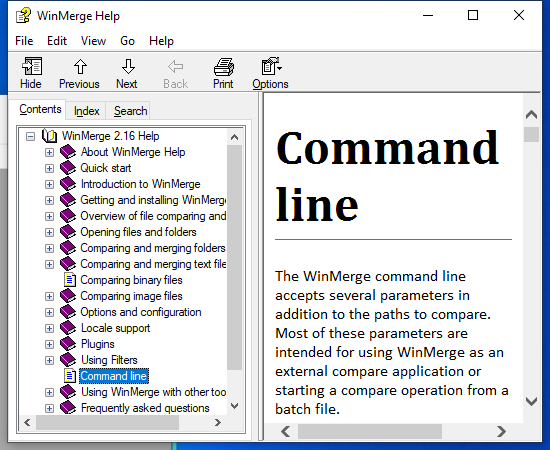
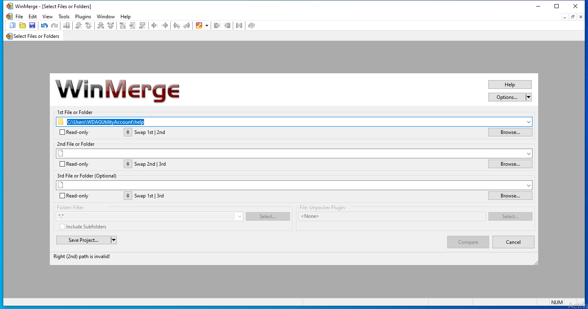

---
title: WinMergeU.exe | WinMerge
---

# WinMergeU.exe 

* File Path: `C:\Program Files\WinMerge\WinMergeU.exe`
* Description: WinMerge

## Screenshot

## Hashes

Type | Hash
-- | --
MD5 | `04A3B37388684EBCD7E361971FFD5A3E`
SHA1 | `BCC3AFB722B2D4A7410FCB4B99DEC4678F7F786F`
SHA256 | `574507B3BB5A3DDBBBBB4FF611DD75528BCF70F2C018F14038C4C7F8AB286045`
SHA384 | `4E29D70F3C43B864250F56DDF12A79B5BCC7E4DC1AF72DBA1D75EA34FD784E1FB6B631CACBF785A9FEF458D4D61333A3`
SHA512 | `82528A52128F975647B1982712FE330463487883A1F143E6F48CD5CA02C355123CAE9906A844FF3C635D15C256C9D6858F7437D444543AB91920C341DBB7EB29`
SSDEEP | `49152:LLi6LTwR/1eDfhPlCVbz4bIg7GPIgL7sauwE9qzrX9sZ1CmolrOd1S05pR+XxLA:OR/MoD76sXvlren5pR+BLA`

## Signature

* Status: The file C:\Program Files\WinMerge\WinMergeU.exe is not digitally signed. You cannot run this script on the current system. For more information about running scripts and setting execution policy, see about_Execution_Policies at https:/go.microsoft.com/fwlink/?LinkID=135170
* Serial: ``
* Thumbprint: ``
* Issuer: 
* Subject: 

## File Metadata

* Original Filename: WinMergeU.EXE
* Product Name: WinMerge
* Company Name: https://winmerge.org
* File Version: 2.16.6.0
* Product Version: 2.16.6.0
* Language: English (United States)
* Legal Copyright: (c) 1996-2020 Dean P. Grimm / Thingamahoochie Software

MIT License. Copyright (c) 2020 Strontic.

