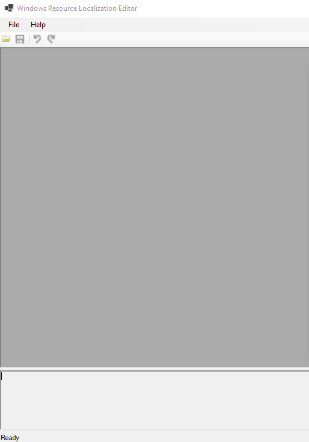

---
title: WinRes.exe | .NET Framework sample Windows forms designer
excerpt: What is WinRes.exe?
---

# WinRes.exe 

* File Path: `C:\Program Files (x86)\Microsoft SDKs\Windows\v10.0A\bin\NETFX 4.8 Tools\WinRes.exe`
* Description: .NET Framework sample Windows forms designer
* Comments: Flavor=Retail

## Screenshot

## Hashes

Type | Hash
-- | --
MD5 | `F8AA83A4AEE120EEB97C729D8886DAF3`
SHA1 | `EE23A9D588FACE97482C34F6A2932AFA1E18B72A`
SHA256 | `00F6542A4909E9E872D6CB9B827D3AB4E7E54EA6E1C0F85421477DA7A666DC17`
SHA384 | `6A8534201E6BFB05CC07BBB479F5629213056A99BA2FF3665ECB2C16D0A0077CAFF976D69A05CE315469BB64122CA311`
SHA512 | `29B84445C1DA6D6B73792B7068CC3476038BE71C7CCF35D461991F0473F4E6182B4DDF808BD782AC335DA249F5965C34FB1ED53E701E8A4B179F045DCEE46DBA`
SSDEEP | `3072:JkgCSWbgfX7wuLMDBfUFIYE29GI8ldg+UPQBLgFppmylTtK5:JbCgfX7wuLMDBsFiyfPIOppmylTI5`
IMP | `F34D5F2D4577ED6D9CEEC516C1F5A744`
PESHA1 | `CE25FFF736D48A1CB5B0994C6560174F812DEE0B`
PE256 | `A923C1A8CDDCE425C189FC59B8207E878FA046EC48C6FD2A7FB74D1EE7A452C5`

## Runtime Data

### Window Title:
Windows Resource Localization Editor

### Open Handles:

Path | Type
-- | --
(R-D)   C:\Windows\Fonts\StaticCache.dat | File
(R-D)   C:\Windows\Microsoft.NET\assembly\GAC_64\mscorlib\v4.0_4.0.0.0__b77a5c561934e089\mscorlib.dll | File
(R-D)   C:\Windows\Microsoft.NET\assembly\GAC_MSIL\Accessibility\v4.0_4.0.0.0__b03f5f7f11d50a3a\Accessibility.dll | File
(R-D)   C:\Windows\Microsoft.NET\assembly\GAC_MSIL\System.Configuration\v4.0_4.0.0.0__b03f5f7f11d50a3a\System.Configuration.dll | File
(R-D)   C:\Windows\Microsoft.NET\assembly\GAC_MSIL\System.Design\v4.0_4.0.0.0__b03f5f7f11d50a3a\System.Design.dll | File
(R-D)   C:\Windows\Microsoft.NET\assembly\GAC_MSIL\System.Drawing\v4.0_4.0.0.0__b03f5f7f11d50a3a\System.Drawing.dll | File
(R-D)   C:\Windows\Microsoft.NET\assembly\GAC_MSIL\System.Windows.Forms\v4.0_4.0.0.0__b77a5c561934e089\System.Windows.Forms.dll | File
(R-D)   C:\Windows\Microsoft.NET\assembly\GAC_MSIL\System.Xml\v4.0_4.0.0.0__b77a5c561934e089\System.XML.dll | File
(R-D)   C:\Windows\Microsoft.NET\assembly\GAC_MSIL\System\v4.0_4.0.0.0__b77a5c561934e089\System.dll | File
(R-D)   C:\Windows\System32\en-US\user32.dll.mui | File
(R-D)   C:\Windows\System32\en-US\winnlsres.dll.mui | File
(RW-)   C:\Users\user | File
(RW-)   C:\Windows\WinSxS\amd64_microsoft.windows.common-controls_6595b64144ccf1df_5.82.19041.488_none_4238de57f6b64d28 | File
(RW-)   C:\Windows\WinSxS\amd64_microsoft.windows.common-controls_6595b64144ccf1df_6.0.19041.488_none_ca04af081b815d21 | File
(RW-)   C:\Windows\WinSxS\amd64_microsoft.windows.gdiplus_6595b64144ccf1df_1.1.19041.685_none_faeca4db76168538 | File
\...\Cor_SxSPublic_IPCBlock | Section
\BaseNamedObjects\C:\*ProgramData\*Microsoft\*Windows\*Caches\*{6AF0698E-D558-4F6E-9B3C-3716689AF493}.2.ver0x0000000000000002.db | Section
\BaseNamedObjects\C:\*ProgramData\*Microsoft\*Windows\*Caches\*{DDF571F2-BE98-426D-8288-1A9A39C3FDA2}.2.ver0x0000000000000002.db | Section
\BaseNamedObjects\C:\*ProgramData\*Microsoft\*Windows\*Caches\*cversions.2 | Section
\BaseNamedObjects\Cor_Private_IPCBlock_v4_6240 | Section
\BaseNamedObjects\NLS_CodePage_1252_3_2_0_0 | Section
\BaseNamedObjects\NLS_CodePage_437_3_2_0_0 | Section
\Sessions\1\BaseNamedObjects\windows_shell_global_counters | Section
\Sessions\1\Windows\Theme1383959086 | Section
\Windows\Theme2042523233 | Section

### Loaded Modules:

Path |
-- |
C:\Program Files (x86)\Microsoft SDKs\Windows\v10.0A\bin\NETFX 4.8 Tools\WinRes.exe |
C:\Windows\System32\ADVAPI32.dll |
C:\Windows\System32\KERNEL32.dll |
C:\Windows\System32\KERNELBASE.dll |
C:\Windows\SYSTEM32\MSCOREE.DLL |
C:\Windows\System32\msvcrt.dll |
C:\Windows\SYSTEM32\ntdll.dll |
C:\Windows\System32\RPCRT4.dll |
C:\Windows\System32\sechost.dll |

## Signature

* Status: Signature verified.
* Serial: `33000001519E8D8F4071A30E41000000000151`
* Thumbprint: `62009AAABDAE749FD47D19150958329BF6FF4B34`
* Issuer: CN=Microsoft Code Signing PCA 2011, O=Microsoft Corporation, L=Redmond, S=Washington, C=US
* Subject: CN=Microsoft Corporation, O=Microsoft Corporation, L=Redmond, S=Washington, C=US

## File Metadata

* Original Filename: WinRes.exe
* Product Name: Microsoft .NET Framework
* Company Name: Microsoft Corporation
* File Version: 4.8.4084.0 built by: NET48REL1
* Product Version: 4.8.4084.0
* Language: English (United States)
* Legal Copyright:  Microsoft Corporation.  All rights reserved.
* Machine Type: 32-bit

## File Scan

* VirusTotal Detections: 0/73
* VirusTotal Link: https://www.virustotal.com/gui/file/00f6542a4909e9e872d6cb9b827d3ab4e7e54ea6e1c0f85421477da7a666dc17/detection

MIT License. Copyright (c) 2020-2021 Strontic.

