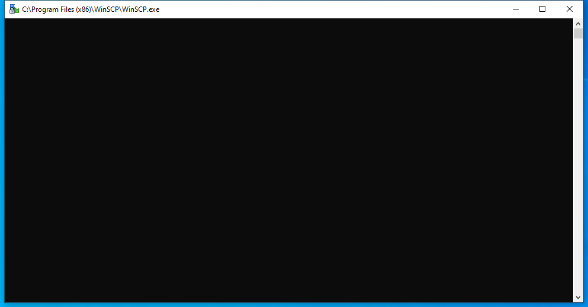
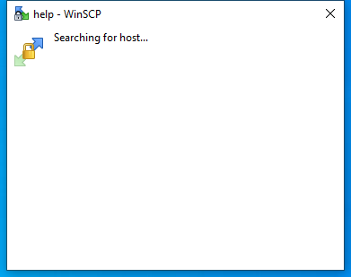

---
title: WinSCP.exe | WinSCP- SFTP, FTP, WebDAV, S3 and SCP client
---

# WinSCP.exe 

* File Path: `C:\program files (x86)\WinSCP\WinSCP.exe`
* Description: WinSCP: SFTP, FTP, WebDAV, S3 and SCP client

## Screenshot

## Hashes

Type | Hash
-- | --
MD5 | `B4C10246F5915CA18F7CF78A38A43EBD`
SHA1 | `0DDE1E88E0D3EE6693C71CA5036A11B6AB42C8D8`
SHA256 | `424505953E12C975D18EB5C0D51EFD79D11BB3A18423AF0098042B9ABE7243FC`
SHA384 | `4CCF626EF696AE9C0A746F756E70D9BE5B4512A7007418AA9B4F9184C8098A443C3329FD35EA3C538B1685FABDAD1D6A`
SHA512 | `0605CF593F07B7107230AF9C6677A71086011FDF94C81C43F603AF0A848E818C5E04CB2F187401C04F0284B05127C409F51DA1CFBD5404EE35B8E0326EADDC1C`
SSDEEP | `393216:69aUyMH+lifETvAf3YThi+eT0+qA+jvY/nWI5Gk:6K4fSmH/n7`

## Runtime Data

### Child Processes:
conhost.exe

### Window Title:
--help - WinSCP

### Open Handles:

Path | Type
-- | --
(R-D)   C:\Windows\Fonts\StaticCache.dat | File
(R-D)   C:\Windows\System32\en-US\propsys.dll.mui | File
(R-D)   C:\Windows\SysWOW64\en-US\user32.dll.mui | File
(R-D)   C:\Windows\WinSxS\x86_microsoft.windows.c..-controls.resources_6595b64144ccf1df_6.0.19041.1_en-us_130e63d987a738df\comctl32.dll.mui | File
(RW-)   C:\Users\user\Documents | File
(RW-)   C:\Windows | File
(RW-)   C:\Windows\WinSxS\x86_microsoft.windows.c..-controls.resources_6595b64144ccf1df_6.0.19041.1_en-us_130e63d987a738df | File
(RW-)   C:\Windows\WinSxS\x86_microsoft.windows.common-controls_6595b64144ccf1df_6.0.19041.1_none_fd031af45b0106f2 | File
\BaseNamedObjects\__ComCatalogCache__ | Section
\BaseNamedObjects\C:\*ProgramData\*Microsoft\*Windows\*Caches\*{6AF0698E-D558-4F6E-9B3C-3716689AF493}.2.ver0x0000000000000002.db | Section
\BaseNamedObjects\C:\*ProgramData\*Microsoft\*Windows\*Caches\*{DDF571F2-BE98-426D-8288-1A9A39C3FDA2}.2.ver0x0000000000000001.db | Section
\BaseNamedObjects\C:\*ProgramData\*Microsoft\*Windows\*Caches\*cversions.2.ro | Section
\BaseNamedObjects\NLS_CodePage_1252_3_2_0_0 | Section
\BaseNamedObjects\NLS_CodePage_437_3_2_0_0 | Section
\BaseNamedObjects\windows_shell_global_counters | Section
\Sessions\1\BaseNamedObjects\windows_shell_global_counters | Section
\Sessions\1\Windows\Theme4048709601 | Section
\Windows\Theme603176458 | Section

### Loaded Modules:

Path |
-- |
C:\program files (x86)\WinSCP\WinSCP.exe |
C:\Windows\SYSTEM32\ntdll.dll |
C:\Windows\System32\wow64.dll |
C:\Windows\System32\wow64cpu.dll |
C:\Windows\System32\wow64win.dll |

## Signature

* Status: Signature verified.
* Serial: `0232466DC95B40EC9D21D9329ABFCD5D`
* Thumbprint: `FB845245CFBB0EE97E76C775348CAA31D74BEC4C`
* Issuer: CN=DigiCert EV Code Signing CA (SHA2), OU=www.digicert.com, O=DigiCert Inc, C=US
* Subject: CN=Martin Prikryl, O=Martin Prikryl, L=Prague, C=CZ, SERIALNUMBER=87331519, OID.2.5.4.15=Private Organization, OID.1.3.6.1.4.1.311.60.2.1.3=CZ

## File Metadata

* Original Filename: winscp.exe
* Product Name: WinSCP
* Company Name: Martin Prikryl
* File Version: 5.17.7.10640
* Product Version: 5.17.7.0
* Language: English (United States)
* Legal Copyright: (c) 2000-2020 Martin Prikryl

## Possible Misuse

*The following table contains possible examples of `WinSCP.exe` being misused. While `WinSCP.exe` is **not** inherently malicious, its legitimate functionality can by abused for malicious purposes.*

Source | Source File | Example | License
-- | -- | -- | --
[sigma](https://github.com/Neo23x0/sigma) | [sysmon_suspicious_remote_thread.yml](https://github.com/Neo23x0/sigma/blob/master/rules/windows/sysmon/sysmon_suspicious_remote_thread.yml) | `- '\winscp.exe'` | [DRL 1.0](https://github.com/Neo23x0/sigma/blob/master/LICENSE.Detection.Rules.md)

MIT License. Copyright (c) 2020 Strontic.

