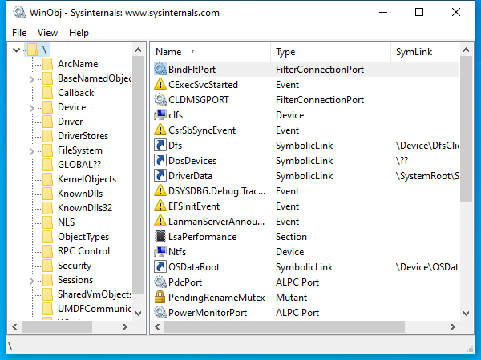

---
title: Winobj.exe | Sysinternals Winobj
excerpt: What is Winobj.exe?
---

# Winobj.exe 

* File Path: `C:\SysinternalsSuite\Winobj.exe`
* Description: Sysinternals Winobj

## Screenshot

## Hashes

Type | Hash
-- | --
MD5 | `FEF8118EDF7918D3C795D6EF03800519`
SHA1 | `36C3D3A07472EDB4BAA220B7E0030CAFD9AB1A2F`
SHA256 | `91B8D19A897CAC6CFC638B0C195EE541E78781402E1D59DAD7F3D532376F32D2`
SHA384 | `982733B42BFF73F574BCE023603104A0231057F3E5BBA2CE7DDB4617040A659ABA5538E022E4902BA5FF58A35BD2AAA6`
SHA512 | `6537E8DF1F34963EABE844AB23D810ECDE858E90C2F9681059450729C522C19D0D2476720ED43B5D21240B094C06863CFCE8CB06D5E117B77EE7A1AC9CD4E6F8`
SSDEEP | `12288:DjqYsDe1+Ydzitc5Cdb3LDh8DF/Qto1GVop8K:qYTHdiO5Cx3YFIq1Ga8K`
IMP | `B80AF39DF5C5E0CC858A01DCEC9D1151`
PESHA1 | `FA57F0DBE9FA656244CA664E5B000BFF153D33EA`
PE256 | `CBB0E462DA564DCAE9DF3A8B42EF1633D97838A094E35E8794BC56C7077FCBDD`

## Runtime Data

### Window Title:
WinObj - Sysinternals: www.sysinternals.com

### Open Handles:

Path | Type
-- | --
(R-D)   C:\Windows\Fonts\StaticCache.dat | File
(R-D)   C:\Windows\System32\en-US\aclui.dll.mui | File
(R-D)   C:\Windows\SystemResources\imageres.dll.mun | File
(RW-)   C:\Windows | File
(RW-)   C:\Windows\WinSxS\x86_microsoft.windows.common-controls_6595b64144ccf1df_6.0.19041.488_none_11b1e5df2ffd8627 | File
(RW-)   C:\xCyclopedia | File
\BaseNamedObjects\NLS_CodePage_1252_3_2_0_0 | Section
\BaseNamedObjects\NLS_CodePage_437_3_2_0_0 | Section
\Sessions\1\Windows\Theme2036293991 | Section
\Windows\Theme1324212991 | Section

### Loaded Modules:

Path |
-- |
C:\SysinternalsSuite\Winobj.exe |
C:\Windows\SYSTEM32\ntdll.dll |
C:\Windows\System32\wow64.dll |
C:\Windows\System32\wow64cpu.dll |
C:\Windows\System32\wow64win.dll |

## Signature

* Status: Signature verified.
* Serial: `6101CF3E00000000000F`
* Thumbprint: `9617094A1CFB59AE7C1F7DFDB6739E4E7C40508F`
* Issuer: CN=Microsoft Code Signing PCA, O=Microsoft Corporation, L=Redmond, S=Washington, C=US
* Subject: CN=Microsoft Corporation, OU=MOPR, O=Microsoft Corporation, L=Redmond, S=Washington, C=US

## File Metadata

* Original Filename: Winobj.exe
* Product Name: Sysinternals Winobj
* Company Name: Sysinternals
* File Version: 2.22
* Product Version: 2.22
* Language: English (United States)
* Legal Copyright: Copyright  1996-2010 Mark Russinovich
* Machine Type: 32-bit

## File Scan

* VirusTotal Detections: 0/69
* VirusTotal Link: https://www.virustotal.com/gui/file/91b8d19a897cac6cfc638b0c195ee541e78781402e1d59dad7f3d532376f32d2/detection/

## Possible Misuse

*The following table contains possible examples of `Winobj.exe` being misused. While `Winobj.exe` is **not** inherently malicious, its legitimate functionality can be abused for malicious purposes.*

Source | Source File | Example | License
-- | -- | -- | --
[stockpile](https://github.com/mitre/stockpile) | [7a6ba833-de40-466a-8969-5c37b13603e0.yml](https://github.com/mitre/stockpile/blob/master/data/abilities/defense-evasion/7a6ba833-de40-466a-8969-5c37b13603e0.yml) | `"winobj",`{:.highlight .language-yaml} | [Apache-2.0](https://github.com/mitre/stockpile/blob/master/LICENSE)

MIT License. Copyright (c) 2020-2021 Strontic.

