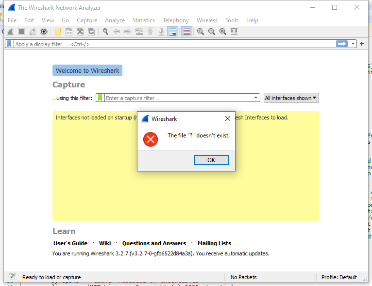

---
title: Wireshark.exe | Wireshark
excerpt: What is Wireshark.exe?
---

# Wireshark.exe 

* File Path: `C:\Program Files\Wireshark\Wireshark.exe`
* Description: Wireshark

## Screenshot



## Hashes

Type | Hash
-- | --
MD5 | `CD90B15301CFBBC4043035B8DD31E219`
SHA1 | `381C71EAB4E8624AD97BFE84218FF88F3349D603`
SHA256 | `0505210A54D9B2981CDC1F3D35F6303B4DDE7E43F5AF91D9237F5D8E975BB609`
SHA384 | `1A13841B0E752DDE12CAF01742C0A2025E8EF2F20A668C83B32709CE1AA284379E6B9FBDC2328F93908DF9C82D4E677A`
SHA512 | `E749C2DD0DCEDB2991AE18939374D6694BA43F02C5A30FFE423BE733C81CEC53CDD25E04DC90286704353FD0768F2B05E1DD6CE8217171D3DB16176CB49174D7`
SSDEEP | `98304:7fDHoycrnB9GJ12cmOb2j1K560b+WZtEkygUmGJs13Hq9jKvDf:7fbo1rnHGcQ51jRbU599G7f`
IMP | `77E20A2ECBA38B7C4C60F3E132FC6D2C`
PESHA1 | `CF1442D7EB3152FC2B8ED30C83341D796EFAC2ED`
PE256 | `046E37C9EA1FE580EB83EA775CE554568CF1B024D96A957535F90DFCD2482F37`

## Runtime Data

### Usage (stdout):
```cmhg
Wireshark 3.2.7 (v3.2.7-0-gfb6522d84a3a)
Interactively dump and analyze network traffic.
See https://www.wireshark.org for more information.

Usage: wireshark [options] ... [ <infile> ]

Capture interface:
  -i <interface>, --interface <interface>
                           name or idx of interface (def: first non-loopback)
  -f <capture filter>      packet filter in libpcap filter syntax
  -s <snaplen>, --snapshot-length <snaplen>
                           packet snapshot length (def: appropriate maximum)
  -p, --no-promiscuous-mode
                           don't capture in promiscuous mode
  -k                       start capturing immediately (def: do nothing)
  -S                       update packet display when new packets are captured
  -l                       turn on automatic scrolling while -S is in use
  -I, --monitor-mode       capture in monitor mode, if available
  -B <buffer size>, --buffer-size <buffer size>
                           size of kernel buffer (def: 2MB)
  -y <link type>, --linktype <link type>
                           link layer type (def: first appropriate)
  --time-stamp-type <type> timestamp method for interface
  -D, --list-interfaces    print list of interfaces and exit
  -L, --list-data-link-types
                           print list of link-layer types of iface and exit
  --list-time-stamp-types  print list of timestamp types for iface and exit

Capture stop conditions:
  -c <packet count>        stop after n packets (def: infinite)
  -a <autostop cond.> ..., --autostop <autostop cond.> ...
                           duration:NUM - stop after NUM seconds
                           filesize:NUM - stop this file after NUM KB
                              files:NUM - stop after NUM files
                            packets:NUM - stop after NUM packets
Capture output:
  -b <ringbuffer opt.> ..., --ring-buffer <ringbuffer opt.>
                           duration:NUM - switch to next file after NUM secs
                           filesize:NUM - switch to next file after NUM KB
                              files:NUM - ringbuffer: replace after NUM files
                            packets:NUM - switch to next file after NUM packets
                           interval:NUM - switch to next file when the time is
                                          an exact multiple of NUM secs
RPCAP options:
  -A <user>:<password>     use RPCAP password authentication
Input file:
  -r <infile>, --read-file <infile>
                           set the filename to read from (no pipes or stdin!)

Processing:
  -R <read filter>, --read-filter <read filter>
                           packet filter in Wireshark display filter syntax
  -n                       disable all name resolutions (def: all enabled)
  -N <name resolve flags>  enable specific name resolution(s): "mnNtdv"
  -d <layer_type>==<selector>,<decode_as_protocol> ...
                           "Decode As", see the man page for details
                           Example: tcp.port==8888,http
  --enable-protocol <proto_name>
                           enable dissection of proto_name
  --disable-protocol <proto_name>
                           disable dissection of proto_name
  --enable-heuristic <short_name>
                           enable dissection of heuristic protocol
  --disable-heuristic <short_name>
                           disable dissection of heuristic protocol

User interface:
  -C <config profile>      start with specified configuration profile
  -H                       hide the capture info dialog during packet capture
  -Y <display filter>, --display-filter <display filter>
                           start with the given display filter
  -g <packet number>       go to specified packet number after "-r"
  -J <jump filter>         jump to the first packet matching the (display)
                           filter
  -j                       search backwards for a matching packet after "-J"
  -t a|ad|adoy|d|dd|e|r|u|ud|udoy
                           format of time stamps (def: r: rel. to first)
  -u s|hms                 output format of seconds (def: s: seconds)
  -X <key>:<value>         eXtension options, see man page for details
  -z <statistics>          show various statistics, see man page for details

Output:
  -w <outfile|->           set the output filename (or '-' for stdout)
  --capture-comment <comment>
                           set the capture file comment, if supported

Miscellaneous:
  -h, --help               display this help and exit
  -v, --version            display version info and exit
  -P <key>:<path>          persconf:path - personal configuration files
                           persdata:path - personal data files
  -o <name>:<value> ...    override preference or recent setting
  -K <keytab>              keytab file to use for kerberos decryption
  --fullscreen             start Wireshark in full screen

```

### Window Title:
The Wireshark Network Analyzer

### Open Handles:

Path | Type
-- | --
(R-D)   C:\Windows\System32\en-US\KernelBase.dll.mui | File
(R-D)   C:\Windows\System32\en-US\UIAutomationCore.dll.mui | File
(R-D)   C:\Windows\System32\en-US\user32.dll.mui | File
(RW-)   C:\Users\user\Documents | File
(RW-)   C:\Windows\System32 | File
(RW-)   C:\Windows\WinSxS\amd64_microsoft.windows.common-controls_6595b64144ccf1df_6.0.19041.488_none_ca04af081b815d21 | File
(RWD)   C:\Users\user\AppData\Local\Microsoft\Windows\Explorer\iconcache_16.db | File
(RWD)   C:\Users\user\AppData\Local\Microsoft\Windows\Explorer\iconcache_32.db | File
(RWD)   C:\Users\user\AppData\Local\Microsoft\Windows\Explorer\iconcache_idx.db | File
\BaseNamedObjects\__ComCatalogCache__ | Section
\BaseNamedObjects\NLS_CodePage_1252_3_2_0_0 | Section
\BaseNamedObjects\NLS_CodePage_437_3_2_0_0 | Section
\Sessions\1\BaseNamedObjects\1bbcHWNDInterface:11a0430 | Section
\Sessions\1\BaseNamedObjects\1bbcHWNDInterface:460428 | Section
\Sessions\1\BaseNamedObjects\windows_shell_global_counters | Section
\Sessions\1\Windows\Theme64749523 | Section
\Windows\Theme1120315852 | Section


### Loaded Modules:

Path |
-- |
C:\Program Files\Wireshark\brotlicommon.dll |
C:\Program Files\Wireshark\brotlidec.dll |
C:\Program Files\Wireshark\cares.dll |
C:\Program Files\Wireshark\comerr64.dll |
C:\Program Files\Wireshark\glib-2.dll |
C:\Program Files\Wireshark\gmodule-2.dll |
C:\Program Files\Wireshark\k5sprt64.dll |
C:\Program Files\Wireshark\krb5_64.dll |
C:\Program Files\Wireshark\libcharset.dll |
C:\Program Files\Wireshark\libffi-6.dll |
C:\Program Files\Wireshark\libgcc_s_seh-1.dll |
C:\Program Files\Wireshark\libgcrypt-20.dll |
C:\Program Files\Wireshark\libgmp-10.dll |
C:\Program Files\Wireshark\libgnutls-30.dll |
C:\Program Files\Wireshark\libgpg-error-0.dll |
C:\Program Files\Wireshark\libhogweed-4.dll |
C:\Program Files\Wireshark\libiconv.dll |
C:\Program Files\Wireshark\libintl.dll |
C:\Program Files\Wireshark\libnettle-6.dll |
C:\Program Files\Wireshark\libp11-kit-0.dll |
C:\Program Files\Wireshark\libsmi-2.dll |
C:\Program Files\Wireshark\libsnappy-1.dll |
C:\Program Files\Wireshark\libtasn1-6.dll |
C:\Program Files\Wireshark\libwinpthread-1.dll |
C:\Program Files\Wireshark\libwireshark.dll |
C:\Program Files\Wireshark\libwiretap.dll |
C:\Program Files\Wireshark\libwsutil.dll |
C:\Program Files\Wireshark\libxml2.dll |
C:\Program Files\Wireshark\lua52.dll |
C:\Program Files\Wireshark\lz4.dll |
C:\Program Files\Wireshark\lzma.dll |
C:\Program Files\Wireshark\nghttp2.dll |
C:\Program Files\Wireshark\pcre.dll |
C:\Program Files\Wireshark\Qt5Core.dll |
C:\Program Files\Wireshark\Qt5Gui.dll |
C:\Program Files\Wireshark\Qt5Multimedia.dll |
C:\Program Files\Wireshark\Qt5Network.dll |
C:\Program Files\Wireshark\Qt5PrintSupport.dll |
C:\Program Files\Wireshark\Qt5Widgets.dll |
C:\Program Files\Wireshark\Qt5WinExtras.dll |
C:\Program Files\Wireshark\WinSparkle.dll |
C:\Program Files\Wireshark\Wireshark.exe |
C:\Program Files\Wireshark\zlib1.dll |
C:\Program Files\Wireshark\zstd.dll |
C:\Windows\System32\ADVAPI32.dll |
C:\Windows\System32\combase.dll |
C:\Windows\System32\COMDLG32.dll |
C:\Windows\System32\CRYPT32.dll |
C:\Windows\SYSTEM32\CRYPTBASE.DLL |
C:\Windows\SYSTEM32\DNSAPI.dll |
C:\Windows\SYSTEM32\dwmapi.dll |
C:\Windows\System32\GDI32.dll |
C:\Windows\System32\gdi32full.dll |
C:\Windows\System32\IMM32.DLL |
C:\Windows\SYSTEM32\IPHLPAPI.DLL |
C:\Windows\System32\KERNEL32.DLL |
C:\Windows\System32\KERNELBASE.dll |
C:\Windows\SYSTEM32\MPR.dll |
C:\Windows\System32\msvcp_win.dll |
C:\Windows\SYSTEM32\MSVCP140.dll |
C:\Windows\System32\msvcrt.dll |
C:\Windows\SYSTEM32\NETAPI32.dll |
C:\Windows\SYSTEM32\NETUTILS.DLL |
C:\Windows\SYSTEM32\ntdll.dll |
C:\Windows\System32\ole32.dll |
C:\Windows\System32\OLEAUT32.dll |
C:\Windows\System32\PSAPI.DLL |
C:\Windows\System32\RPCRT4.dll |
C:\Windows\System32\sechost.dll |
C:\Windows\System32\shcore.dll |
C:\Windows\System32\SHELL32.dll |
C:\Windows\System32\SHLWAPI.dll |
C:\Windows\SYSTEM32\SRVCLI.DLL |
C:\Windows\System32\ucrtbase.dll |
C:\Windows\System32\USER32.dll |
C:\Windows\SYSTEM32\USERENV.dll |
C:\Windows\SYSTEM32\UxTheme.dll |
C:\Windows\SYSTEM32\VCRUNTIME140.dll |
C:\Windows\SYSTEM32\VCRUNTIME140_1.dll |
C:\Windows\SYSTEM32\VERSION.dll |
C:\Windows\System32\win32u.dll |
C:\Windows\SYSTEM32\WININET.dll |
C:\Windows\SYSTEM32\WINMM.dll |
C:\Windows\SYSTEM32\WINSPOOL.DRV |
C:\Windows\System32\WS2_32.dll |
C:\Windows\SYSTEM32\WSOCK32.dll |
C:\Windows\WinSxS\amd64_microsoft.windows.common-controls_6595b64144ccf1df_6.0.19041.488_none_ca04af081b815d21\COMCTL32.dll |


## Signature

* Status: Signature verified.
* Serial: `02CCD99F7D556C13CE8710C69D09B31A`
* Thumbprint: `E8EF7325044D018B0C0DCD8CBA4190B155857F3B`
* Issuer: CN=Sectigo RSA Code Signing CA, O=Sectigo Limited, L=Salford, S=Greater Manchester, C=GB
* Subject: CN="Wireshark Foundation, Inc.", O="Wireshark Foundation, Inc.", STREET=711 4th street, L=Davis, S=CA, PostalCode=95616, C=US

## File Metadata

* Original Filename: Wireshark.exe
* Product Name: Wireshark
* Company Name: The Wireshark developer community, https://www.wireshark.org/
* File Version: 3.2.7
* Product Version: 3.2.7
* Language: English (United States)
* Legal Copyright: Copyright  2000 Gerald Combs <gerald@wireshark.org>, Gilbert Ramirez <gram@alumni.rice.edu> and others
* Machine Type: 64-bit

## File Scan

* VirusTotal Detections: 0/70
* VirusTotal Link: https://www.virustotal.com/gui/file/0505210a54d9b2981cdc1f3d35f6303b4dde7e43f5af91d9237f5d8e975bb609/detection/


## Possible Misuse

*The following table contains possible examples of `Wireshark.exe` being misused. While `Wireshark.exe` is **not** inherently malicious, its legitimate functionality can be abused for malicious purposes.*

Source | Source File | Example | License
-- | -- | -- | --
[sigma](https://github.com/Neo23x0/sigma) | [lnx_auditd_susp_c2_commands.yml](https://github.com/Neo23x0/sigma/blob/master/rules/linux/auditd/lnx_auditd_susp_c2_commands.yml) | `description: Detects suspicious activities as declared by Florian Roth in its 'Best Practice Auditd Configuration'. This includes the detection of the following commands; wget, curl, base64, nc, netcat, ncat, ssh, socat, wireshark, rawshark, rdesktop, nmap. These commands match a few techniques from the tactics "Command and Control", including not exhaustively the following; Application Layer Protocol (T1071), Non-Application Layer Protocol (T1095), Data Encoding (T1132)`{:.highlight .language-yaml} | [DRL 1.0](https://github.com/Neo23x0/sigma/blob/master/LICENSE.Detection.Rules.md)
[malware-ioc](https://github.com/eset/malware-ioc) | [invisimole.yar](https://github.com/eset/malware-ioc/blob/master/invisimole/invisimole.yar) | `$s1 = "Wireshark-is-running-{9CA78EEA-EA4D-4490-9240-FC01FCEF464B}" xor`{:.highlight .language-cmhg} | [© ESET 2014-2018](https://github.com/eset/malware-ioc/blob/master/LICENSE)
[malware-ioc](https://github.com/eset/malware-ioc) | [misp_invisimole.json](https://github.com/eset/malware-ioc/blob/master/invisimole/misp_invisimole.json) | `"description": "Adversaries may check for the presence of a virtual machine environment (VME) or sandbox to avoid potential detection of tools and activities. If the adversary detects a VME, they may alter their malware to conceal the core functions of the implant or disengage from the victim. They may also search for VME artifacts before dropping secondary or additional payloads. Adversaries may use the information from learned from [Virtualization/Sandbox Evasion](https://attack.mitre.org/techniques/T1497) during automated discovery to shape follow-on behaviors.\n\nAdversaries may use several methods including [Security Software Discovery](https://attack.mitre.org/techniques/T1063) to accomplish [Virtualization/Sandbox Evasion](https://attack.mitre.org/techniques/T1497) by searching for security monitoring tools (e.g., Sysinternals, Wireshark, etc.) to help determine if it is an analysis environment. Additional methods include use of sleep timers or loops within malware code to avoid operating within a temporary sandboxes. (Citation: Unit 42 Pirpi July 2015)\n\n###Virtual Machine Environment Artifacts Discovery###\n\nAdversaries may use utilities such as [Windows Management Instrumentation](https://attack.mitre.org/techniques/T1047), [PowerShell](https://attack.mitre.org/techniques/T1086), [Systeminfo](https://attack.mitre.org/software/S0096), and the [Query Registry](https://attack.mitre.org/techniques/T1012) to obtain system information and search for VME artifacts. Adversaries may search for VME artifacts in memory, processes, file system, and/or the Registry. Adversaries may use [Scripting](https://attack.mitre.org/techniques/T1064) to combine these checks into one script and then have the program exit if it determines the system to be a virtual environment. Also, in applications like VMWare, adversaries can use a special I/O port to send commands and receive output. Adversaries may also check the drive size. For example, this can be done using the Win32 DeviceIOControl function. \n\nExample VME Artifacts in the Registry(Citation: McAfee Virtual Jan 2017)\n\n* <code>HKLM\\SOFTWARE\\Oracle\\VirtualBox Guest Additions</code>\n* <code>HKLM\\HARDWARE\\Description\\System\\”SystemBiosVersion”;”VMWARE”</code>\n* <code>HKLM\\HARDWARE\\ACPI\\DSDT\\BOX_</code>\n\nExample VME files and DLLs on the system(Citation: McAfee Virtual Jan 2017)\n\n* <code>WINDOWS\\system32\\drivers\\vmmouse.sys</code> \n* <code>WINDOWS\\system32\\vboxhook.dll</code>\n* <code>Windows\\system32\\vboxdisp.dll</code>\n\nCommon checks may enumerate services running that are unique to these applications, installed programs on the system, manufacturer/product fields for strings relating to virtual machine applications, and VME-specific hardware/processor instructions.(Citation: McAfee Virtual Jan 2017)\n\n###User Activity Discovery###\n\nAdversaries may search for user activity on the host (e.g., browser history, cache, bookmarks, number of files in the home directories, etc.) for reassurance of an authentic environment. They might detect this type of information via user interaction and digital signatures. They may have malware check the speed and frequency of mouse clicks to determine if it’s a sandboxed environment.(Citation: Sans Virtual Jan 2016) Other methods may rely on specific user interaction with the system before the malicious code is activated. Examples include waiting for a document to close before activating a macro (Citation: Unit 42 Sofacy Nov 2018) and waiting for a user to double click on an embedded image to activate (Citation: FireEye FIN7 April 2017).\n\n###Virtual Hardware Fingerprinting Discovery###\n\nAdversaries may check the fan and temperature of the system to gather evidence that can be indicative a virtual environment. An adversary may perform a CPU check using a WMI query <code>$q = “Select * from Win32_Fan” Get-WmiObject -Query $q</code>. If the results of the WMI query return more than zero elements, this might tell them that the machine is a physical one. (Citation: Unit 42 OilRig Sept 2018)",`{:.highlight .language-cmhg} | [© ESET 2014-2018](https://github.com/eset/malware-ioc/blob/master/LICENSE)
[atomic-red-team](https://github.com/redcanaryco/atomic-red-team) | [T1040.md](https://github.com/redcanaryco/atomic-red-team/blob/master/atomics/T1040/T1040.md) | Perform a PCAP. Wireshark will be required for tshark. TCPdump may already be installed. | [MIT License. © 2018 Red Canary](https://github.com/redcanaryco/atomic-red-team/blob/master/LICENSE.txt)
[atomic-red-team](https://github.com/redcanaryco/atomic-red-team) | [T1040.md](https://github.com/redcanaryco/atomic-red-team/blob/master/atomics/T1040/T1040.md) | Perform a PCAP on macOS. This will require Wireshark/tshark to be installed. TCPdump may already be installed. | [MIT License. © 2018 Red Canary](https://github.com/redcanaryco/atomic-red-team/blob/master/LICENSE.txt)
[atomic-red-team](https://github.com/redcanaryco/atomic-red-team) | [T1040.md](https://github.com/redcanaryco/atomic-red-team/blob/master/atomics/T1040/T1040.md) | Perform a packet capture using the windows command prompt. This will require a host that has Wireshark/Tshark | [MIT License. © 2018 Red Canary](https://github.com/redcanaryco/atomic-red-team/blob/master/LICENSE.txt)
[atomic-red-team](https://github.com/redcanaryco/atomic-red-team) | [T1040.md](https://github.com/redcanaryco/atomic-red-team/blob/master/atomics/T1040/T1040.md) | \| wireshark_url \| wireshark installer download URL \| Url \| https://1.eu.dl.wireshark.org/win64/Wireshark-win64-3.4.5.exe\| | [MIT License. © 2018 Red Canary](https://github.com/redcanaryco/atomic-red-team/blob/master/LICENSE.txt)
[atomic-red-team](https://github.com/redcanaryco/atomic-red-team) | [T1040.md](https://github.com/redcanaryco/atomic-red-team/blob/master/atomics/T1040/T1040.md) | \| tshark_path \| path to tshark.exe \| Path \| c:&#92;program files&#92;wireshark&#92;tshark.exe\| | [MIT License. © 2018 Red Canary](https://github.com/redcanaryco/atomic-red-team/blob/master/LICENSE.txt)
[atomic-red-team](https://github.com/redcanaryco/atomic-red-team) | [T1040.md](https://github.com/redcanaryco/atomic-red-team/blob/master/atomics/T1040/T1040.md) | "c:\Program Files\Wireshark\tshark.exe" -i #{interface} -c 5 | [MIT License. © 2018 Red Canary](https://github.com/redcanaryco/atomic-red-team/blob/master/LICENSE.txt)
[atomic-red-team](https://github.com/redcanaryco/atomic-red-team) | [T1040.md](https://github.com/redcanaryco/atomic-red-team/blob/master/atomics/T1040/T1040.md) | ##### Description: tshark must be installed and in the default path of "c:\Program Files\Wireshark\Tshark.exe". | [MIT License. © 2018 Red Canary](https://github.com/redcanaryco/atomic-red-team/blob/master/LICENSE.txt)
[atomic-red-team](https://github.com/redcanaryco/atomic-red-team) | [T1071.001.md](https://github.com/redcanaryco/atomic-red-team/blob/master/atomics/T1071.001/T1071.001.md) | Use an application such as Wireshark to record the session and observe user agent strings and responses. | [MIT License. © 2018 Red Canary](https://github.com/redcanaryco/atomic-red-team/blob/master/LICENSE.txt)
[signature-base](https://github.com/Neo23x0/signature-base) | [apt_turla.yar](https://github.com/Neo23x0/signature-base/blob/master/yara/apt_turla.yar) | $s5 = "wireshark.exe" fullword ascii | [CC BY-NC 4.0](https://github.com/Neo23x0/signature-base/blob/master/LICENSE)
[signature-base](https://github.com/Neo23x0/signature-base) | [apt_waterbear.yar](https://github.com/Neo23x0/signature-base/blob/master/yara/apt_waterbear.yar) | $s2 = "WIRESHARK" fullword ascii | [CC BY-NC 4.0](https://github.com/Neo23x0/signature-base/blob/master/LICENSE)
[signature-base](https://github.com/Neo23x0/signature-base) | [apt_winnti_burning_umbrella.yar](https://github.com/Neo23x0/signature-base/blob/master/yara/apt_winnti_burning_umbrella.yar) | $s1 = "wireshark" fullword wide | [CC BY-NC 4.0](https://github.com/Neo23x0/signature-base/blob/master/LICENSE)
[signature-base](https://github.com/Neo23x0/signature-base) | [apt_zxshell.yar](https://github.com/Neo23x0/signature-base/blob/master/yara/apt_zxshell.yar) | $x12 = "AntiSniff -a wireshark.exe" fullword ascii | [CC BY-NC 4.0](https://github.com/Neo23x0/signature-base/blob/master/LICENSE)
[signature-base](https://github.com/Neo23x0/signature-base) | [gen_rats_malwareconfig.yar](https://github.com/Neo23x0/signature-base/blob/master/yara/gen_rats_malwareconfig.yar) | $e = "wireshark" wide | [CC BY-NC 4.0](https://github.com/Neo23x0/signature-base/blob/master/LICENSE)
[stockpile](https://github.com/mitre/stockpile) | [7a6ba833-de40-466a-8969-5c37b13603e0.yml](https://github.com/mitre/stockpile/blob/master/data/abilities/defense-evasion/7a6ba833-de40-466a-8969-5c37b13603e0.yml) | `"wireshark",`{:.highlight .language-yaml} | [Apache-2.0](https://github.com/mitre/stockpile/blob/master/LICENSE)


MIT License. Copyright (c) 2020-2021 Strontic.


