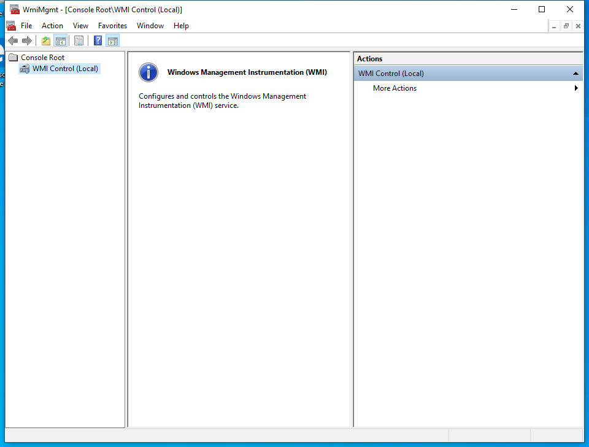

---
title: WmiMgmt.msc | 
excerpt: What is WmiMgmt.msc?
---

# WmiMgmt.msc 

* File Path: `C:\Windows\system32\WmiMgmt.msc`
* Description: WmiMgmt - [Console Root\WMI Control (Local)] (Window Title)

## Screenshot

## Hashes

Type | Hash
-- | --
MD5 | `E0ADDCE97EE521C9AC4F53EE17A05BD5`
SHA1 | `2F8DD03B0433FA5D511AB80546A95037A1EB178D`
SHA256 | `E18A549B10943645361372EBB7871FD23A0608A84AE0405FF1BE946AB8BDC1EE`
SHA384 | `0E0BE5A11DAE7E9AA9FDA51EC35053FA61FCBF126B24C14D927180C93F38D33F88177AC71B26CB8D3AD3DBE2E0749540`
SHA512 | `D396B8B2D86D7331CAC2E183B869224905A3FF7CF33300CD60DD8E5E55BF31D6170322624EE3AE18FF41D647C1E65177252654A64FF5FE5C74778F17E6ECFCD4`
SSDEEP | `384:ll04OzLxJj55N4Z6TAbcJNeoJkWL3YhABOD8hE72BZaY4eI02N1iaFxAMNHvQ1Xy:ELxJZmbCNeoJjC2BZaY4e12y4v2g3`
PESHA1 | `2F8DD03B0433FA5D511AB80546A95037A1EB178D`
PE256 | `E18A549B10943645361372EBB7871FD23A0608A84AE0405FF1BE946AB8BDC1EE`

## Runtime Data

### Window Title:
WmiMgmt - [Console Root\WMI Control (Local)]

### Open Handles:

Path | Type
-- | --
(R-D)   C:\Windows\Fonts\StaticCache.dat | File
(R-D)   C:\Windows\System32\en-US\KernelBase.dll.mui | File
(R-D)   C:\Windows\System32\en-US\MFC42u.dll.mui | File
(R-D)   C:\Windows\System32\en-US\mmc.exe.mui | File
(R-D)   C:\Windows\System32\en-US\mmcbase.dll.mui | File
(R-D)   C:\Windows\System32\en-US\mmcndmgr.dll.mui | File
(R-D)   C:\Windows\System32\en-US\user32.dll.mui | File
(R-D)   C:\Windows\System32\wbem\en-US\wbemcntl.dll.mui | File
(R-D)   C:\Windows\SystemResources\mmcbase.dll.mun | File
(R-D)   C:\Windows\SystemResources\mmcndmgr.dll.mun | File
(RW-)   C:\Users\user | File
(RW-)   C:\Windows\WinSxS\amd64_microsoft.windows.common-controls_6595b64144ccf1df_5.82.19041.488_none_4238de57f6b64d28 | File
(RW-)   C:\Windows\WinSxS\amd64_microsoft.windows.common-controls_6595b64144ccf1df_6.0.19041.746_none_ca02b4b61b8320a4 | File
\BaseNamedObjects\__ComCatalogCache__ | Section
\BaseNamedObjects\C:\*ProgramData\*Microsoft\*Windows\*Caches\*{6AF0698E-D558-4F6E-9B3C-3716689AF493}.2.ver0x0000000000000002.db | Section
\BaseNamedObjects\C:\*ProgramData\*Microsoft\*Windows\*Caches\*{DDF571F2-BE98-426D-8288-1A9A39C3FDA2}.2.ver0x0000000000000002.db | Section
\BaseNamedObjects\C:\*ProgramData\*Microsoft\*Windows\*Caches\*cversions.2 | Section
\BaseNamedObjects\NLS_CodePage_1252_3_2_0_0 | Section
\BaseNamedObjects\NLS_CodePage_437_3_2_0_0 | Section
\BaseNamedObjects\windows_shell_global_counters | Section
\Sessions\1\BaseNamedObjects\23e8HWNDInterface:9004bc | Section
\Sessions\1\BaseNamedObjects\23e8HWNDInterface:d10540 | Section
\Sessions\1\BaseNamedObjects\SessionImmersiveColorPreference | Section
\Sessions\1\BaseNamedObjects\windows_shell_global_counters | Section
\Sessions\1\Windows\Theme3205582532 | Section
\Windows\Theme3800351183 | Section

### Loaded Modules:

Path |
-- |
C:\Windows\SYSTEM32\apphelp.dll |
C:\Windows\System32\KERNEL32.DLL |
C:\Windows\System32\KERNELBASE.dll |
C:\Windows\SYSTEM32\mmc.exe |
C:\Windows\SYSTEM32\ntdll.dll |

## Signature

* Status: Signature verified.
* Serial: `3300000266BD1580EFA75CD6D3000000000266`
* Thumbprint: `A4341B9FD50FB9964283220A36A1EF6F6FAA7840`
* Issuer: CN=Microsoft Windows Production PCA 2011, O=Microsoft Corporation, L=Redmond, S=Washington, C=US
* Subject: CN=Microsoft Windows, O=Microsoft Corporation, L=Redmond, S=Washington, C=US

## File Metadata

* Original Filename: 
* Product Name: 
* Company Name: 
* File Version: 
* Product Version: 
* Language: 
* Legal Copyright: 

## File Scan

* VirusTotal Detections: 0/76
* VirusTotal Link: https://www.virustotal.com/gui/file/e18a549b10943645361372ebb7871fd23a0608a84ae0405ff1be946ab8bdc1ee/detection

## File Similarity (ssdeep match)

File | Score
-- | --
[C:\Windows\system32\en-US\WmiMgmt.msc](WmiMgmt.msc-E0ADDCE97EE521C9AC4F53EE17A05BD5.md) | 100

MIT License. Copyright (c) 2020-2021 Strontic.

