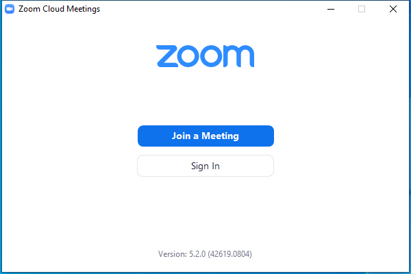

---
title: Zoom.exe | Zoom Meetings
excerpt: What is Zoom.exe?
---

# Zoom.exe 

* File Path: `C:\program files (x86)\Zoom\bin\Zoom.exe`
* Description: Zoom Meetings
* Comments: Zoom

## Screenshot

## Hashes

Type | Hash
-- | --
MD5 | `65CA9E0DF3C8B0D76BB0126B0C593A3C`
SHA1 | `300C9AB04B41CDF662857D6CDF6E73381FF398A9`
SHA256 | `00E8008A3B4BFE3D7D0C58EB8F8BE0F8A635D44179410C8459FB9CBDFFBCBC80`
SHA384 | `9D52A02986F802668EB4B1AB598BA613615A6DC5D7964B9C9E643D326F8DAD4298B9939C529D8D9DE3161B015B00391C`
SHA512 | `06B76A425AADE6DEB7EFBB1A0D5DAB6607DC87602562DB7B6220FA6D4E4B202741DEBB4CBCCE7F5FF9D5B17BA0056386ADA79FAFC2A6F56C753AE3A0505551EC`
SSDEEP | `3072:SDUgnzYh4YW8oqp5R4a4rzluvs9Sjo1CsEBCQ/mErfEqrgsmlp3vKpRB0+9:SggnzYh4YW8oqp5R4a8CrBUqEvCpRB06`

## Runtime Data

### Window Title:
Zoom Cloud Meetings

### Open Handles:

Path | Type
-- | --
(R-D)   C:\Windows\Fonts\StaticCache.dat | File
(R-D)   C:\Windows\System32\en-US\crypt32.dll.mui | File
(R-D)   C:\Windows\System32\en-US\KernelBase.dll.mui | File
(R-D)   C:\Windows\WinSxS\x86_microsoft.windows.c..-controls.resources_6595b64144ccf1df_6.0.19041.1_en-us_130e63d987a738df\comctl32.dll.mui | File
(RW-)   C:\Users\user\AppData\Roaming\Zoom\appsafecheck.txt | File
(RW-)   C:\Users\user\AppData\Roaming\Zoom\data\zoomus.enc.db | File
(RW-)   C:\Users\user\AppData\Roaming\Zoom\data\zoomus.tmp.enc.db | File
(RW-)   C:\Users\user\Documents | File
(RW-)   C:\Windows | File
(RW-)   C:\Windows\WinSxS\x86_microsoft.windows.c..-controls.resources_6595b64144ccf1df_6.0.19041.1_en-us_130e63d987a738df | File
(RW-)   C:\Windows\WinSxS\x86_microsoft.windows.common-controls_6595b64144ccf1df_6.0.19041.1_none_fd031af45b0106f2 | File
(RW-)   C:\Windows\WinSxS\x86_microsoft.windows.gdiplus_6595b64144ccf1df_1.1.19041.450_none_4294d6e08a97344a | File
\BaseNamedObjects\__ComCatalogCache__ | Section
\BaseNamedObjects\C:\*ProgramData\*Microsoft\*Windows\*Caches\*{6AF0698E-D558-4F6E-9B3C-3716689AF493}.2.ver0x0000000000000002.db | Section
\BaseNamedObjects\C:\*ProgramData\*Microsoft\*Windows\*Caches\*{DDF571F2-BE98-426D-8288-1A9A39C3FDA2}.2.ver0x0000000000000001.db | Section
\BaseNamedObjects\C:\*ProgramData\*Microsoft\*Windows\*Caches\*cversions.2.ro | Section
\BaseNamedObjects\NLS_CodePage_1252_3_2_0_0 | Section
\BaseNamedObjects\NLS_CodePage_437_3_2_0_0 | Section
\BaseNamedObjects\windows_shell_global_counters | Section
\Sessions\1\BaseNamedObjects\103e9adc-7b31-4414-93b7-3f2633235b8f | Section
\Sessions\1\BaseNamedObjects\windows_shell_global_counters | Section
\Sessions\1\BaseNamedObjects\windows_webcache_counters_{9B6AB5B3-91BC-4097-835C-EA2DEC95E9CC}_S-1-5-21-2047949552-857980807-821054962-504 | Section
\Sessions\1\Windows\Theme4048709601 | Section
\Windows\Theme603176458 | Section

### Loaded Modules:

Path |
-- |
C:\program files (x86)\Zoom\bin\Zoom.exe |
C:\Windows\SYSTEM32\ntdll.dll |
C:\Windows\System32\wow64.dll |
C:\Windows\System32\wow64cpu.dll |
C:\Windows\System32\wow64win.dll |

## Signature

* Status: Signature verified.
* Serial: `0510C6B2FF7AB71C786EF572239B1243`
* Thumbprint: `0F9ADA46756C17EFFFD467D10654E2A766566CB3`
* Issuer: CN=DigiCert EV Code Signing CA (SHA2), OU=www.digicert.com, O=DigiCert Inc, C=US
* Subject: CN="Zoom Video Communications, Inc.", O="Zoom Video Communications, Inc.", L=San Jose, S=California, C=US, SERIALNUMBER=4969967, OID.2.5.4.15=Private Organization, OID.1.3.6.1.4.1.311.60.2.1.2=Delaware, OID.1.3.6.1.4.1.311.60.2.1.3=US

## File Metadata

* Original Filename: Zoom
* Product Name: Zoom
* Company Name: Zoom Video Communications, Inc.
* File Version: 5,2,44052,0816
* Product Version: 5,2,44052,0816
* Language: English (United States)
* Legal Copyright:  Zoom Video Communications, Inc. All rights reserved.

## File Similarity (ssdeep match)

File | Score
-- | --
[C:\Program Files (x86)\Zoom\bin\Zoom.exe](Zoom.exe-0B1A5820D639D1F99EF6BCA5406F69C6.md) | 36
[C:\Program Files (x86)\Zoom\bin\Zoom.exe](Zoom.exe-59A1CFFFD1A4736E6C7C31840D6DF90C.md) | 41
[C:\Program Files (x86)\Zoom\bin\Zoom.exe](Zoom.exe-EF568D198B3DEDB38FCC19FA94950B06.md) | 40
[C:\Program Files (x86)\Zoom\bin\ZoomDocConverter.exe](ZoomDocConverter.exe-6FA586963D8EACAF21B0B3175E19E14A.md) | 33
[C:\Program Files (x86)\Zoom\bin\ZoomDocConverter.exe](ZoomDocConverter.exe-8697E1745C1F8819A3B35611FA3B5694.md) | 33
[C:\program files (x86)\Zoom\bin\ZoomDocConverter.exe](ZoomDocConverter.exe-99C31B5AA52C51669444A916B3C02BB7.md) | 35
[C:\Program Files (x86)\Zoom\bin\ZoomDocConverter.exe](ZoomDocConverter.exe-F5575E3999B99035CFAC687907102B12.md) | 32
[C:\Program Files (x86)\Zoom\bin\zTscoder.exe](zTscoder.exe-02B12B5F0587796022DF4C9B71C25F70.md) | 29
[C:\Program Files (x86)\Zoom\bin\zTscoder.exe](zTscoder.exe-685CB56B9EEE21EE835A68392709D89B.md) | 30
[C:\program files (x86)\Zoom\bin\zTscoder.exe](zTscoder.exe-DEAB73614D4D7C0807C5391FED75035A.md) | 33
[C:\Program Files (x86)\Zoom\bin\zTscoder.exe](zTscoder.exe-F95816E6ED240884AA0AA47BCE0229B4.md) | 32

MIT License. Copyright (c) 2020-2021 Strontic.

