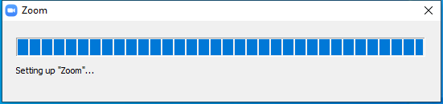

---
title: Zoom_launcher.exe | Zoom
excerpt: What is Zoom_launcher.exe?
---

# Zoom_launcher.exe 

* File Path: `C:\Program Files (x86)\Zoom\bin\Zoom_launcher.exe`
* Description: Zoom
* Comments: Zoom

## Screenshot

## Hashes

Type | Hash
-- | --
MD5 | `FFEBD6A3E1403DDBD5B6358218AE9993`
SHA1 | `8B905EBBBA043B93542E6758AA5D3522E9FC94D1`
SHA256 | `A92FB46CEEA991EB38FC320DEE41A30D09DE8E7D6B4FE042338A0401716CD619`
SHA384 | `A417F3A66FA0737FF935700FA521A7ECF4C0F7C07C39BC962FEBD7FF93B5FEE4D39207D95C501B92D3B26940A38620EC`
SHA512 | `B468257DB1487F74C60A623E1C89BFB8BA7AE69913E818AA3800C27A4CE5CE5DC5BA0A97BC5F510A6A052677E9FBB5DA9D14EE6A349BF9B26930D47F0D2859E0`
SSDEEP | `6144:mFz8oOzVLKi7eMZwBD+vpwujJDuEz/LPp0lvCpRBP7LiZr:mG9zVLKseMZGCvjJDuEz/LhhwZr`
IMP | `46E463A679FB6B220854E275744B017A`
PESHA1 | `72BDBCE4226CEBF319D8CB2774CAE7CB3C61F7D0`
PE256 | `2B10A0C6AB560F9A51B07641AC3954E9CF8832BF2525EE58D260D9A57419CE97`

## Runtime Data

### Window Title:
Zoom

### Open Handles:

Path | Type
-- | --
(---)   C:\Users\user\AppData\Roaming\Zoom\ZoomDownload\Zoom.msi | File
(R-D)   C:\Windows\Fonts\StaticCache.dat | File
(R-D)   C:\Windows\System32\en-US\crypt32.dll.mui | File
(R-D)   C:\Windows\System32\en-US\mswsock.dll.mui | File
(RW-)   C:\Windows | File
(RW-)   C:\Windows\WinSxS\x86_microsoft.windows.common-controls_6595b64144ccf1df_5.82.19041.488_none_89e6152f0b32762e | File
(RW-)   C:\xCyclopedia | File
\BaseNamedObjects\F932B6C7-3A20-46A0-B8A0-8894AA421973 | Section
\BaseNamedObjects\NLS_CodePage_1252_3_2_0_0 | Section
\BaseNamedObjects\NLS_CodePage_437_3_2_0_0 | Section
\Sessions\1\BaseNamedObjects\UrlZonesSM_user | Section
\Sessions\1\BaseNamedObjects\windows_shell_global_counters | Section
\Sessions\1\BaseNamedObjects\windows_webcache_counters_{9B6AB5B3-91BC-4097-835C-EA2DEC95E9CC}_S-1-5-21-2047949552-857980807-821054962-504 | Section
\Sessions\1\Windows\Theme2547664911 | Section
\Windows\Theme3854699184 | Section

### Loaded Modules:

Path |
-- |
C:\Program Files (x86)\Zoom\bin\Zoom_launcher.exe |
C:\Windows\SYSTEM32\ntdll.dll |
C:\Windows\System32\wow64.dll |
C:\Windows\System32\wow64cpu.dll |
C:\Windows\System32\wow64win.dll |

## Signature

* Status: Signature verified.
* Serial: `0510C6B2FF7AB71C786EF572239B1243`
* Thumbprint: `0F9ADA46756C17EFFFD467D10654E2A766566CB3`
* Issuer: CN=DigiCert EV Code Signing CA (SHA2), OU=www.digicert.com, O=DigiCert Inc, C=US
* Subject: CN="Zoom Video Communications, Inc.", O="Zoom Video Communications, Inc.", L=San Jose, S=California, C=US, SERIALNUMBER=4969967, OID.2.5.4.15=Private Organization, OID.1.3.6.1.4.1.311.60.2.1.2=Delaware, OID.1.3.6.1.4.1.311.60.2.1.3=US

## File Metadata

* Original Filename: Zoom
* Product Name: Zoom
* Company Name: Zoom Video Communications, Inc.
* File Version: 5,3,52670,0921
* Product Version: 5,3,52670,0921
* Language: English (United States)
* Legal Copyright:  Zoom Video Communications, Inc. All rights reserved.
* Machine Type: 32-bit

## File Scan

* VirusTotal Detections: 0/70
* VirusTotal Link: https://www.virustotal.com/gui/file/a92fb46ceea991eb38fc320dee41a30d09de8e7d6b4fe042338a0401716cd619/detection/

MIT License. Copyright (c) 2020-2021 Strontic.

