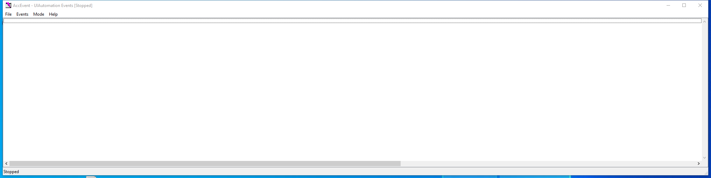

---
title: accevent.exe | Accessible Event Watcher (64-bit UNICODE Release)
excerpt: What is accevent.exe?
---

# accevent.exe 

* File Path: `C:\Program Files (x86)\Windows Kits\10\bin\10.0.19041.0\x64\accevent.exe`
* Description: Accessible Event Watcher (64-bit UNICODE Release)

## Screenshot

## Hashes

Type | Hash
-- | --
MD5 | `499CAE98F79635D60CC333400963554E`
SHA1 | `8CE29B08A90A7475323703341C1FACC9DF459C72`
SHA256 | `6917FB723925188A1C1B9A88BA279FD9FC9EF374B8895AAC7BCE00E0D1F05E7B`
SHA384 | `4E318FE67EC110CFFE82932982FC1077BD0F408C52A8E4D798CF57CDD1F37F7F48C4C679A5F5FDB8A1C1F430DF50CD3F`
SHA512 | `9BB0971669FA0B0C46DCF927E71BC073B0AB06D4ED15F6518C809E7344A1C09126F0D5F3268C9605FD2E104DDE22378CC401FE89C1452A446D1D07479F432C53`
SSDEEP | `3072:yc4gVryv9MLzq9VTuF63OBTd9XXhijscGP4PPgz3UMKYMKhCfNIHlr1JryPeXXOq:f4gVmczqJ3whijscGP4PPgz3UMKYMKhv`
IMP | `6ACE1C3BCA2847724E06F3A9E6815C0A`
PESHA1 | `2179AE8D65091F8C6AFDA43BE9432F5C7D5F9343`
PE256 | `7FA5FC5616C155423768882B9A871B9FAC03136FC1EAA40C7B8E90C01FCC9F35`

## Runtime Data

### Window Title:
AccEvent - UIAutomation Events [Stopped]

### Open Handles:

Path | Type
-- | --
(R-D)   C:\Windows\Fonts\StaticCache.dat | File
(RW-)   C:\Users\user | File
(RW-)   C:\Windows\System32 | File
(RW-)   C:\Windows\WinSxS\amd64_microsoft.windows.common-controls_6595b64144ccf1df_6.0.19041.488_none_ca04af081b815d21 | File
\BaseNamedObjects\__ComCatalogCache__ | Section
\BaseNamedObjects\C:\*ProgramData\*Microsoft\*Windows\*Caches\*{6AF0698E-D558-4F6E-9B3C-3716689AF493}.2.ver0x0000000000000002.db | Section
\BaseNamedObjects\C:\*ProgramData\*Microsoft\*Windows\*Caches\*{DDF571F2-BE98-426D-8288-1A9A39C3FDA2}.2.ver0x0000000000000002.db | Section
\BaseNamedObjects\C:\*ProgramData\*Microsoft\*Windows\*Caches\*cversions.2 | Section
\BaseNamedObjects\NLS_CodePage_1252_3_2_0_0 | Section
\BaseNamedObjects\NLS_CodePage_437_3_2_0_0 | Section
\Sessions\1\Windows\Theme1383959086 | Section
\Windows\Theme2042523233 | Section

### Loaded Modules:

Path |
-- |
C:\Program Files (x86)\Windows Kits\10\bin\10.0.19041.0\x64\accevent.exe |
C:\Windows\System32\ADVAPI32.dll |
C:\Windows\System32\GDI32.dll |
C:\Windows\System32\gdi32full.dll |
C:\Windows\System32\KERNEL32.DLL |
C:\Windows\System32\KERNELBASE.dll |
C:\Windows\System32\msvcp_win.dll |
C:\Windows\System32\msvcrt.dll |
C:\Windows\SYSTEM32\ntdll.dll |
C:\Windows\System32\RPCRT4.dll |
C:\Windows\System32\sechost.dll |
C:\Windows\System32\ucrtbase.dll |
C:\Windows\System32\USER32.dll |
C:\Windows\System32\win32u.dll |

## Signature

* Status: Signature verified.
* Serial: `33000002CF6D2CC57CAA65A6D80000000002CF`
* Thumbprint: `1A221B3B4FEF088B17BA6704FD088DF192D9E0EF`
* Issuer: CN=Microsoft Code Signing PCA 2010, O=Microsoft Corporation, L=Redmond, S=Washington, C=US
* Subject: CN=Microsoft Corporation, O=Microsoft Corporation, L=Redmond, S=Washington, C=US

## File Metadata

* Original Filename: ACCEVENT.EXE
* Product Name: Microsoft Active Accessibility
* Company Name: Microsoft Corporation
* File Version: 7.2.0.0
* Product Version: 7.2.0.0
* Language: English (United States)
* Legal Copyright:  2012 Microsoft Corporation. All rights reserved.
* Machine Type: 64-bit

## File Scan

* VirusTotal Detections: Unknown

## File Similarity (ssdeep match)

File | Score
-- | --
[C:\Program Files (x86)\Windows Kits\10\bin\10.0.19041.0\arm64\accevent.exe](accevent.exe-EE4E6F4157D2F4A00810ECF85D685644.md) | 60
[C:\Program Files (x86)\Windows Kits\10\bin\10.0.19041.0\arm64\inspect.exe](inspect.exe-C2BE3E8768023C282F359DDC71B9D2C0.md) | 32
[C:\Program Files (x86)\Windows Kits\10\bin\10.0.19041.0\x64\inspect.exe](inspect.exe-6F5AEEA6E52F989AB14616FE0BC9D668.md) | 30

MIT License. Copyright (c) 2020-2021 Strontic.

