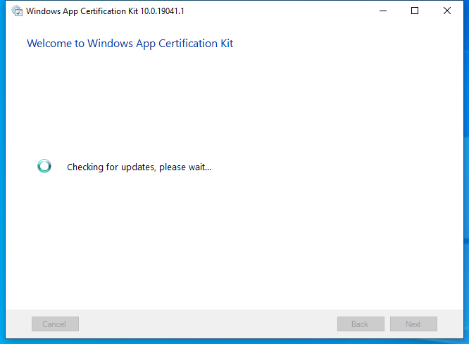

---
title: appcertui.exe | Windows App Certification Kit
excerpt: What is appcertui.exe?
---

# appcertui.exe 

* File Path: `C:\Program Files (x86)\Windows Kits\10\App Certification Kit\appcertui.exe`
* Description: Windows App Certification Kit

## Screenshot

## Hashes

Type | Hash
-- | --
MD5 | `7D8AE72EFA1EA28946A79F7E6B21B06D`
SHA1 | `8381E5087CC79A11091F2D575DAF2ED791806B67`
SHA256 | `E10DBCECA3299AFB2DDE5B22063B26E84C7311A7D002ADD4FF0D22E41D4AC4D0`
SHA384 | `8717982077E2599DEB8D63C038AE660711F20E3E4D08941921DDA1BDF96535C5C043BA89370C0E337CEF9652CF84A96F`
SHA512 | `A7AFEA3CA6E620831D2B93A9945BD8D6870E5A7FC5D18471032778F2FA3A5CE2E2CB04D91E4342A5646935265397CD26B1BBD0432454E219525C6D5681110263`
SSDEEP | `3072:p+2KJ2ufJo8YI8ROB/WD0vWFYeW8qURpqHzz/gZ7nIVOAw085X6hFDZDWPlOavC:p+DJJoRK/2C+6sjIVOAw0XZWEwC`
IMP | `n/a`
PESHA1 | `21B58CF7D67BC3014C85057C883DDAC516DC3117`
PE256 | `E528B993D75605413DE440F833878E4C76FA89A3103A1A2491675876E9B4FB3A`

## Runtime Data

### Child Processes:
csrss.exe wininit.exe

### Window Title:
Windows App Certification Kit 10.0.19041.1

### Open Handles:

Path | Type
-- | --
(R-D)   C:\Program Files (x86)\Windows Kits\10\App Certification Kit\en\appcertui.resources.dll | File
(R-D)   C:\Program Files (x86)\Windows Kits\10\App Certification Kit\microsoft.ae.dll | File
(R-D)   C:\Program Files (x86)\Windows Kits\10\App Certification Kit\Microsoft.AE.Windows.dll | File
(R-D)   C:\Program Files (x86)\Windows Kits\10\App Certification Kit\Microsoft.Diagnostics.Tracing.EventSource.dll | File
(R-D)   C:\Program Files (x86)\Windows Kits\10\App Certification Kit\microsoft.windows.softwarelogo.shared.dll | File
(R-D)   C:\Program Files (x86)\Windows Kits\10\App Certification Kit\microsoft.windows.softwarelogo.userinterface.common.dll | File
(R-D)   C:\Program Files (x86)\Windows Kits\10\App Certification Kit\microsoft.windows.softwarelogo.userinterface.workflows.dll | File
(R-D)   C:\Windows\Microsoft.NET\assembly\GAC_64\mscorlib\v4.0_4.0.0.0__b77a5c561934e089\mscorlib.dll | File
(R-D)   C:\Windows\Microsoft.NET\assembly\GAC_MSIL\Accessibility\v4.0_4.0.0.0__b03f5f7f11d50a3a\Accessibility.dll | File
(R-D)   C:\Windows\Microsoft.NET\assembly\GAC_MSIL\System.Configuration\v4.0_4.0.0.0__b03f5f7f11d50a3a\System.Configuration.dll | File
(R-D)   C:\Windows\Microsoft.NET\assembly\GAC_MSIL\System.Drawing\v4.0_4.0.0.0__b03f5f7f11d50a3a\System.Drawing.dll | File
(R-D)   C:\Windows\Microsoft.NET\assembly\GAC_MSIL\System.Windows.Forms\v4.0_4.0.0.0__b77a5c561934e089\System.Windows.Forms.dll | File
(R-D)   C:\Windows\Microsoft.NET\assembly\GAC_MSIL\System.Xml\v4.0_4.0.0.0__b77a5c561934e089\System.XML.dll | File
(R-D)   C:\Windows\Microsoft.NET\assembly\GAC_MSIL\System\v4.0_4.0.0.0__b77a5c561934e089\System.dll | File
(R-D)   C:\Windows\System32\en-US\KernelBase.dll.mui | File
(R-D)   C:\Windows\System32\en-US\winnlsres.dll.mui | File
(RW-)   C:\Users\user | File
(RW-)   C:\Windows\WinSxS\amd64_microsoft.windows.common-controls_6595b64144ccf1df_5.82.19041.488_none_4238de57f6b64d28 | File
(RW-)   C:\Windows\WinSxS\amd64_microsoft.windows.gdiplus_6595b64144ccf1df_1.1.19041.685_none_faeca4db76168538 | File
\...\Cor_SxSPublic_IPCBlock | Section
\BaseNamedObjects\C:\*ProgramData\*Microsoft\*Windows\*Caches\*{6AF0698E-D558-4F6E-9B3C-3716689AF493}.2.ver0x0000000000000002.db | Section
\BaseNamedObjects\C:\*ProgramData\*Microsoft\*Windows\*Caches\*{DDF571F2-BE98-426D-8288-1A9A39C3FDA2}.2.ver0x0000000000000002.db | Section
\BaseNamedObjects\C:\*ProgramData\*Microsoft\*Windows\*Caches\*cversions.2 | Section
\BaseNamedObjects\Cor_Private_IPCBlock_v4_9704 | Section
\BaseNamedObjects\NLS_CodePage_1252_3_2_0_0 | Section
\BaseNamedObjects\NLS_CodePage_437_3_2_0_0 | Section
\Sessions\1\BaseNamedObjects\windows_shell_global_counters | Section
\Sessions\1\Windows\Theme1383959086 | Section
\Windows\Theme2042523233 | Section

### Loaded Modules:

Path |
-- |
C:\Program Files (x86)\Windows Kits\10\App Certification Kit\appcertui.exe |
C:\Windows\System32\ADVAPI32.dll |
C:\Windows\System32\KERNEL32.dll |
C:\Windows\System32\KERNELBASE.dll |
C:\Windows\SYSTEM32\MSCOREE.DLL |
C:\Windows\System32\msvcrt.dll |
C:\Windows\SYSTEM32\ntdll.dll |
C:\Windows\System32\RPCRT4.dll |
C:\Windows\System32\sechost.dll |

## Signature

* Status: Signature verified.
* Serial: `33000002CF6D2CC57CAA65A6D80000000002CF`
* Thumbprint: `1A221B3B4FEF088B17BA6704FD088DF192D9E0EF`
* Issuer: CN=Microsoft Code Signing PCA 2010, O=Microsoft Corporation, L=Redmond, S=Washington, C=US
* Subject: CN=Microsoft Corporation, O=Microsoft Corporation, L=Redmond, S=Washington, C=US

## File Metadata

* Original Filename: appcertui.exe
* Product Name: Windows App Certification Kit
* Company Name: Microsoft Corporation
* File Version: 10.0.19041.1 (WinBuild.160101.0800)
* Product Version: 10.0.19041.1
* Language: English (United States)
* Legal Copyright:  Microsoft Corporation. All rights reserved.
* Machine Type: 64-bit

## File Scan

* VirusTotal Detections: 0/73
* VirusTotal Link: https://www.virustotal.com/gui/file/e10dbceca3299afb2dde5b22063b26e84c7311a7d002add4ff0d22e41d4ac4d0/detection

## File Similarity (ssdeep match)

File | Score
-- | --
[C:\Program Files (x86)\Windows Kits\10\App Certification Kit\cs\appcertui.resources.dll](appcertui.resources.dll-8CAAC47BE550AFB3A21BAA9B65047B1B.md) | 69
[C:\Program Files (x86)\Windows Kits\10\App Certification Kit\cs\Microsoft.Windows.SoftwareLogo.UserInterface.Workflows.resources.dll](Microsoft.Windows.SoftwareLogo.UserInterface.Workflows.resources.dll-EAAF5F9B4F24B082D58F2293E2A1AC7D.md) | 72
[C:\Program Files (x86)\Windows Kits\10\App Certification Kit\de\appcertui.resources.dll](appcertui.resources.dll-4142BDC92945435FA121DFB4FF8900D0.md) | 69
[C:\Program Files (x86)\Windows Kits\10\App Certification Kit\de\Microsoft.Windows.SoftwareLogo.UserInterface.Workflows.resources.dll](Microsoft.Windows.SoftwareLogo.UserInterface.Workflows.resources.dll-9935E42C3B1355FB224F2C22D4B521D8.md) | 66
[C:\Program Files (x86)\Windows Kits\10\App Certification Kit\en\appcertui.resources.dll](appcertui.resources.dll-01D10ED04E8F1D4E91B7C808EADC5C03.md) | 69
[C:\Program Files (x86)\Windows Kits\10\App Certification Kit\en\Microsoft.Windows.SoftwareLogo.UserInterface.Workflows.resources.dll](Microsoft.Windows.SoftwareLogo.UserInterface.Workflows.resources.dll-F6453A002B978873B8084A285193C6EA.md) | 68
[C:\Program Files (x86)\Windows Kits\10\App Certification Kit\es\appcertui.resources.dll](appcertui.resources.dll-64714F35AB8D65DDFB5DA17E6F2A81A4.md) | 68
[C:\Program Files (x86)\Windows Kits\10\App Certification Kit\es\Microsoft.Windows.SoftwareLogo.UserInterface.Workflows.resources.dll](Microsoft.Windows.SoftwareLogo.UserInterface.Workflows.resources.dll-92D5CBDC3EE3C74C51898D05CCA35652.md) | 66
[C:\Program Files (x86)\Windows Kits\10\App Certification Kit\fr\appcertui.resources.dll](appcertui.resources.dll-492AB3709839B7C226E3A80793241476.md) | 68
[C:\Program Files (x86)\Windows Kits\10\App Certification Kit\fr\Microsoft.Windows.SoftwareLogo.UserInterface.Workflows.resources.dll](Microsoft.Windows.SoftwareLogo.UserInterface.Workflows.resources.dll-9C4106C841004F06C1DE18281A966525.md) | 68
[C:\Program Files (x86)\Windows Kits\10\App Certification Kit\it\appcertui.resources.dll](appcertui.resources.dll-4A84E63614BC42309584F72BAA8E4089.md) | 68
[C:\Program Files (x86)\Windows Kits\10\App Certification Kit\it\Microsoft.Windows.SoftwareLogo.UserInterface.Workflows.resources.dll](Microsoft.Windows.SoftwareLogo.UserInterface.Workflows.resources.dll-C4C1337F98FD8980ACD98CAA4FAF12BC.md) | 69
[C:\Program Files (x86)\Windows Kits\10\App Certification Kit\ja\appcertui.resources.dll](appcertui.resources.dll-6BC3E2839344E72EFD953607511AFC04.md) | 69
[C:\Program Files (x86)\Windows Kits\10\App Certification Kit\ja\Microsoft.Windows.SoftwareLogo.UserInterface.Workflows.resources.dll](Microsoft.Windows.SoftwareLogo.UserInterface.Workflows.resources.dll-2D73624D59531F202E29A6DEAF48B9D2.md) | 66
[C:\Program Files (x86)\Windows Kits\10\App Certification Kit\ko\appcertui.resources.dll](appcertui.resources.dll-A50F9D21D814DC7B805CDB17393B45A7.md) | 72
[C:\Program Files (x86)\Windows Kits\10\App Certification Kit\ko\Microsoft.Windows.SoftwareLogo.UserInterface.Workflows.resources.dll](Microsoft.Windows.SoftwareLogo.UserInterface.Workflows.resources.dll-1BC7DDCF4D3879A36722C370BCFC1336.md) | 68
[C:\Program Files (x86)\Windows Kits\10\App Certification Kit\microsoft.windows.softwarelogo.userinterface.workflows.dll](microsoft.windows.softwarelogo.userinterface.workflows.dll-4BBBAA3AB73EE70D4480EC501F66255B.md) | 41
[C:\Program Files (x86)\Windows Kits\10\App Certification Kit\pl\appcertui.resources.dll](appcertui.resources.dll-22C8F15AC0056448461EBF1B227C46D0.md) | 68
[C:\Program Files (x86)\Windows Kits\10\App Certification Kit\pl\Microsoft.Windows.SoftwareLogo.UserInterface.Workflows.resources.dll](Microsoft.Windows.SoftwareLogo.UserInterface.Workflows.resources.dll-79423AAD33D503C1F34A32A675C48D8B.md) | 68
[C:\Program Files (x86)\Windows Kits\10\App Certification Kit\pt-br\appcertui.resources.dll](appcertui.resources.dll-87E1244A21D7F40D816BF2967582938C.md) | 69
[C:\Program Files (x86)\Windows Kits\10\App Certification Kit\pt-br\Microsoft.Windows.SoftwareLogo.UserInterface.Workflows.resources.dll](Microsoft.Windows.SoftwareLogo.UserInterface.Workflows.resources.dll-56ACB054723B5CF1F6977215D3F48EE6.md) | 71
[C:\Program Files (x86)\Windows Kits\10\App Certification Kit\qps-ploc\appcertui.resources.dll](appcertui.resources.dll-760B580F70A0613235C78036C7B5B3E1.md) | 69
[C:\Program Files (x86)\Windows Kits\10\App Certification Kit\qps-ploc\Microsoft.Windows.SoftwareLogo.UserInterface.Workflows.resources.dll](Microsoft.Windows.SoftwareLogo.UserInterface.Workflows.resources.dll-9FD1A1529DBEF8F3340F4FF1B82A32C0.md) | 68
[C:\Program Files (x86)\Windows Kits\10\App Certification Kit\ru\appcertui.resources.dll](appcertui.resources.dll-0E404120DDCB5B820E7D8DDD0A8461E7.md) | 68
[C:\Program Files (x86)\Windows Kits\10\App Certification Kit\ru\Microsoft.Windows.SoftwareLogo.UserInterface.Workflows.resources.dll](Microsoft.Windows.SoftwareLogo.UserInterface.Workflows.resources.dll-63329657A1B5DA787396CF18946517AB.md) | 66
[C:\Program Files (x86)\Windows Kits\10\App Certification Kit\tr\appcertui.resources.dll](appcertui.resources.dll-4A0C7C3CB0118AF0B460DE37E81C79A5.md) | 69
[C:\Program Files (x86)\Windows Kits\10\App Certification Kit\tr\Microsoft.Windows.SoftwareLogo.UserInterface.Workflows.resources.dll](Microsoft.Windows.SoftwareLogo.UserInterface.Workflows.resources.dll-DB57363485E1084F288D04FB0B8464B7.md) | 69
[C:\Program Files (x86)\Windows Kits\10\App Certification Kit\zh-hans\appcertui.resources.dll](appcertui.resources.dll-8EF2A6A8F18454A15FDA2E0C37098952.md) | 68
[C:\Program Files (x86)\Windows Kits\10\App Certification Kit\zh-hans\Microsoft.Windows.SoftwareLogo.UserInterface.Workflows.resources.dll](Microsoft.Windows.SoftwareLogo.UserInterface.Workflows.resources.dll-066B7E59BFB26F7A98DF00EB32403A3B.md) | 66
[C:\Program Files (x86)\Windows Kits\10\App Certification Kit\zh-hant\appcertui.resources.dll](appcertui.resources.dll-CA51B183B4779E6BB968F8ED78876CF0.md) | 69
[C:\Program Files (x86)\Windows Kits\10\App Certification Kit\zh-hant\Microsoft.Windows.SoftwareLogo.UserInterface.Workflows.resources.dll](Microsoft.Windows.SoftwareLogo.UserInterface.Workflows.resources.dll-F19755EC24DC36C0717F57DBA63A2795.md) | 66

MIT License. Copyright (c) 2020 Strontic.

