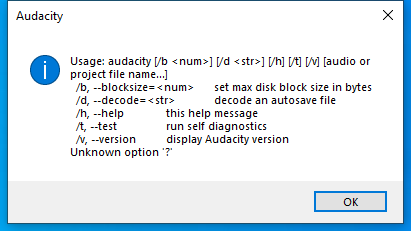

---
title: audacity.exe | Audacity Cross-Platform Sound Editor
---

# audacity.exe 

* File Path: `C:\Program Files (x86)\Audacity\audacity.exe`
* Description: Audacity Cross-Platform Sound Editor

## Screenshot

## Hashes

Type | Hash
-- | --
MD5 | `7967B8F8CD538CCE5378EF7C36DE6FC4`
SHA1 | `D1F5013AE1C8295D116F7DDD44D2507328B19B31`
SHA256 | `02239A8C897496BA9F03AC967AF2CA5A03221BE83D8E7339097EDBFFC2B96E37`
SHA384 | `7F7450BB6538EC99A00AE3B81D4A508FA7CF8A6C68383200492031AAEE1CA9DBA4F7C097B2CF309FAA3A4D8C72AA0895`
SHA512 | `3754BA0ACD5B776ED3D8404E88FFCCC092F353E2BB9207B55F478FFD9511F062FF185FB433146B2811A350BEA456B42872A7C3C2D199A7CD7FD05568EE9EE0F0`
SSDEEP | `196608:v/Tp1rRkHitW0liJmogNmBeQ9WZvT7c2CwKUJ6u:3DRkHOmBL9CvTQm`

## Signature

* Status: The file C:\Program Files (x86)\Audacity\audacity.exe is not digitally signed. You cannot run this script on the current system. For more information about running scripts and setting execution policy, see about_Execution_Policies at https:/go.microsoft.com/fwlink/?LinkID=135170
* Serial: ``
* Thumbprint: ``
* Issuer: 
* Subject: 

## File Metadata

* Original Filename: Audacity.exe
* Product Name: Audacity
* Company Name: Audacity Team
* File Version: 2,4,2,0
* Product Version: 2,4,2,0
* Language: English (United States)
* Legal Copyright: Copyright  2018. All rights reserved.

MIT License. Copyright (c) 2020 Strontic.

