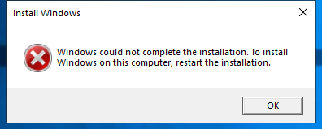

---
title: audit.exe | Audit
excerpt: What is audit.exe?
---

# audit.exe 

* File Path: `C:\WINDOWS\system32\oobe\audit.exe`
* Description: Audit

## Screenshot

## Hashes

Type | Hash
-- | --
MD5 | `64D3E6166E6745B4FC61098620E05784`
SHA1 | `71572EF736887580FFDA5125D1F7844BE4AFB9ED`
SHA256 | `B9E65643F65B75FEB6469705E8B0306F67D457B7F58EC3BF277E638DA2CF7839`
SHA384 | `A9D8F9EE79342B2F14EEE62FD94F8268FDF27396BBAE564C2DF9493866089075A66B0E2933B4A3BBE07B10489BFF1CF1`
SHA512 | `F1CFE55A72A41808A4457293A78CD6CC2927F432F5B82792D3235B77B0BBFCCFA7C43476E038248936BA7D731428E043FDB44BEFFBF1EB4FA77A99621532D18D`
SSDEEP | `1536:3rppAJ6k28LEKHjJSuy+nGvHEC2t1NIW4FAiRGFQEnE3LPaZJzv82KzOx8+dypSF:4kpAxDJzDxC2yFRwmLCPT82KzE8p/fi`
IMP | `AA718AA2BBC15B5CD3427E2BCEC14DC6`
PESHA1 | `3C058390676760AC8FF49CCC0538909968439F0F`
PE256 | `4632D188B9EF0365A1CA116E33ACD698C935403779C8DFCB435DC794DAE8B9F3`

## Runtime Data

### Window Title:
Install Windows

### Open Handles:

Path | Type
-- | --
(R-D)   C:\Windows\Fonts\StaticCache.dat | File
(R-D)   C:\Windows\System32\oobe\en-US\audit.exe.mui | File
(RW-)   C:\Windows\Panther\UnattendGC\diagerr.xml | File
(RW-)   C:\Windows\Panther\UnattendGC\diagwrn.xml | File
(RW-)   C:\Windows\Panther\UnattendGC\setupact.log | File
(RW-)   C:\Windows\Panther\UnattendGC\setuperr.log | File
(RW-)   C:\Windows\System32 | File
\BaseNamedObjects\C:\*ProgramData\*Microsoft\*Windows\*Caches\*{6AF0698E-D558-4F6E-9B3C-3716689AF493}.2.ver0x0000000000000001.db | Section
\BaseNamedObjects\C:\*ProgramData\*Microsoft\*Windows\*Caches\*{DDF571F2-BE98-426D-8288-1A9A39C3FDA2}.2.ver0x0000000000000001.db | Section
\BaseNamedObjects\C:\*ProgramData\*Microsoft\*Windows\*Caches\*cversions.2.ro | Section
\BaseNamedObjects\SetupLogSection | Section
\Sessions\2\BaseNamedObjects\NLS_CodePage_1252_3_2_0_0 | Section
\Sessions\2\BaseNamedObjects\NLS_CodePage_437_3_2_0_0 | Section
\Sessions\2\Windows\Theme1077709572 | Section
\Windows\Theme3461253685 | Section

### Loaded Modules:

Path |
-- |
C:\WINDOWS\System32\combase.dll |
C:\WINDOWS\System32\KERNEL32.DLL |
C:\WINDOWS\System32\KERNELBASE.dll |
C:\WINDOWS\System32\msvcrt.dll |
C:\WINDOWS\SYSTEM32\ntdll.dll |
C:\WINDOWS\system32\oobe\audit.exe |

## Signature

* Status: Signature verified.
* Serial: `33000002ED2C45E4C145CF48440000000002ED`
* Thumbprint: `312860D2047EB81F8F58C29FF19ECDB4C634CF6A`
* Issuer: CN=Microsoft Windows Production PCA 2011, O=Microsoft Corporation, L=Redmond, S=Washington, C=US
* Subject: CN=Microsoft Windows, O=Microsoft Corporation, L=Redmond, S=Washington, C=US

## File Metadata

* Original Filename: AUDIT.EXE.MUI
* Product Name: Microsoft Windows Operating System
* Company Name: Microsoft Corporation
* File Version: 10.0.22000.120 (WinBuild.160101.0800)
* Product Version: 10.0.22000.120
* Language: English (United States)
* Legal Copyright:  Microsoft Corporation. All rights reserved.
* Machine Type: 64-bit

## File Scan

* VirusTotal Detections: 1/71
* VirusTotal Link: https://www.virustotal.com/gui/file/b9e65643f65b75feb6469705e8b0306f67d457b7f58ec3bf277e638da2cf7839/detection

MIT License. Copyright (c) 2020-2021 Strontic.

