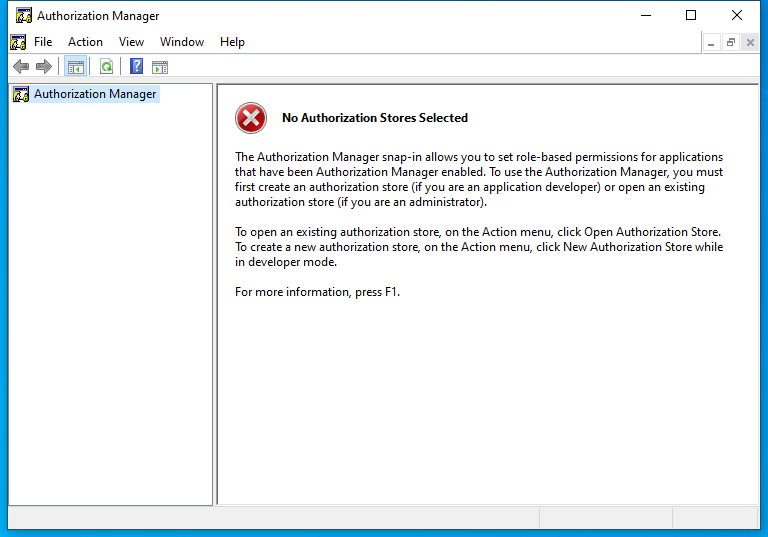

---
title: azman.msc | 
excerpt: What is azman.msc?
---

# azman.msc 

* File Path: `C:\Windows\system32\azman.msc`
* Description: Authorization Manager (Window Title)

## Screenshot

## Hashes

Type | Hash
-- | --
MD5 | `C5B3E109B3B88B0CC420304EA7BF6B70`
SHA1 | `75C0F59C487BDB4EFB937FB996730F696ADE0530`
SHA256 | `2457BBFC5BFEE27705FBAD896EE28327FFBAD20D56BF333F837711E0CFA20180`
SHA384 | `70E23CDC60BDDCE6B53B36635696829AA65906F65EF410305C1FF58BDDAE00625B8C9BF1433DACE96404BEE93D3D5EF7`
SHA512 | `E0F6B4EFEF1C96CA1B101EEED65F87BF3823B60AE4CC80CFE077C7840D4E2757E8789F08FD1DD37372FF39348CFF900DB0B3E1CE29DC55A0ED98506F65264EA3`
SSDEEP | `192:wPZ/vtP4EfpAs41Yqjghaj7P7yzLYykP7yHPDP7yjP7y6H:0Nss4zj7PUYVPEDPoP9H`
PESHA1 | `75C0F59C487BDB4EFB937FB996730F696ADE0530`
PE256 | `2457BBFC5BFEE27705FBAD896EE28327FFBAD20D56BF333F837711E0CFA20180`

## Runtime Data

### Window Title:
Authorization Manager

### Open Handles:

Path | Type
-- | --
(R-D)   C:\Windows\Fonts\StaticCache.dat | File
(R-D)   C:\Windows\System32\en-US\azroleui.dll.mui | File
(R-D)   C:\Windows\System32\en-US\KernelBase.dll.mui | File
(R-D)   C:\Windows\System32\en-US\MFC42u.dll.mui | File
(R-D)   C:\Windows\System32\en-US\mmc.exe.mui | File
(R-D)   C:\Windows\System32\en-US\mmcbase.dll.mui | File
(R-D)   C:\Windows\System32\en-US\mmcndmgr.dll.mui | File
(R-D)   C:\Windows\System32\en-US\user32.dll.mui | File
(R-D)   C:\Windows\SystemResources\mmcbase.dll.mun | File
(R-D)   C:\Windows\SystemResources\mmcndmgr.dll.mun | File
(RW-)   C:\Users\user | File
(RW-)   C:\Windows\WinSxS\amd64_microsoft.windows.common-controls_6595b64144ccf1df_5.82.19041.488_none_4238de57f6b64d28 | File
(RW-)   C:\Windows\WinSxS\amd64_microsoft.windows.common-controls_6595b64144ccf1df_6.0.19041.746_none_ca02b4b61b8320a4 | File
\BaseNamedObjects\__ComCatalogCache__ | Section
\BaseNamedObjects\C:\*ProgramData\*Microsoft\*Windows\*Caches\*{6AF0698E-D558-4F6E-9B3C-3716689AF493}.2.ver0x0000000000000002.db | Section
\BaseNamedObjects\C:\*ProgramData\*Microsoft\*Windows\*Caches\*{DDF571F2-BE98-426D-8288-1A9A39C3FDA2}.2.ver0x0000000000000002.db | Section
\BaseNamedObjects\C:\*ProgramData\*Microsoft\*Windows\*Caches\*cversions.2 | Section
\BaseNamedObjects\NLS_CodePage_1252_3_2_0_0 | Section
\BaseNamedObjects\NLS_CodePage_437_3_2_0_0 | Section
\BaseNamedObjects\windows_shell_global_counters | Section
\Sessions\1\BaseNamedObjects\d20HWNDInterface:26202a0 | Section
\Sessions\1\BaseNamedObjects\d20HWNDInterface:370556 | Section
\Sessions\1\BaseNamedObjects\SessionImmersiveColorPreference | Section
\Sessions\1\BaseNamedObjects\windows_shell_global_counters | Section
\Sessions\1\Windows\Theme3205582532 | Section
\Windows\Theme3800351183 | Section

### Loaded Modules:

Path |
-- |
C:\Windows\SYSTEM32\AcGenral.dll |
C:\Windows\SYSTEM32\apphelp.dll |
C:\Windows\System32\KERNEL32.DLL |
C:\Windows\System32\KERNELBASE.dll |
C:\Windows\SYSTEM32\mmc.exe |
C:\Windows\System32\msvcrt.dll |
C:\Windows\SYSTEM32\ntdll.dll |
C:\Windows\System32\RPCRT4.dll |
C:\Windows\System32\sechost.dll |

## Signature

* Status: Signature verified.
* Serial: `3300000266BD1580EFA75CD6D3000000000266`
* Thumbprint: `A4341B9FD50FB9964283220A36A1EF6F6FAA7840`
* Issuer: CN=Microsoft Windows Production PCA 2011, O=Microsoft Corporation, L=Redmond, S=Washington, C=US
* Subject: CN=Microsoft Windows, O=Microsoft Corporation, L=Redmond, S=Washington, C=US

## File Metadata

* Original Filename: 
* Product Name: 
* Company Name: 
* File Version: 
* Product Version: 
* Language: 
* Legal Copyright: 

## File Scan

* VirusTotal Detections: 0/75
* VirusTotal Link: https://www.virustotal.com/gui/file/2457bbfc5bfee27705fbad896ee28327ffbad20d56bf333f837711e0cfa20180/detection

## File Similarity (ssdeep match)

File | Score
-- | --
[C:\Windows\system32\en-US\azman.msc](azman.msc-C5B3E109B3B88B0CC420304EA7BF6B70.md) | 100
[C:\Windows\system32\en-US\rsop.msc](rsop.msc-49525986566A050AA233A428AA50D83F.md) | 41
[C:\Windows\system32\rsop.msc](rsop.msc-49525986566A050AA233A428AA50D83F.md) | 41
[C:\Windows\SysWOW64\azman.msc](azman.msc-C5B3E109B3B88B0CC420304EA7BF6B70.md) | 100
[C:\Windows\SysWOW64\en-US\azman.msc](azman.msc-C5B3E109B3B88B0CC420304EA7BF6B70.md) | 100
[C:\Windows\SysWOW64\en-US\rsop.msc](rsop.msc-49525986566A050AA233A428AA50D83F.md) | 41
[C:\Windows\SysWOW64\rsop.msc](rsop.msc-49525986566A050AA233A428AA50D83F.md) | 41

MIT License. Copyright (c) 2020-2021 Strontic.

