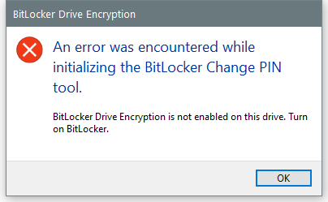

---
title: bdechangepin.exe | BitLocker Drive Encryption: PIN Change Tool
---

# bdechangepin.exe 

* File Path: `C:\Windows\system32\bdechangepin.exe`
* Description: BitLocker Drive Encryption: PIN Change Tool

## Screenshot

## Hashes

Type | Hash
-- | --
MD5 | `F58E82580EC2E892BDC9BDFCA1EE9FB7`
SHA1 | `7DC8F2E61CBB44A9BFD8FBAE4F936483FA7B1E33`
SHA256 | `B6D905244DE5F8B472F2C1528FF87674E6C397A2D4522CF340F7B8E538261DC6`
SHA384 | `B9215092E18BE8E1888DC0CE5E9385ABE5039EE5919979933D5C0D420969957334EB0C2EF73B81FA8B2879DD67ECCEA7`
SHA512 | `7B4B4ED1B1E61563715F1E5896DD7BA4168F15B82A369F8621079315306D9C80569B18628FF80E2ABD3202592DCA8CB8E19A4DD7D91ED813A14578EFE9BC1ADF`
SSDEEP | `6144:HVHv9HVxHEVHHHQVb1kHVqHVqHQQ9T8TXT5ThT2HVfAXTWT6TITQTMVyW176eIs/:xvH+S+`

## Signature

* Status: Signature verified.
* Serial: `3300000266BD1580EFA75CD6D3000000000266`
* Thumbprint: `A4341B9FD50FB9964283220A36A1EF6F6FAA7840`
* Issuer: CN=Microsoft Windows Production PCA 2011, O=Microsoft Corporation, L=Redmond, S=Washington, C=US
* Subject: CN=Microsoft Windows, O=Microsoft Corporation, L=Redmond, S=Washington, C=US

## File Metadata

* Original Filename: bdechangepin.exe.mui
* Product Name: Microsoft Windows Operating System
* Company Name: Microsoft Corporation
* File Version: 10.0.19041.1 (WinBuild.160101.0800)
* Product Version: 10.0.19041.1
* Language: English (United States)
* Legal Copyright:  Microsoft Corporation. All rights reserved.

## File Similarity (ssdeep match)

File | Score
-- | --
[C:\WINDOWS\system32\bdechangepin.exe](bdechangepin.exe-237877714A318D9E9766014BA859831F.md) | 74
[C:\Windows\system32\bdechangepin.exe](bdechangepin.exe-5EEE93027DABB96684475B1041B1CA5D.md) | 74

MIT License. Copyright (c) 2020 Strontic.

