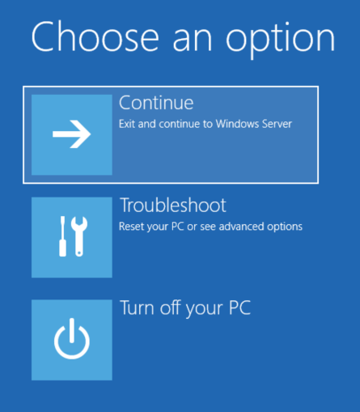

---
title: bootim.exe | boot immersive menus
---

# bootim.exe 

* File Path: `C:\Windows\system32\bootim.exe`
* Description: boot immersive menus

## Screenshot

## Hashes

Type | Hash
-- | --
MD5 | `DF4E5C0AB1332332EB4C4E2BA35E3873`
SHA1 | `0B24F4DB350881372DCB6A51C1DA3890EAFEBE20`
SHA256 | `B495453D533B88387CCB2D8D03B990131161CCA2EF30E93E26D1EA267891ED45`
SHA384 | `6C0231E09F7BA339441B5766D827D1E7244D6CD9B9232F1CCF44CEBF653BD9035FECBBC4C66D249E1AE80C7044259121`
SHA512 | `A331FE77C2B18697D73F333E1ADA944EB31C9438BFA28AB67738215BE7BF4322AFA7DC5426AB81D5D29489ABA8DC4DACA67F4E3E765D90D3C67C88EBEDA4CA88`
SSDEEP | `768:G9FtEU+i2u88EoO7nwF2IDech22GBw6n:CpUuBqwFLecfGBw6n`

## Signature

* Status: Signature verified.
* Serial: `330000023241FB59996DCC4DFF000000000232`
* Thumbprint: `FF82BC38E1DA5E596DF374C53E3617F7EDA36B06`
* Issuer: CN=Microsoft Windows Production PCA 2011, O=Microsoft Corporation, L=Redmond, S=Washington, C=US
* Subject: CN=Microsoft Windows, O=Microsoft Corporation, L=Redmond, S=Washington, C=US

## File Metadata

* Original Filename: bootim.exe
* Product Name: Microsoft Windows Operating System
* Company Name: Microsoft Corporation
* File Version: 10.0.19041.1 (WinBuild.160101.0800)
* Product Version: 10.0.19041.1
* Language: English (United States)
* Legal Copyright:  Microsoft Corporation. All rights reserved.

MIT License. Copyright (c) 2020 Strontic.

