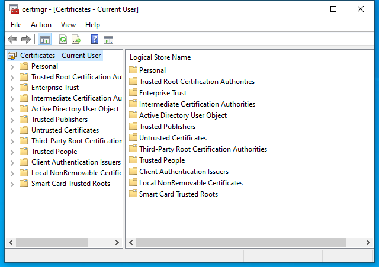

---
title: certmgr.msc | 
excerpt: What is certmgr.msc?
---

# certmgr.msc 

* File Path: `C:\Windows\system32\certmgr.msc`
* Description: certmgr - [Certificates - Current User] (Window Title)

## Screenshot

## Hashes

Type | Hash
-- | --
MD5 | `4C7390A1FF613FBBF59141CA0BE8AE89`
SHA1 | `1D33193A30CD686E543F74094F04BA3B11D8F68F`
SHA256 | `D79C0D2369818F893074AF14404F57848BB1327DFAFFDE83C82D7D165135FA4F`
SHA384 | `88C526C819890243E7288330D18A87481315BC5203844105455D09874306C07201B0171FC5E664D9CC801E7898085DC4`
SHA512 | `FACDF3B7ED11FCC1C953CC3EA6430145E3FAAD8CFCB729DB1E336444BB805DF09E43D5F0263F050992AE35AE5FF44A6FFF7E7C7BFC3F16C4B4CFF9F963A93EBD`
SSDEEP | `384:SHe6Zz48hWT/1zWj4DLfPHo9dXS79N3xPeMy7L:SeSz9C/1zWj4DLfPI9NMlkH`
PESHA1 | `1D33193A30CD686E543F74094F04BA3B11D8F68F`
PE256 | `D79C0D2369818F893074AF14404F57848BB1327DFAFFDE83C82D7D165135FA4F`

## Runtime Data

### Window Title:
certmgr - [Certificates - Current User]

### Open Handles:

Path | Type
-- | --
(R-D)   C:\Windows\Fonts\StaticCache.dat | File
(R-D)   C:\Windows\System32\en-US\aclui.dll.mui | File
(R-D)   C:\Windows\System32\en-US\certmgr.dll.mui | File
(R-D)   C:\Windows\System32\en-US\crypt32.dll.mui | File
(R-D)   C:\Windows\System32\en-US\KernelBase.dll.mui | File
(R-D)   C:\Windows\System32\en-US\MFC42u.dll.mui | File
(R-D)   C:\Windows\System32\en-US\mmc.exe.mui | File
(R-D)   C:\Windows\System32\en-US\mmcbase.dll.mui | File
(R-D)   C:\Windows\System32\en-US\mmcndmgr.dll.mui | File
(R-D)   C:\Windows\System32\en-US\user32.dll.mui | File
(R-D)   C:\Windows\SystemResources\mmcbase.dll.mun | File
(R-D)   C:\Windows\SystemResources\mmcndmgr.dll.mun | File
(RW-)   C:\Users\user | File
(RW-)   C:\Windows\System32 | File
(RW-)   C:\Windows\WinSxS\amd64_microsoft.windows.common-controls_6595b64144ccf1df_5.82.19041.488_none_4238de57f6b64d28 | File
(RW-)   C:\Windows\WinSxS\amd64_microsoft.windows.common-controls_6595b64144ccf1df_6.0.19041.746_none_ca02b4b61b8320a4 | File
\BaseNamedObjects\__ComCatalogCache__ | Section
\BaseNamedObjects\C:\*ProgramData\*Microsoft\*Windows\*Caches\*{6AF0698E-D558-4F6E-9B3C-3716689AF493}.2.ver0x0000000000000002.db | Section
\BaseNamedObjects\C:\*ProgramData\*Microsoft\*Windows\*Caches\*{DDF571F2-BE98-426D-8288-1A9A39C3FDA2}.2.ver0x0000000000000002.db | Section
\BaseNamedObjects\C:\*ProgramData\*Microsoft\*Windows\*Caches\*cversions.2 | Section
\BaseNamedObjects\NLS_CodePage_1252_3_2_0_0 | Section
\BaseNamedObjects\NLS_CodePage_437_3_2_0_0 | Section
\BaseNamedObjects\windows_shell_global_counters | Section
\Sessions\1\BaseNamedObjects\223cHWNDInterface:2605a8 | Section
\Sessions\1\BaseNamedObjects\223cHWNDInterface:5f0554 | Section
\Sessions\1\BaseNamedObjects\SessionImmersiveColorPreference | Section
\Sessions\1\BaseNamedObjects\windows_shell_global_counters | Section
\Sessions\1\Windows\Theme3205582532 | Section
\Windows\Theme3800351183 | Section

### Loaded Modules:

Path |
-- |
C:\Windows\SYSTEM32\apphelp.dll |
C:\Windows\System32\KERNEL32.DLL |
C:\Windows\System32\KERNELBASE.dll |
C:\Windows\SYSTEM32\mmc.exe |
C:\Windows\SYSTEM32\ntdll.dll |

## Signature

* Status: Signature verified.
* Serial: `3300000266BD1580EFA75CD6D3000000000266`
* Thumbprint: `A4341B9FD50FB9964283220A36A1EF6F6FAA7840`
* Issuer: CN=Microsoft Windows Production PCA 2011, O=Microsoft Corporation, L=Redmond, S=Washington, C=US
* Subject: CN=Microsoft Windows, O=Microsoft Corporation, L=Redmond, S=Washington, C=US

## File Metadata

* Original Filename: 
* Product Name: 
* Company Name: 
* File Version: 
* Product Version: 
* Language: 
* Legal Copyright: 

## File Scan

* VirusTotal Detections: 0/76
* VirusTotal Link: https://www.virustotal.com/gui/file/d79c0d2369818f893074af14404f57848bb1327dfaffde83c82d7d165135fa4f/detection

## File Similarity (ssdeep match)

File | Score
-- | --
[C:\Windows\system32\certlm.msc](certlm.msc-DCCA682FEA47192106EC4F2001EAE182.md) | 93
[C:\Windows\system32\en-US\certlm.msc](certlm.msc-DCCA682FEA47192106EC4F2001EAE182.md) | 93
[C:\Windows\system32\en-US\certmgr.msc](certmgr.msc-4C7390A1FF613FBBF59141CA0BE8AE89.md) | 100
[C:\Windows\system32\en-US\gpedit.msc](gpedit.msc-6C054DA115C2CA2C523ABD159ED7814B.md) | 33
[C:\Windows\system32\en-US\printmanagement.msc](printmanagement.msc-4856202475EFE0D66FA11EE1DCF6D0D3.md) | 44
[C:\Windows\system32\en-US\tpm.msc](tpm.msc-9359341F78E00134B527814B4868ECD5.md) | 44
[C:\Windows\system32\gpedit.msc](gpedit.msc-6C054DA115C2CA2C523ABD159ED7814B.md) | 33
[C:\Windows\system32\printmanagement.msc](printmanagement.msc-4856202475EFE0D66FA11EE1DCF6D0D3.md) | 44
[C:\Windows\system32\tpm.msc](tpm.msc-9359341F78E00134B527814B4868ECD5.md) | 44
[C:\Windows\SysWOW64\certlm.msc](certlm.msc-DCCA682FEA47192106EC4F2001EAE182.md) | 93
[C:\Windows\SysWOW64\certmgr.msc](certmgr.msc-4C7390A1FF613FBBF59141CA0BE8AE89.md) | 100
[C:\Windows\SysWOW64\en-US\gpedit.msc](gpedit.msc-6C054DA115C2CA2C523ABD159ED7814B.md) | 33
[C:\Windows\SysWOW64\gpedit.msc](gpedit.msc-6C054DA115C2CA2C523ABD159ED7814B.md) | 33
[C:\Windows\SysWOW64\tpm.msc](tpm.msc-9359341F78E00134B527814B4868ECD5.md) | 44

MIT License. Copyright (c) 2020-2021 Strontic.

