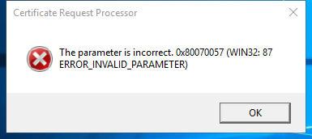

---
title: certreq.exe | CertReq.exe
---

# certreq.exe 

* File Path: `C:\WINDOWS\SysWOW64\certreq.exe`
* Description: CertReq.exe

## Screenshot



## Hashes

Type | Hash
-- | --
MD5 | `1B7605D3ABAF54DDC4A36114BD183B50`
SHA1 | `76C1FCDEB4BC7EF3E3971AAB8C36C62E25DA33DE`
SHA256 | `12F4C455B0A8E3E0B679841AEF920616D43DD2898B780C23A962236A5F2B8A09`
SHA384 | `05502452A80F6D89FC96E9CEB5B9B6F4D87B767D0994893A1175C81B38DB25E21FE07082AA1013F1C21E72FF933EA8DF`
SHA512 | `25214FCAE7123445540601F9A6B2217123FA431490E4083FE971BDF107D20DD17DD1425DEB01678269F994B44F44B3350A2F88C90CE602B37C20262EF3A2DF48`
SSDEEP | `6144:ywwR7re3Aw043EWZg/DUK4imJCeBySNaz79qXquhWTeM6MoSXhzdHdfzV44h:TOgAZfUKDmJCeBJNav9qXquExdd7C4h`

## Runtime Data

### Usage (stdout):
```Batchfile
Usage:
  CertReq -?
  CertReq [-v] -?
  CertReq [-Command] -?

  CertReq [-Submit] [Options] [RequestFileIn [CertFileOut [CertChainFileOut [FullResponseFileOut]]]]
    Submit a request to a Certification Authority.

  Options:
    -attrib AttributeString
    -binary
    -PolicyServer PolicyServer
    -config ConfigString
    -Anonymous
    -Kerberos
    -ClientCertificate ClientCertId
    -UserName UserName
    -p Password
    -crl
    -rpc
    -AdminForceMachine
    -RenewOnBehalfOf
    -NoChallenge

  CertReq -Retrieve [Options] RequestId [CertFileOut [CertChainFileOut [FullResponseFileOut]]]
    Retrieve a response to a previous request from a Certification Authority.

  Options:
    -binary
    -PolicyServer PolicyServer
    -config ConfigString
    -Anonymous
    -Kerberos
    -ClientCertificate ClientCertId
    -UserName UserName
    -p Password
    -crl
    -rpc
    -AdminForceMachine

  CertReq -New [Options] [PolicyFileIn [RequestFileOut]]
    Create a new request as directed by PolicyFileIn

  Options:
    -attrib AttributeString
    -binary
    -cert CertId
    -PolicyServer PolicyServer
    -config ConfigString
    -Anonymous
    -Kerberos
    -ClientCertificate ClientCertId
    -UserName UserName
    -p Password
    -pin Pin
    -user
    -machine
    -xchg ExchangeCertFile

  CertReq -Accept [Options] [CertChainFileIn | FullResponseFileIn | CertFileIn]
    Accept and install a response to a previous new request.

  Options:
    -user 
    -machine 
    -pin Pin

  CertReq -Policy [Options] [RequestFileIn [PolicyFileIn [RequestFileOut [PKCS10FileOut]]]]
    Construct a cross certification or qualified subordination request
    from an existing CA certificate or from an existing request.

  Options:
    -attrib AttributeString
    -binary
    -cert CertId
    -PolicyServer PolicyServer
    -Anonymous
    -Kerberos
    -ClientCertificate ClientCertId
    -UserName UserName
    -p Password
    -pin Pin
    -noEKU
    -AlternateSignatureAlgorithm
    -HashAlgorithm HashAlgorithm

  CertReq -Sign [Options] [RequestFileIn [RequestFileOut]]
    Sign a certificate request with an enrollment agent or qualified
    subordination signing certificate.

  Options:
    -binary
    -cert CertId
    -PolicyServer PolicyServer
    -Anonymous
    -Kerberos
    -ClientCertificate ClientCertId
    -UserName UserName
    -p Password
    -pin Pin
    -crl
    -noEKU
    -HashAlgorithm HashAlgorithm

  CertReq -Enroll [Options] TemplateName
  CertReq -Enroll -cert CertId [Options] Renew [ReuseKeys]
    Enroll for or renew a certificate.

  Options:
    -PolicyServer PolicyServer
    -user 
    -machine 
    -pin Pin

  CertReq -EnrollAIK [Options] [KeyContainerName]
    Enroll for AIK certificate.

  Options:
    -config

  CertReq -EnrollCredGuardCert [Options] TemplateName [ExtensionInfFile]
    NOTE: Enrolling for machine account Credential Guard certificate is not supported on this platform.

  Options:
    Not supported on this platform

  CertReq -EnrollLogon [Options]
    Enroll for Hello for Business Logon certificate via ADFS.

  Options:
    -q

  CertReq -Post [Options]
    POST an http request.

  Options:
    -attrib AttributeString
    -config URL

Unknown argument: -help

```

### Child Processes:
conhost.exe

## Signature

* Status: Signature verified.
* Serial: `330000023241FB59996DCC4DFF000000000232`
* Thumbprint: `FF82BC38E1DA5E596DF374C53E3617F7EDA36B06`
* Issuer: CN=Microsoft Windows Production PCA 2011, O=Microsoft Corporation, L=Redmond, S=Washington, C=US
* Subject: CN=Microsoft Windows, O=Microsoft Corporation, L=Redmond, S=Washington, C=US

## File Metadata

* Original Filename: CertReq.exe
* Product Name: Microsoft Windows Operating System
* Company Name: Microsoft Corporation
* File Version: 10.0.18362.1 (WinBuild.160101.0800)
* Product Version: 10.0.18362.1
* Language: English (United States)
* Legal Copyright:  Microsoft Corporation. All rights reserved.


MIT License. Copyright (c) 2020 Strontic.


