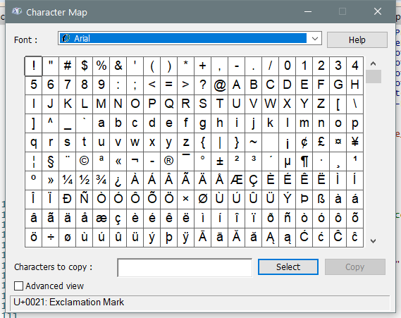

---
title: charmap.exe | Character Map
---

# charmap.exe 

* File Path: `C:\Windows\system32\charmap.exe`
* Description: Character Map

## Screenshot

## Hashes

Type | Hash
-- | --
MD5 | `9FE7E5B2973E876A0A48A2B3C3104AEB`
SHA1 | `68EBCD6019C94215568DAAF356CA71EE76C024CC`
SHA256 | `25E722D47EA9421B38E41059C73077606CAEE3EF6B6E4885E3D59F80E014B1D8`
SHA384 | `72CDE8130C5BC100328B0FCBF84A4705FE5EE1888BE749285F64341A6DF70C0F9E2F643CA48DCDD23B7F972251427D73`
SHA512 | `C2AAE18B11B743A043942948A3903E347BA5813E5B2AE3BD4CB951C745B1F9DCA80074588C9923E035319C4BE0B46ACA1ADF8CD3E042865A6794E9391A1CAE4B`
SSDEEP | `3072:ci6ND48iXJJ5G4peH4817f7UIH+XnF/buMbrLF5NUdrSO9K/tagbdDu5nB:8i5J5GK63lY7n1Dbgqt5g`

## Signature

* Status: Signature verified.
* Serial: `33000000BCE120FDD27CC8EE930000000000BC`
* Thumbprint: `E85459B23C232DB3CB94C7A56D47678F58E8E51E`
* Issuer: CN=Microsoft Windows Production PCA 2011, O=Microsoft Corporation, L=Redmond, S=Washington, C=US
* Subject: CN=Microsoft Windows, O=Microsoft Corporation, L=Redmond, S=Washington, C=US

## File Metadata

* Original Filename: charmap.exe.mui
* Product Name: Microsoft Windows Operating System
* Company Name: Microsoft Corporation
* File Version: 5.2.3668.0
* Product Version: 5.2.3668.0
* Language: English (United States)
* Legal Copyright:  Microsoft Corporation. All rights reserved.

## File Similarity (ssdeep match)

File | Score
-- | --
[C:\Windows\system32\charmap.exe](charmap.exe-56007E9A525980A3F904798CF2A65DF6.md) | 50
[C:\WINDOWS\system32\charmap.exe](charmap.exe-763D2F95751F734633EA53F15ADE3893.md) | 54
[C:\Windows\system32\charmap.exe](charmap.exe-AD1FC94B3D6E12283B0E1AF32F53005D.md) | 50
[C:\Windows\SysWOW64\charmap.exe](charmap.exe-436AB8366C52C59543BEB03F4599C01B.md) | 50
[C:\WINDOWS\SysWOW64\charmap.exe](charmap.exe-9F65E094BBB947E7AC3BB4ABB2749156.md) | 54
[C:\Windows\SysWOW64\charmap.exe](charmap.exe-B21D8C4FBAF5C9324EA279F4EE38D733.md) | 50
[C:\Windows\SysWOW64\charmap.exe](charmap.exe-E42E8639F4A99DBA11570C3B50625A2F.md) | 57

MIT License. Copyright (c) 2020 Strontic.

