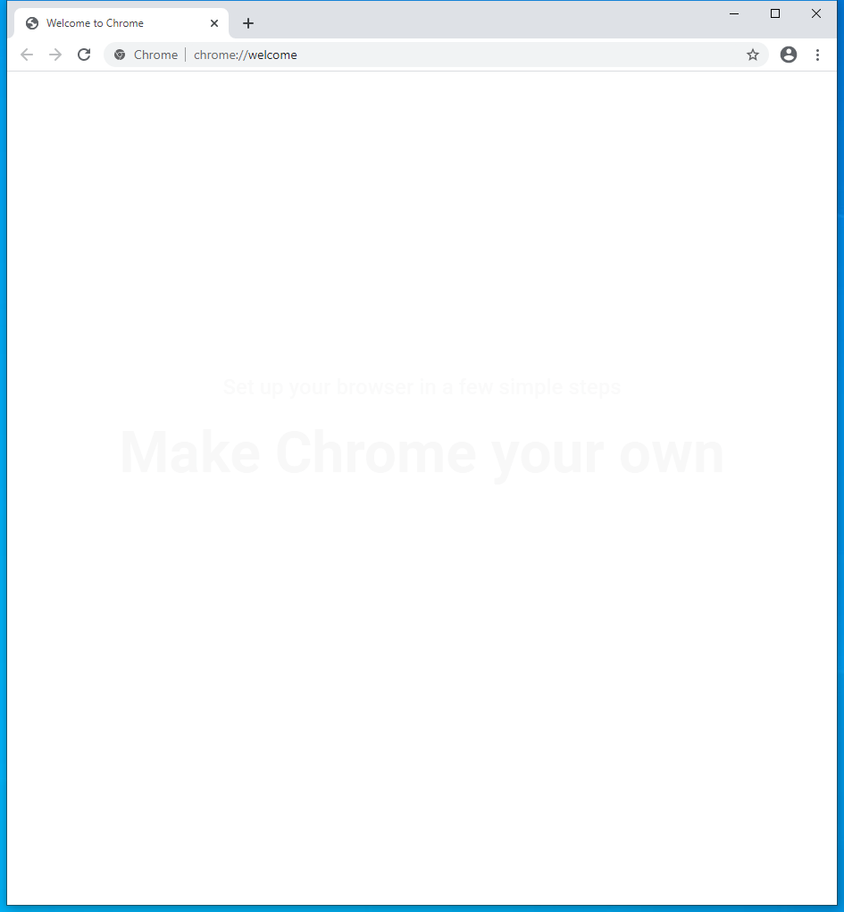

---
title: chrome.exe | Google Chrome
excerpt: What is chrome.exe?
---

# chrome.exe 

* File Path: `C:\Program Files (x86)\Google\Chrome\Application\chrome.exe`
* Description: Google Chrome

## Screenshot

## Hashes

Type | Hash
-- | --
MD5 | `184AC5D5E7A81024DD8B3A961ED70735`
SHA1 | `C571FC25BE6876C37C47C0F90BB8D1550F3A843F`
SHA256 | `7CF0BB881E8EE0B4ED43D73B4ECA634F9C1B14D2DE4DE916177BB4ED2939F16E`
SHA384 | `2F64B9479612AA8D85BD602E3E529708AC88C6DD50C26E16F2C5472581F59E4DCA037E41830AB6B1F7692F4F75E4F2B8`
SHA512 | `43C42D00CD5CA5B0D7612C17C4FF112290B46583EB456EFC98A2B27DF8CC1B4146686F7D1C5081E5AFD8B0280F8B5E2531C4E20B9C19CEFAE591FCE0FAE285DB`
SSDEEP | `24576:RmduWOgCPLdX/JmrLAWZ71C6/63V1b2vxB7CT2fg10oi:RmEWO/PLTuLrZpCnF1Kv/WTC`

## Runtime Data

### Child Processes:
chrome.exe chrome.exe chrome.exe chrome.exe chrome.exe chrome.exe chrome.exe chrome.exe chrome.exe

## Signature

* Status: Signature verified.
* Serial: `0C15BE4A15BB0903C901B1D6C265302F`
* Thumbprint: `CB7E84887F3C6015FE7EDFB4F8F36DF7DC10590E`
* Issuer: CN=DigiCert SHA2 Assured ID Code Signing CA, OU=www.digicert.com, O=DigiCert Inc, C=US
* Subject: CN=Google LLC, O=Google LLC, L=Mountain View, S=ca, C=US

## File Metadata

* Original Filename: chrome.exe
* Product Name: Google Chrome
* Company Name: Google LLC
* File Version: 84.0.4147.125
* Product Version: 84.0.4147.125
* Language: English (United States)
* Legal Copyright: Copyright 2020 Google LLC. All rights reserved.

## Possible Misuse

*The following table contains possible examples of `chrome.exe` being misused. While `chrome.exe` is **not** inherently malicious, its legitimate functionality can by abused for malicious purposes.*

Source | Source File | Example | License
-- | -- | -- | --
[sigma](https://github.com/Neo23x0/sigma) | [proxy_apt40.yml](https://github.com/Neo23x0/sigma/blob/master/rules/proxy/proxy_apt40.yml) | `c-useragent: 'Mozilla/5.0 (Windows NT 6.1; WOW64) AppleWebKit/537.36 (KHTML, like Gecko) Chrome/36.0.1985.143 Safari/537.36'` | [DRL 1.0](https://github.com/Neo23x0/sigma/blob/master/LICENSE.Detection.Rules.md)
[sigma](https://github.com/Neo23x0/sigma) | [proxy_ua_apt.yml](https://github.com/Neo23x0/sigma/blob/master/rules/proxy/proxy_ua_apt.yml) | `- 'Mozilla/5.0 (Windows NT 6.1; WOW64) Chrome/28.0.1500.95 Safari/537.36'  # Hidden Cobra malware` | [DRL 1.0](https://github.com/Neo23x0/sigma/blob/master/LICENSE.Detection.Rules.md)
[sigma](https://github.com/Neo23x0/sigma) | [proxy_ua_frameworks.yml](https://github.com/Neo23x0/sigma/blob/master/rules/proxy/proxy_ua_frameworks.yml) | `- 'Mozilla/5.0 (Windows; U; Windows NT 5.1; en-US) AppleWebKit/525.13 (KHTML, like Gecko) Chrome/4.0.221.6 Safari/525.13'` | [DRL 1.0](https://github.com/Neo23x0/sigma/blob/master/LICENSE.Detection.Rules.md)
[sigma](https://github.com/Neo23x0/sigma) | [proxy_ua_malware.yml](https://github.com/Neo23x0/sigma/blob/master/rules/proxy/proxy_ua_malware.yml) | `- 'Mozilla/5.0 (Windows NT 6.1; WOW64; rv:53.0) Gecko/20100101 Chrome /53.0'  # DargonOK` | [DRL 1.0](https://github.com/Neo23x0/sigma/blob/master/LICENSE.Detection.Rules.md)
[sigma](https://github.com/Neo23x0/sigma) | [win_alert_lsass_access.yml](https://github.com/Neo23x0/sigma/blob/master/rules/windows/builtin/win_alert_lsass_access.yml) | `- Google Chrome GoogleUpdate.exe` | [DRL 1.0](https://github.com/Neo23x0/sigma/blob/master/LICENSE.Detection.Rules.md)
[sigma](https://github.com/Neo23x0/sigma) | [win_suspicious_outbound_kerberos_connection.yml](https://github.com/Neo23x0/sigma/blob/master/rules/windows/builtin/win_suspicious_outbound_kerberos_connection.yml) | `- '\chrome.exe'` | [DRL 1.0](https://github.com/Neo23x0/sigma/blob/master/LICENSE.Detection.Rules.md)
[sigma](https://github.com/Neo23x0/sigma) | [win_user_driver_loaded.yml](https://github.com/Neo23x0/sigma/blob/master/rules/windows/builtin/win_user_driver_loaded.yml) | `- '*\Google\Chrome\Application\chrome.exe'` | [DRL 1.0](https://github.com/Neo23x0/sigma/blob/master/LICENSE.Detection.Rules.md)
[sigma](https://github.com/Neo23x0/sigma) | [sysmon_suspicious_outbound_kerberos_connection.yml](https://github.com/Neo23x0/sigma/blob/master/rules/windows/network_connection/sysmon_suspicious_outbound_kerberos_connection.yml) | `- '\chrome.exe'` | [DRL 1.0](https://github.com/Neo23x0/sigma/blob/master/LICENSE.Detection.Rules.md)
[sigma](https://github.com/Neo23x0/sigma) | [sysmon_susp_rdp.yml](https://github.com/Neo23x0/sigma/blob/master/rules/windows/network_connection/sysmon_susp_rdp.yml) | `- '*\chrome.exe'` | [DRL 1.0](https://github.com/Neo23x0/sigma/blob/master/LICENSE.Detection.Rules.md)
[sigma](https://github.com/Neo23x0/sigma) | [win_plugx_susp_exe_locations.yml](https://github.com/Neo23x0/sigma/blob/master/rules/windows/process_creation/win_plugx_susp_exe_locations.yml) | `Image: '*\Google\Chrome\application\\*'` | [DRL 1.0](https://github.com/Neo23x0/sigma/blob/master/LICENSE.Detection.Rules.md)
[sigma](https://github.com/Neo23x0/sigma) | [win_susp_powershell_parent_process.yml](https://github.com/Neo23x0/sigma/blob/master/rules/windows/process_creation/win_susp_powershell_parent_process.yml) | `- '\chrome.exe'` | [DRL 1.0](https://github.com/Neo23x0/sigma/blob/master/LICENSE.Detection.Rules.md)
[malware-ioc](https://github.com/eset/malware-ioc) | [misp-machete-event.json](https://github.com/eset/malware-ioc/blob/master/machete/misp-machete-event.json) | `"value": "Chrome.exe",` | [© ESET 2014-2018](https://github.com/eset/malware-ioc/blob/master/LICENSE)
[malware-ioc](https://github.com/eset/malware-ioc) | [misp-machete-event.json](https://github.com/eset/malware-ioc/blob/master/machete/misp-machete-event.json) | `"value": "chrome.sfx.exe",` | [© ESET 2014-2018](https://github.com/eset/malware-ioc/blob/master/LICENSE)
[malware-ioc](https://github.com/eset/malware-ioc) | [machete](https://github.com/eset/malware-ioc/blob/master/machete/README.adoc) | `=== Chrome.exe` | [© ESET 2014-2018](https://github.com/eset/malware-ioc/blob/master/LICENSE)
[malware-ioc](https://github.com/eset/malware-ioc) | [machete](https://github.com/eset/malware-ioc/blob/master/machete/README.adoc) | `\|`03929A5530639C1D9DBD395A298C59FD7EFF1DEC`\|chrome.sfx.exe` | [© ESET 2014-2018](https://github.com/eset/malware-ioc/blob/master/LICENSE)
[malware-ioc](https://github.com/eset/malware-ioc) | [machete](https://github.com/eset/malware-ioc/blob/master/machete/README.adoc) | `\|`0AC64E08E63601AD9D6A4EF019E5B374784AF80A`\|chrome.sfx.exe` | [© ESET 2014-2018](https://github.com/eset/malware-ioc/blob/master/LICENSE)
[malware-ioc](https://github.com/eset/malware-ioc) | [machete](https://github.com/eset/malware-ioc/blob/master/machete/README.adoc) | `\|`161629F63422AB34108854662313F87A278DD7F5`\|chrome.sfx.exe` | [© ESET 2014-2018](https://github.com/eset/malware-ioc/blob/master/LICENSE)
[malware-ioc](https://github.com/eset/malware-ioc) | [machete](https://github.com/eset/malware-ioc/blob/master/machete/README.adoc) | `\|`67ECBC1E9A66719C599E6DDED33A85F70DACA13E`\|chrome.sfx.exe` | [© ESET 2014-2018](https://github.com/eset/malware-ioc/blob/master/LICENSE)
[malware-ioc](https://github.com/eset/malware-ioc) | [mispadu](https://github.com/eset/malware-ioc/blob/master/mispadu/README.adoc) | `=== Google Chrome extension` | [© ESET 2014-2018](https://github.com/eset/malware-ioc/blob/master/LICENSE)
[malware-ioc](https://github.com/eset/malware-ioc) | [mispadu](https://github.com/eset/malware-ioc/blob/master/mispadu/README.adoc) | `\| `8B950BF660AA7B5FB619E1F6E665D348BF56C86A` \| Google Chrome credential stealer     \| Win32/PSWTool.ChromePass.A` | [© ESET 2014-2018](https://github.com/eset/malware-ioc/blob/master/LICENSE)
[malware-ioc](https://github.com/eset/malware-ioc) | [2020_Q2](https://github.com/eset/malware-ioc/blob/master/quarterly_reports/2020_Q2/README.adoc) | `=== Chrome addons` | [© ESET 2014-2018](https://github.com/eset/malware-ioc/blob/master/LICENSE)
[malware-ioc](https://github.com/eset/malware-ioc) | [stantinko.yar](https://github.com/eset/malware-ioc/blob/master/stantinko/stantinko.yar) | `$x1 = "Mozilla/5.0 (Windows NT 5.1) AppleWebKit/537.36 (KHTML, like Gecko) Chrome/46.0.2490.71 Safari/537.36" fullword ascii` | [© ESET 2014-2018](https://github.com/eset/malware-ioc/blob/master/LICENSE)
[atomic-red-team](https://github.com/redcanaryco/atomic-red-team) | [index.md](https://github.com/redcanaryco/atomic-red-team/blob/master/atomics/Indexes/Indexes-Markdown/index.md) | - Atomic Test #1: Chrome (Developer Mode) [linux, windows, macos] | [MIT License. © 2018 Red Canary](https://github.com/redcanaryco/atomic-red-team/blob/master/LICENSE.txt)
[atomic-red-team](https://github.com/redcanaryco/atomic-red-team) | [index.md](https://github.com/redcanaryco/atomic-red-team/blob/master/atomics/Indexes/Indexes-Markdown/index.md) | - Atomic Test #2: Chrome (Chrome Web Store) [linux, windows, macos] | [MIT License. © 2018 Red Canary](https://github.com/redcanaryco/atomic-red-team/blob/master/LICENSE.txt)
[atomic-red-team](https://github.com/redcanaryco/atomic-red-team) | [index.md](https://github.com/redcanaryco/atomic-red-team/blob/master/atomics/Indexes/Indexes-Markdown/index.md) | - Atomic Test #1: Run Chrome-password Collector [windows] | [MIT License. © 2018 Red Canary](https://github.com/redcanaryco/atomic-red-team/blob/master/LICENSE.txt)
[atomic-red-team](https://github.com/redcanaryco/atomic-red-team) | [index.md](https://github.com/redcanaryco/atomic-red-team/blob/master/atomics/Indexes/Indexes-Markdown/index.md) | - Atomic Test #3: List Google Chrome Bookmark JSON Files on macOS [macos] | [MIT License. © 2018 Red Canary](https://github.com/redcanaryco/atomic-red-team/blob/master/LICENSE.txt)
[atomic-red-team](https://github.com/redcanaryco/atomic-red-team) | [index.md](https://github.com/redcanaryco/atomic-red-team/blob/master/atomics/Indexes/Indexes-Markdown/index.md) | - Atomic Test #4: List Google Chrome Bookmarks on Windows with powershell [windows] | [MIT License. © 2018 Red Canary](https://github.com/redcanaryco/atomic-red-team/blob/master/LICENSE.txt)
[atomic-red-team](https://github.com/redcanaryco/atomic-red-team) | [index.md](https://github.com/redcanaryco/atomic-red-team/blob/master/atomics/Indexes/Indexes-Markdown/index.md) | - Atomic Test #5: List Google Chrome / Edge Chromium Bookmarks on Windows with command prompt [windows] | [MIT License. © 2018 Red Canary](https://github.com/redcanaryco/atomic-red-team/blob/master/LICENSE.txt)
[atomic-red-team](https://github.com/redcanaryco/atomic-red-team) | [linux-index.md](https://github.com/redcanaryco/atomic-red-team/blob/master/atomics/Indexes/Indexes-Markdown/linux-index.md) | - Atomic Test #1: Chrome (Developer Mode) [linux, windows, macos] | [MIT License. © 2018 Red Canary](https://github.com/redcanaryco/atomic-red-team/blob/master/LICENSE.txt)
[atomic-red-team](https://github.com/redcanaryco/atomic-red-team) | [linux-index.md](https://github.com/redcanaryco/atomic-red-team/blob/master/atomics/Indexes/Indexes-Markdown/linux-index.md) | - Atomic Test #2: Chrome (Chrome Web Store) [linux, windows, macos] | [MIT License. © 2018 Red Canary](https://github.com/redcanaryco/atomic-red-team/blob/master/LICENSE.txt)
[atomic-red-team](https://github.com/redcanaryco/atomic-red-team) | [macos-index.md](https://github.com/redcanaryco/atomic-red-team/blob/master/atomics/Indexes/Indexes-Markdown/macos-index.md) | - Atomic Test #1: Chrome (Developer Mode) [linux, windows, macos] | [MIT License. © 2018 Red Canary](https://github.com/redcanaryco/atomic-red-team/blob/master/LICENSE.txt)
[atomic-red-team](https://github.com/redcanaryco/atomic-red-team) | [macos-index.md](https://github.com/redcanaryco/atomic-red-team/blob/master/atomics/Indexes/Indexes-Markdown/macos-index.md) | - Atomic Test #2: Chrome (Chrome Web Store) [linux, windows, macos] | [MIT License. © 2018 Red Canary](https://github.com/redcanaryco/atomic-red-team/blob/master/LICENSE.txt)
[atomic-red-team](https://github.com/redcanaryco/atomic-red-team) | [macos-index.md](https://github.com/redcanaryco/atomic-red-team/blob/master/atomics/Indexes/Indexes-Markdown/macos-index.md) | - Atomic Test #3: List Google Chrome Bookmark JSON Files on macOS [macos] | [MIT License. © 2018 Red Canary](https://github.com/redcanaryco/atomic-red-team/blob/master/LICENSE.txt)
[atomic-red-team](https://github.com/redcanaryco/atomic-red-team) | [windows-index.md](https://github.com/redcanaryco/atomic-red-team/blob/master/atomics/Indexes/Indexes-Markdown/windows-index.md) | - Atomic Test #1: Chrome (Developer Mode) [linux, windows, macos] | [MIT License. © 2018 Red Canary](https://github.com/redcanaryco/atomic-red-team/blob/master/LICENSE.txt)
[atomic-red-team](https://github.com/redcanaryco/atomic-red-team) | [windows-index.md](https://github.com/redcanaryco/atomic-red-team/blob/master/atomics/Indexes/Indexes-Markdown/windows-index.md) | - Atomic Test #2: Chrome (Chrome Web Store) [linux, windows, macos] | [MIT License. © 2018 Red Canary](https://github.com/redcanaryco/atomic-red-team/blob/master/LICENSE.txt)
[atomic-red-team](https://github.com/redcanaryco/atomic-red-team) | [windows-index.md](https://github.com/redcanaryco/atomic-red-team/blob/master/atomics/Indexes/Indexes-Markdown/windows-index.md) | - Atomic Test #4: List Google Chrome Bookmarks on Windows with powershell [windows] | [MIT License. © 2018 Red Canary](https://github.com/redcanaryco/atomic-red-team/blob/master/LICENSE.txt)
[atomic-red-team](https://github.com/redcanaryco/atomic-red-team) | [windows-index.md](https://github.com/redcanaryco/atomic-red-team/blob/master/atomics/Indexes/Indexes-Markdown/windows-index.md) | - Atomic Test #5: List Google Chrome / Edge Chromium Bookmarks on Windows with command prompt [windows] | [MIT License. © 2018 Red Canary](https://github.com/redcanaryco/atomic-red-team/blob/master/LICENSE.txt)
[atomic-red-team](https://github.com/redcanaryco/atomic-red-team) | [windows-index.md](https://github.com/redcanaryco/atomic-red-team/blob/master/atomics/Indexes/Indexes-Markdown/windows-index.md) | - Atomic Test #1: Run Chrome-password Collector [windows] | [MIT License. © 2018 Red Canary](https://github.com/redcanaryco/atomic-red-team/blob/master/LICENSE.txt)
[atomic-red-team](https://github.com/redcanaryco/atomic-red-team) | [T1176.md](https://github.com/redcanaryco/atomic-red-team/blob/master/atomics/T1176/T1176.md) | <blockquote>Adversaries may abuse Internet browser extensions to establish persistence access to victim systems. Browser extensions or plugins are small programs that can add functionality and customize aspects of Internet browsers. They can be installed directly or through a browser's app store and generally have access and permissions to everything that the browser can access. (Citation: Wikipedia Browser Extension) (Citation: Chrome Extensions Definition) | [MIT License. © 2018 Red Canary](https://github.com/redcanaryco/atomic-red-team/blob/master/LICENSE.txt)
[atomic-red-team](https://github.com/redcanaryco/atomic-red-team) | [T1176.md](https://github.com/redcanaryco/atomic-red-team/blob/master/atomics/T1176/T1176.md) | Malicious extensions can be installed into a browser through malicious app store downloads masquerading as legitimate extensions, through social engineering, or by an adversary that has already compromised a system. Security can be limited on browser app stores so it may not be difficult for malicious extensions to defeat automated scanners. (Citation: Malicious Chrome Extension Numbers) Once the extension is installed, it can browse to websites in the background, (Citation: Chrome Extension Crypto Miner) (Citation: ICEBRG Chrome Extensions) steal all information that a user enters into a browser (including credentials) (Citation: Banker Google Chrome Extension Steals Creds) (Citation: Catch All Chrome Extension) and be used as an installer for a RAT for persistence. | [MIT License. © 2018 Red Canary](https://github.com/redcanaryco/atomic-red-team/blob/master/LICENSE.txt)
[atomic-red-team](https://github.com/redcanaryco/atomic-red-team) | [T1176.md](https://github.com/redcanaryco/atomic-red-team/blob/master/atomics/T1176/T1176.md) | There have also been instances of botnets using a persistent backdoor through malicious Chrome extensions. (Citation: Stantinko Botnet) There have also been similar examples of extensions being used for command & control  (Citation: Chrome Extension C2 Malware).</blockquote> | [MIT License. © 2018 Red Canary](https://github.com/redcanaryco/atomic-red-team/blob/master/LICENSE.txt)
[atomic-red-team](https://github.com/redcanaryco/atomic-red-team) | [T1176.md](https://github.com/redcanaryco/atomic-red-team/blob/master/atomics/T1176/T1176.md) | - [Atomic Test #1 - Chrome (Developer Mode)](#atomic-test-1---chrome-developer-mode) | [MIT License. © 2018 Red Canary](https://github.com/redcanaryco/atomic-red-team/blob/master/LICENSE.txt)
[atomic-red-team](https://github.com/redcanaryco/atomic-red-team) | [T1176.md](https://github.com/redcanaryco/atomic-red-team/blob/master/atomics/T1176/T1176.md) | - [Atomic Test #2 - Chrome (Chrome Web Store)](#atomic-test-2---chrome-chrome-web-store) | [MIT License. © 2018 Red Canary](https://github.com/redcanaryco/atomic-red-team/blob/master/LICENSE.txt)
[atomic-red-team](https://github.com/redcanaryco/atomic-red-team) | [T1176.md](https://github.com/redcanaryco/atomic-red-team/blob/master/atomics/T1176/T1176.md) | ## Atomic Test #1 - Chrome (Developer Mode) | [MIT License. © 2018 Red Canary](https://github.com/redcanaryco/atomic-red-team/blob/master/LICENSE.txt)
[atomic-red-team](https://github.com/redcanaryco/atomic-red-team) | [T1176.md](https://github.com/redcanaryco/atomic-red-team/blob/master/atomics/T1176/T1176.md) | Turn on Chrome developer mode and Load Extension found in the src directory | [MIT License. © 2018 Red Canary](https://github.com/redcanaryco/atomic-red-team/blob/master/LICENSE.txt)
[atomic-red-team](https://github.com/redcanaryco/atomic-red-team) | [T1176.md](https://github.com/redcanaryco/atomic-red-team/blob/master/atomics/T1176/T1176.md) | 1. Navigate to [chrome://extensions](chrome://extensions) and | [MIT License. © 2018 Red Canary](https://github.com/redcanaryco/atomic-red-team/blob/master/LICENSE.txt)
[atomic-red-team](https://github.com/redcanaryco/atomic-red-team) | [T1176.md](https://github.com/redcanaryco/atomic-red-team/blob/master/atomics/T1176/T1176.md) | ## Atomic Test #2 - Chrome (Chrome Web Store) | [MIT License. © 2018 Red Canary](https://github.com/redcanaryco/atomic-red-team/blob/master/LICENSE.txt)
[atomic-red-team](https://github.com/redcanaryco/atomic-red-team) | [T1176.md](https://github.com/redcanaryco/atomic-red-team/blob/master/atomics/T1176/T1176.md) | Install the "Minimum Viable Malicious Extension" Chrome extension | [MIT License. © 2018 Red Canary](https://github.com/redcanaryco/atomic-red-team/blob/master/LICENSE.txt)
[atomic-red-team](https://github.com/redcanaryco/atomic-red-team) | [T1176.md](https://github.com/redcanaryco/atomic-red-team/blob/master/atomics/T1176/T1176.md) | 1. Navigate to https://chrome.google.com/webstore/detail/minimum-viable-malicious/odlpfdolehmhciiebahbpnaopneicend | [MIT License. © 2018 Red Canary](https://github.com/redcanaryco/atomic-red-team/blob/master/LICENSE.txt)
[atomic-red-team](https://github.com/redcanaryco/atomic-red-team) | [T1176.md](https://github.com/redcanaryco/atomic-red-team/blob/master/atomics/T1176/T1176.md) | in Chrome | [MIT License. © 2018 Red Canary](https://github.com/redcanaryco/atomic-red-team/blob/master/LICENSE.txt)
[atomic-red-team](https://github.com/redcanaryco/atomic-red-team) | [T1176.md](https://github.com/redcanaryco/atomic-red-team/blob/master/atomics/T1176/T1176.md) | 2. Click 'Add to Chrome' | [MIT License. © 2018 Red Canary](https://github.com/redcanaryco/atomic-red-team/blob/master/LICENSE.txt)
[atomic-red-team](https://github.com/redcanaryco/atomic-red-team) | [T1217.md](https://github.com/redcanaryco/atomic-red-team/blob/master/atomics/T1217/T1217.md) | - [Atomic Test #3 - List Google Chrome Bookmark JSON Files on macOS](#atomic-test-3---list-google-chrome-bookmark-json-files-on-macos) | [MIT License. © 2018 Red Canary](https://github.com/redcanaryco/atomic-red-team/blob/master/LICENSE.txt)
[atomic-red-team](https://github.com/redcanaryco/atomic-red-team) | [T1217.md](https://github.com/redcanaryco/atomic-red-team/blob/master/atomics/T1217/T1217.md) | - [Atomic Test #4 - List Google Chrome Bookmarks on Windows with powershell](#atomic-test-4---list-google-chrome-bookmarks-on-windows-with-powershell) | [MIT License. © 2018 Red Canary](https://github.com/redcanaryco/atomic-red-team/blob/master/LICENSE.txt)
[atomic-red-team](https://github.com/redcanaryco/atomic-red-team) | [T1217.md](https://github.com/redcanaryco/atomic-red-team/blob/master/atomics/T1217/T1217.md) | - [Atomic Test #5 - List Google Chrome / Edge Chromium Bookmarks on Windows with command prompt](#atomic-test-5---list-google-chrome--edge-chromium-bookmarks-on-windows-with-command-prompt) | [MIT License. © 2018 Red Canary](https://github.com/redcanaryco/atomic-red-team/blob/master/LICENSE.txt)
[atomic-red-team](https://github.com/redcanaryco/atomic-red-team) | [T1217.md](https://github.com/redcanaryco/atomic-red-team/blob/master/atomics/T1217/T1217.md) | ## Atomic Test #3 - List Google Chrome Bookmark JSON Files on macOS | [MIT License. © 2018 Red Canary](https://github.com/redcanaryco/atomic-red-team/blob/master/LICENSE.txt)
[atomic-red-team](https://github.com/redcanaryco/atomic-red-team) | [T1217.md](https://github.com/redcanaryco/atomic-red-team/blob/master/atomics/T1217/T1217.md) | Searches for Google Chrome's Bookmark file (on macOS) that contains bookmarks in JSON format and lists any found instances to a text file. | [MIT License. © 2018 Red Canary](https://github.com/redcanaryco/atomic-red-team/blob/master/LICENSE.txt)
[atomic-red-team](https://github.com/redcanaryco/atomic-red-team) | [T1217.md](https://github.com/redcanaryco/atomic-red-team/blob/master/atomics/T1217/T1217.md) | \| output_file \| Path where captured results will be placed. \| Path \| /tmp/T1217-Chrome.txt\| | [MIT License. © 2018 Red Canary](https://github.com/redcanaryco/atomic-red-team/blob/master/LICENSE.txt)
[atomic-red-team](https://github.com/redcanaryco/atomic-red-team) | [T1217.md](https://github.com/redcanaryco/atomic-red-team/blob/master/atomics/T1217/T1217.md) | find / -path "*/Google/Chrome/*/Bookmarks" -exec echo {} >> #{output_file} \; | [MIT License. © 2018 Red Canary](https://github.com/redcanaryco/atomic-red-team/blob/master/LICENSE.txt)
[atomic-red-team](https://github.com/redcanaryco/atomic-red-team) | [T1217.md](https://github.com/redcanaryco/atomic-red-team/blob/master/atomics/T1217/T1217.md) | ## Atomic Test #4 - List Google Chrome Bookmarks on Windows with powershell | [MIT License. © 2018 Red Canary](https://github.com/redcanaryco/atomic-red-team/blob/master/LICENSE.txt)
[atomic-red-team](https://github.com/redcanaryco/atomic-red-team) | [T1217.md](https://github.com/redcanaryco/atomic-red-team/blob/master/atomics/T1217/T1217.md) | ## Atomic Test #5 - List Google Chrome / Edge Chromium Bookmarks on Windows with command prompt | [MIT License. © 2018 Red Canary](https://github.com/redcanaryco/atomic-red-team/blob/master/LICENSE.txt)
[atomic-red-team](https://github.com/redcanaryco/atomic-red-team) | [T1555.003.md](https://github.com/redcanaryco/atomic-red-team/blob/master/atomics/T1555.003/T1555.003.md) | For example, on Windows systems, encrypted credentials may be obtained from Google Chrome by reading a database file, <code>AppData\Local\Google\Chrome\User Data\Default\Login Data</code> and executing a SQL query: <code>SELECT action_url, username_value, password_value FROM logins;</code>. The plaintext password can then be obtained by passing the encrypted credentials to the Windows API function <code>CryptUnprotectData</code>, which uses the victim’s cached logon credentials as the decryption key. (Citation: Microsoft CryptUnprotectData ‎April 2018) | [MIT License. © 2018 Red Canary](https://github.com/redcanaryco/atomic-red-team/blob/master/LICENSE.txt)
[atomic-red-team](https://github.com/redcanaryco/atomic-red-team) | [T1555.003.md](https://github.com/redcanaryco/atomic-red-team/blob/master/atomics/T1555.003/T1555.003.md) | - [Atomic Test #1 - Run Chrome-password Collector](#atomic-test-1---run-chrome-password-collector) | [MIT License. © 2018 Red Canary](https://github.com/redcanaryco/atomic-red-team/blob/master/LICENSE.txt)
[atomic-red-team](https://github.com/redcanaryco/atomic-red-team) | [T1555.003.md](https://github.com/redcanaryco/atomic-red-team/blob/master/atomics/T1555.003/T1555.003.md) | ## Atomic Test #1 - Run Chrome-password Collector | [MIT License. © 2018 Red Canary](https://github.com/redcanaryco/atomic-red-team/blob/master/LICENSE.txt)
[atomic-red-team](https://github.com/redcanaryco/atomic-red-team) | [T1555.003.md](https://github.com/redcanaryco/atomic-red-team/blob/master/atomics/T1555.003/T1555.003.md) | A modified sysinternals suite will be downloaded and staged. The Chrome-password collector, renamed accesschk.exe, will then be executed from #{file_path}. | [MIT License. © 2018 Red Canary](https://github.com/redcanaryco/atomic-red-team/blob/master/LICENSE.txt)
[signature-base](https://github.com/Neo23x0/signature-base) | [airbnb_binaryalert.yar](https://github.com/Neo23x0/signature-base/blob/master/vendor/yara/airbnb_binaryalert.yar) | description = "Decrypt Google Chrome / Chromium passwords and credit cards on macOS / OS X." | [CC BY-NC 4.0](https://github.com/Neo23x0/signature-base/blob/master/LICENSE)
[signature-base](https://github.com/Neo23x0/signature-base) | [airbnb_binaryalert.yar](https://github.com/Neo23x0/signature-base/blob/master/vendor/yara/airbnb_binaryalert.yar) | $a1 = "Credit Cards for Chrome Profile" wide ascii | [CC BY-NC 4.0](https://github.com/Neo23x0/signature-base/blob/master/LICENSE)
[signature-base](https://github.com/Neo23x0/signature-base) | [airbnb_binaryalert.yar](https://github.com/Neo23x0/signature-base/blob/master/vendor/yara/airbnb_binaryalert.yar) | $a2 = "Passwords for Chrome Profile" wide ascii | [CC BY-NC 4.0](https://github.com/Neo23x0/signature-base/blob/master/LICENSE)
[signature-base](https://github.com/Neo23x0/signature-base) | [airbnb_binaryalert.yar](https://github.com/Neo23x0/signature-base/blob/master/vendor/yara/airbnb_binaryalert.yar) | $a4 = "ERROR getting Chrome Safe Storage Key" wide ascii | [CC BY-NC 4.0](https://github.com/Neo23x0/signature-base/blob/master/LICENSE)
[signature-base](https://github.com/Neo23x0/signature-base) | [apt_apt41.yar](https://github.com/Neo23x0/signature-base/blob/master/yara/apt_apt41.yar) | $s3 = "Mozilla/5.0 (Windows NT 6.1; WOW64) AppleWebKit/537.36 (KHTML, like Gecko) Chrome/54.0.2840.71 Safari/537.36" fullword ascii | [CC BY-NC 4.0](https://github.com/Neo23x0/signature-base/blob/master/LICENSE)
[signature-base](https://github.com/Neo23x0/signature-base) | [apt_buckeye.yar](https://github.com/Neo23x0/signature-base/blob/master/yara/apt_buckeye.yar) | $x3 = "Chrome User Data folder where the password file is stored" wide | [CC BY-NC 4.0](https://github.com/Neo23x0/signature-base/blob/master/LICENSE)
[signature-base](https://github.com/Neo23x0/signature-base) | [apt_buckeye.yar](https://github.com/Neo23x0/signature-base/blob/master/yara/apt_buckeye.yar) | $s4 = "Chrome Passwords List!Select the windows profile folder" fullword wide | [CC BY-NC 4.0](https://github.com/Neo23x0/signature-base/blob/master/LICENSE)
[signature-base](https://github.com/Neo23x0/signature-base) | [apt_buckeye.yar](https://github.com/Neo23x0/signature-base/blob/master/yara/apt_buckeye.yar) | $s8 = "Chrome Password Recovery" fullword wide | [CC BY-NC 4.0](https://github.com/Neo23x0/signature-base/blob/master/LICENSE)
[signature-base](https://github.com/Neo23x0/signature-base) | [apt_dragonfly.yar](https://github.com/Neo23x0/signature-base/blob/master/yara/apt_dragonfly.yar) | $s7 = "\\Appdata\\Local\\Google\\Chrome\\User Data\\Default\\" fullword wide | [CC BY-NC 4.0](https://github.com/Neo23x0/signature-base/blob/master/LICENSE)
[signature-base](https://github.com/Neo23x0/signature-base) | [apt_duqu2.yar](https://github.com/Neo23x0/signature-base/blob/master/yara/apt_duqu2.yar) | $x2 = "Mozilla/5.0 (Windows NT 6.1; WOW64) AppleWebKit/535.7 (KHTML, like Gecko) Chrome/16.0.912.63 Safari/535.7xs5D9rRDFpg2g" fullword wide | [CC BY-NC 4.0](https://github.com/Neo23x0/signature-base/blob/master/LICENSE)
[signature-base](https://github.com/Neo23x0/signature-base) | [apt_freemilk.yar](https://github.com/Neo23x0/signature-base/blob/master/yara/apt_freemilk.yar) | $s3 = "\\Google\\Chrome\\User Data\\Default\\Login Data" fullword ascii | [CC BY-NC 4.0](https://github.com/Neo23x0/signature-base/blob/master/LICENSE)
[signature-base](https://github.com/Neo23x0/signature-base) | [apt_rokrat.yar](https://github.com/Neo23x0/signature-base/blob/master/yara/apt_rokrat.yar) | $a1 = "\\Google\\Chrome\\User Data\\Default\\Login Data" fullword ascii | [CC BY-NC 4.0](https://github.com/Neo23x0/signature-base/blob/master/LICENSE)
[signature-base](https://github.com/Neo23x0/signature-base) | [apt_shellcrew_streamex.yar](https://github.com/Neo23x0/signature-base/blob/master/yara/apt_shellcrew_streamex.yar) | $d = "Mozilla/5.0 (Windows NT 6.1; WOW64) AppleWebKit/537.36 (KHTML, like Gecko) Chrome/39.0.2171.95 Safari/537.36" wide | [CC BY-NC 4.0](https://github.com/Neo23x0/signature-base/blob/master/LICENSE)
[signature-base](https://github.com/Neo23x0/signature-base) | [apt_stonedrill.yar](https://github.com/Neo23x0/signature-base/blob/master/yara/apt_stonedrill.yar) | $s1 = "WshShell.CopyFile \"%COMMON_APPDATA%\\Chrome\\" ascii | [CC BY-NC 4.0](https://github.com/Neo23x0/signature-base/blob/master/LICENSE)
[signature-base](https://github.com/Neo23x0/signature-base) | [apt_stonedrill.yar](https://github.com/Neo23x0/signature-base/blob/master/yara/apt_stonedrill.yar) | $s5 = " , \"%COMMON_APPDATA%\\Chrome\\" ascii | [CC BY-NC 4.0](https://github.com/Neo23x0/signature-base/blob/master/LICENSE)
[signature-base](https://github.com/Neo23x0/signature-base) | [apt_telebots.yar](https://github.com/Neo23x0/signature-base/blob/master/yara/apt_telebots.yar) | $s5 = "\\Local\\Google\\Chrome\\User Data\\Default\\Login Data" fullword ascii | [CC BY-NC 4.0](https://github.com/Neo23x0/signature-base/blob/master/LICENSE)
[signature-base](https://github.com/Neo23x0/signature-base) | [apt_turla_mosquito.yar](https://github.com/Neo23x0/signature-base/blob/master/yara/apt_turla_mosquito.yar) | $s1 = "Mozilla/5.0 (Windows NT 6.1) AppleWebKit/537.36 (KHTML, like Gecko) Chrome/41.0.2228.0 Safari/537.36" fullword wide | [CC BY-NC 4.0](https://github.com/Neo23x0/signature-base/blob/master/LICENSE)
[signature-base](https://github.com/Neo23x0/signature-base) | [apt_turla_mosquito.yar](https://github.com/Neo23x0/signature-base/blob/master/yara/apt_turla_mosquito.yar) | $a2 = "Mozilla/5.0 (Windows NT 6.1) AppleWebKit/537.36 (KHTML, like Gecko) Chrome/41.0.2228.0 Safari/537.36" fullword wide | [CC BY-NC 4.0](https://github.com/Neo23x0/signature-base/blob/master/LICENSE)
[signature-base](https://github.com/Neo23x0/signature-base) | [apt_wilted_tulip.yar](https://github.com/Neo23x0/signature-base/blob/master/yara/apt_wilted_tulip.yar) | description = "Detects Chrome password dumper used in Operation Wilted Tulip" | [CC BY-NC 4.0](https://github.com/Neo23x0/signature-base/blob/master/LICENSE)
[signature-base](https://github.com/Neo23x0/signature-base) | [apt_wilted_tulip.yar](https://github.com/Neo23x0/signature-base/blob/master/yara/apt_wilted_tulip.yar) | $x1 = "%s.exe -f \"C:\\Users\\Admin\\Google\\Chrome\\TestProfile\" -o \"c:\\passlist.txt\"" fullword ascii | [CC BY-NC 4.0](https://github.com/Neo23x0/signature-base/blob/master/LICENSE)
[signature-base](https://github.com/Neo23x0/signature-base) | [apt_wilted_tulip.yar](https://github.com/Neo23x0/signature-base/blob/master/yara/apt_wilted_tulip.yar) | $x3 = "//Dump Chrome Passwords to a Output file \"c:\\passlist.txt\"" fullword ascii | [CC BY-NC 4.0](https://github.com/Neo23x0/signature-base/blob/master/LICENSE)
[signature-base](https://github.com/Neo23x0/signature-base) | [apt_xrat.yar](https://github.com/Neo23x0/signature-base/blob/master/yara/apt_xrat.yar) | $s3 = "Mozilla/5.0 (Windows NT 6.1; WOW64) AppleWebKit/537.36 (KHTML, like Gecko) Chrome/35.0.1916.114 Safari/537.36" fullword wide | [CC BY-NC 4.0](https://github.com/Neo23x0/signature-base/blob/master/LICENSE)
[signature-base](https://github.com/Neo23x0/signature-base) | [crime_bad_patch.yar](https://github.com/Neo23x0/signature-base/blob/master/yara/crime_bad_patch.yar) | $s2 = "\\Appdata\\Local\\Google\\Chrome\\User Data\\Default\\Login Data.*" fullword wide | [CC BY-NC 4.0](https://github.com/Neo23x0/signature-base/blob/master/LICENSE)
[signature-base](https://github.com/Neo23x0/signature-base) | [crime_bad_patch.yar](https://github.com/Neo23x0/signature-base/blob/master/yara/crime_bad_patch.yar) | $s4 = "\\Appdata\\Local\\Google\\Chrome\\User Data\\Default\\Cookies.*" fullword wide | [CC BY-NC 4.0](https://github.com/Neo23x0/signature-base/blob/master/LICENSE)
[signature-base](https://github.com/Neo23x0/signature-base) | [crime_credstealer_generic.yar](https://github.com/Neo23x0/signature-base/blob/master/yara/crime_credstealer_generic.yar) | $s5 = "%s\\Google\\Chrome\\User Data\\Default\\Login Data" fullword ascii | [CC BY-NC 4.0](https://github.com/Neo23x0/signature-base/blob/master/LICENSE)
[signature-base](https://github.com/Neo23x0/signature-base) | [crime_envrial.yar](https://github.com/Neo23x0/signature-base/blob/master/yara/crime_envrial.yar) | $a3 = "\\Google\\Chrome\\User Data\\Default\\Login Data" fullword wide | [CC BY-NC 4.0](https://github.com/Neo23x0/signature-base/blob/master/LICENSE)
[signature-base](https://github.com/Neo23x0/signature-base) | [crime_mirai.yar](https://github.com/Neo23x0/signature-base/blob/master/yara/crime_mirai.yar) | $s1 = "User-Agent: Mozilla/5.0 (Windows NT 6.1; WOW64) AppleWebKit/537.36 (KHTML, like Gecko) Chrome/41.0.2272.101 Safari/537.36" fullword ascii | [CC BY-NC 4.0](https://github.com/Neo23x0/signature-base/blob/master/LICENSE)
[signature-base](https://github.com/Neo23x0/signature-base) | [crime_rombertik_carbongrabber.yar](https://github.com/Neo23x0/signature-base/blob/master/yara/crime_rombertik_carbongrabber.yar) | $s4 = "chrome.exe" fullword ascii | [CC BY-NC 4.0](https://github.com/Neo23x0/signature-base/blob/master/LICENSE)
[signature-base](https://github.com/Neo23x0/signature-base) | [crime_rombertik_carbongrabber.yar](https://github.com/Neo23x0/signature-base/blob/master/yara/crime_rombertik_carbongrabber.yar) | $s6 = "chrome.dll" fullword ascii | [CC BY-NC 4.0](https://github.com/Neo23x0/signature-base/blob/master/LICENSE)
[signature-base](https://github.com/Neo23x0/signature-base) | [crime_rombertik_carbongrabber.yar](https://github.com/Neo23x0/signature-base/blob/master/yara/crime_rombertik_carbongrabber.yar) | $s8 = "Mozilla/5.0 (Windows NT 6.0; WOW64) AppleWebKit/537.36 (KHTML, like Gecko) Chrome" ascii | [CC BY-NC 4.0](https://github.com/Neo23x0/signature-base/blob/master/LICENSE)
[signature-base](https://github.com/Neo23x0/signature-base) | [exploit_cve_2015_2426.yar](https://github.com/Neo23x0/signature-base/blob/master/yara/exploit_cve_2015_2426.yar) | $s3 = "Mozilla/5.0 (Windows NT 6.1; WOW64) AppleWebKit/537.36 (KHTML, like Gecko) Chrome/36.0.1985.125 Safari/537.36" fullword ascii /* PEStudio Blacklist: strings */ | [CC BY-NC 4.0](https://github.com/Neo23x0/signature-base/blob/master/LICENSE)
[signature-base](https://github.com/Neo23x0/signature-base) | [general_cloaking.yar](https://github.com/Neo23x0/signature-base/blob/master/yara/general_cloaking.yar) | and not filepath contains "Chrome" | [CC BY-NC 4.0](https://github.com/Neo23x0/signature-base/blob/master/LICENSE)
[signature-base](https://github.com/Neo23x0/signature-base) | [generic_anomalies.yar](https://github.com/Neo23x0/signature-base/blob/master/yara/generic_anomalies.yar) | description = "Detects uncommon file size of chrome.exe" | [CC BY-NC 4.0](https://github.com/Neo23x0/signature-base/blob/master/LICENSE)
[signature-base](https://github.com/Neo23x0/signature-base) | [generic_anomalies.yar](https://github.com/Neo23x0/signature-base/blob/master/yara/generic_anomalies.yar) | and filename == "chrome.exe" | [CC BY-NC 4.0](https://github.com/Neo23x0/signature-base/blob/master/LICENSE)
[signature-base](https://github.com/Neo23x0/signature-base) | [spy_equation_fiveeyes.yar](https://github.com/Neo23x0/signature-base/blob/master/yara/spy_equation_fiveeyes.yar) | $s5 = "Chrome" fullword wide | [CC BY-NC 4.0](https://github.com/Neo23x0/signature-base/blob/master/LICENSE)
[signature-base](https://github.com/Neo23x0/signature-base) | [thor-hacktools.yar](https://github.com/Neo23x0/signature-base/blob/master/yara/thor-hacktools.yar) | $s4 = "softwares.chrome(" fullword ascii | [CC BY-NC 4.0](https://github.com/Neo23x0/signature-base/blob/master/LICENSE)

MIT License. Copyright (c) 2020 Strontic.

