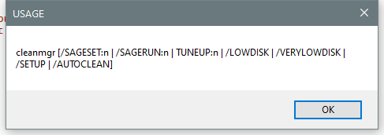
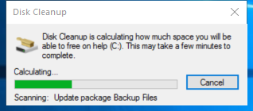

---
title: cleanmgr.exe | Disk Space Cleanup Manager for Windows
---

# cleanmgr.exe 

* File Path: `C:\Windows\system32\cleanmgr.exe`
* Description: Disk Space Cleanup Manager for Windows

## Screenshot




## Hashes

Type | Hash
-- | --
MD5 | `D17E532DB343357FC9EBF5E559820BD4`
SHA1 | `6EDC7C835D5C3410909999690D0ECF3D3EDB480A`
SHA256 | `A43C79ECAE0D4726157FBB2E9E2E314D3622201678B56DB514AAE50EA84A09F9`
SHA384 | `A6664786AEB39A5C0170F8BC80A592F0D85C95C267ABB9456DCA980BB0ED4DC548B220357767025C2D878E2D3DE43D80`
SHA512 | `225E4959335DEFFF69D91358DDE1DF86CF54A19325F0589A316F57923101BE6A5244F6E845A18CBBD9A017870F5BC150F3D2C8ABC007BD0EE1F125623F0C4778`
SSDEEP | `3072:bQVx/3xmYvearjjPFC2bbymKByAEPGRvQhRkKqUa9antF5hvvJkuXpZ:a57XgtmKBFE+ohSKq99UF5hvv/`

### Child Processes:
DismHost.exe

## Signature

* Status: Signature verified.
* Serial: `3300000266BD1580EFA75CD6D3000000000266`
* Thumbprint: `A4341B9FD50FB9964283220A36A1EF6F6FAA7840`
* Issuer: CN=Microsoft Windows Production PCA 2011, O=Microsoft Corporation, L=Redmond, S=Washington, C=US
* Subject: CN=Microsoft Windows, O=Microsoft Corporation, L=Redmond, S=Washington, C=US

## File Metadata

* Original Filename: CLEANMGR.DLL.MUI
* Product Name: Microsoft Windows Operating System
* Company Name: Microsoft Corporation
* File Version: 10.0.19041.1 (WinBuild.160101.0800)
* Product Version: 10.0.19041.1
* Language: English (United States)
* Legal Copyright:  Microsoft Corporation. All rights reserved.

## File Similarity (ssdeep match)

File | Score
-- | --
[C:\Windows\system32\cleanmgr.exe](cleanmgr.exe-B6A5162D28FDCB87869A2ED87F46C8A6.md) | 71
[C:\Windows\system32\cleanmgr.exe](cleanmgr.exe-FC13869B5250959618FA81B9AAA2BDF8.md) | 71
[C:\Windows\SysWOW64\cleanmgr.exe](cleanmgr.exe-3DF1CA27764BE371A667B72A664B4C65.md) | 66
[C:\Windows\SysWOW64\cleanmgr.exe](cleanmgr.exe-485C3639234C59ED6BF09F73704B110E.md) | 74
[C:\Windows\SysWOW64\cleanmgr.exe](cleanmgr.exe-5AB8F80E61D780F31585E612B83FFFAD.md) | 66


## Additional Info*

**The information below is copied from [MicrosoftDocs](https://github.com/MicrosoftDocs/windowsserverdocs), which is maintained by [Microsoft](https://opensource.microsoft.com/codeofconduct/). Available under [CC BY 4.0](https://creativecommons.org/licenses/by/4.0/) license.*

---

## cleanmgr

> Applies to: Windows Server 2019, Windows Server 2016, Windows Server 2012, Windows Server 2008 R2, Windows Server (Semi-Annual Channel)

Clears unnecessary files from your computer's hard disk. You can use command-line options to specify that **Cleanmgr** cleans up Temp files, Internet files, downloaded files, and Recycle Bin files. You can then schedule the task to run at a specific time by using the **Scheduled Tasks** tool.

### Syntax

```
cleanmgr [/d <driveletter>] [/sageset:n]  [/sagerun:n] [/TUNEUP:n] [/LOWDISK] [/VERYLOWDISK]
```

#### Parameters

| Parameter | Description |
| --------- | ----------- |
| /d `<driveletter>` | Specifies the drive that you want Disk Cleanup to clean.<p>**NOTE:** The **/d** option is not utilized with `/sagerun:n`. |
| /sageset:n | Displays the **Disk Cleanup Settings** dialog box and also creates a registry key to store the settings that you select. The `n` value, which is stored in the registry, allows you to specify tasks for Disk Cleanup to run. The `n` value can be any integer value from 0 to 65535. |
| /sagerun:n | Runs the specified tasks that are assigned to the n value if you use the **\sageset** option. All drives on the computer are enumerated and the selected profile runs against each drive. |
| /tuneup:n | Run **/sageset** and **/sagerun** for the same `n` . |
| /lowdisk | Run with the default settings. |
| /verylowdisk | Run with the default settings, no user prompts. |
| /? | Displays help at the command prompt. |

##### Options

The options for the files that you can specify for Disk Cleanup by using **/sageset** and **/sagerun** include:

- **Temporary Setup Files** - These are files that were created by a Setup program that is no longer running.

- **Downloaded Program Files** - Downloaded program files are ActiveX controls and Java programs that are downloaded automatically from the Internet when you view certain pages. These files are temporarily stored in the Downloaded Program Files folder on the hard disk. This option includes a View Files button so that you can see the files before Disk Cleanup removes them. The button opens the C:\Winnt\Downloaded Program Files folder.

- **Temporary Internet Files** - The Temporary Internet Files folder contains Web pages that are stored on your hard disk for quick viewing. Disk Cleanup removes these page but leaves your personalized settings for Web pages intact. This option also includes a View Files button, which opens the C:\Documents and Settings\Username\Local Settings\Temporary Internet Files\Content.IE5 folder.

- **Old Chkdsk Files** - When Chkdsk checks a disk for errors, Chkdsk might save lost file fragments as files in the root folder on the disk. These files are unnecessary.

- **Recycle Bin** - The Recycle Bin contains files that you have deleted from the computer. These files are not permanently removed until you empty the Recycle Bin. This option includes a View Files button that opens the Recycle Bin.<p>**Note:** A Recycle Bin may appear in more than one drive, for example, not just in %SystemRoot%.

- **Temporary Files** - Programs sometimes store temporary information in a Temp folder. Before a program quits, the program usually deletes this information. You can safely delete temporary files that have not been modified within the last week.

- **Temporary Offline Files** - Temporary offline files are local copies of recently used network files. These files are automatically cached so that you can use them after you disconnect from the network. A **View Files** button opens the Offline Files folder.

- **Offline Files** - Offline files are local copies of network files that you specifically want to have available offline so that you can use them after you disconnect from the network. A **View Files** button opens the Offline Files folder.

- **Compress Old Files** - Windows can compress files that you have not used recently. Compressing files saves disk space, but you can still use the files. No files are deleted. Because files are compressed at different rates, the displayed amount of disk space that you will gain is approximate. An Options button permits you to specify the number of days to wait before Disk Cleanup compresses an unused file.

- **Catalog Files for the Content Indexer** - The Indexing service speeds up and improves file searches by maintaining an index of the files that are on the disk. These Catalog files remain from a previous indexing operation and can be deleted safely.<p>**Note:** Catalog File may appear in more than one drive, for example, not just in `%SystemRoot%`.

>[!NOTE]
> If you specify cleaning up the drive that contains the Windows installation, all of these options are available on the **Disk Cleanup** tab. If you specify any other drive, only the Recycle Bin and the Catalog files for content index options are available on the **Disk Cleanup** tab.

### Examples

To run the Disk Cleanup app so that you can use its dialog box to specify options for use later, saving the settings to the set **1**, type the following:

```
cleanmgr /sageset:1
```

To run Disk Cleanup and include the options that you specified with the cleanmgr /sageset:1 command, type:

```
cleanmgr /sagerun:1
```

To run `cleanmgr /sageset:1` and `cleanmgr /sagerun:1` together, type:

```
cleanmgr /tuneup:1
```

### Additional References

- [Free up drive space in Windows 10](https://support.microsoft.com/help/12425/windows-10-free-up-drive-space)

- [Command-Line Syntax Key](https://github.com/MicrosoftDocs/windowsserverdocs/tree/master/WindowsServerDocs/administration/windows-commands/command-line-syntax-key.md)

---


MIT License. Copyright (c) 2020 Strontic.


