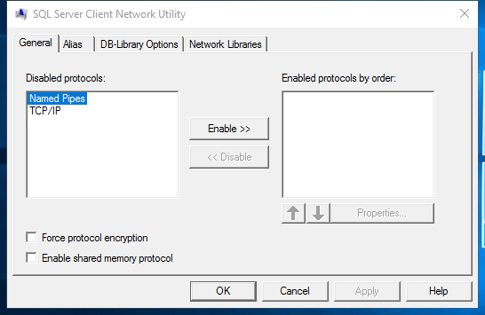

---
title: cliconfg.exe | SQL Client Configuration Utility EXE
---

# cliconfg.exe 

* File Path: `C:\Windows\SysWOW64\cliconfg.exe`
* Description: SQL Client Configuration Utility EXE

## Screenshot

## Hashes

Type | Hash
-- | --
MD5 | `8479031B34E1F72E08EB5EC618368822`
SHA1 | `0D2EAA86B7908F05E9440FBF07D0BFAD0770A450`
SHA256 | `37A10CF80FE6542A4A7AC1297C05423AC4410136685BFD3E9F8E2326AB9097F3`
SHA384 | `5285FC8DFC418FC380C74F7DAE89FBCC5A13E183EB16CAC97621D9C6A93080CA93B30E8C8E85A27CEE57B01C507C9A24`
SHA512 | `998074580414EC757FF93C99248B14711A136782418C97A4A7370C49E32FA6FC5DD9C847B23A118542F8B88F83EDC48891EF76884F806116DD84CBAF16D7B133`
SSDEEP | `384:aDfQx42X5iIDBrXIhWrwWlPXuNvBQAMYJQ2JQSkdowyoX:ibxqI6LuI30lJBkvT`

## Signature

* Status: Signature verified.
* Serial: `33000000BCE120FDD27CC8EE930000000000BC`
* Thumbprint: `E85459B23C232DB3CB94C7A56D47678F58E8E51E`
* Issuer: CN=Microsoft Windows Production PCA 2011, O=Microsoft Corporation, L=Redmond, S=Washington, C=US
* Subject: CN=Microsoft Windows, O=Microsoft Corporation, L=Redmond, S=Washington, C=US

## File Metadata

* Original Filename: cliconfg.exe
* Product Name: Microsoft Windows Operating System
* Company Name: Microsoft Corporation
* File Version: 10.0.14393.0 (rs1_release.160715-1616)
* Product Version: 10.0.14393.0
* Language: English (United States)
* Legal Copyright:  Microsoft Corporation. All rights reserved.

## File Similarity (ssdeep match)

File | Score
-- | --
[C:\windows\system32\cliconfg.exe](cliconfg.exe-1A81668402876DBDE84C5E111C8D4A78.md) | 61
[C:\WINDOWS\system32\cliconfg.exe](cliconfg.exe-23270B94D888BC3AC565E97C8DD6F4BB.md) | 63
[C:\Windows\system32\cliconfg.exe](cliconfg.exe-2F01F4A027E09027DBD2651FF3359DF9.md) | 66
[C:\Windows\system32\cliconfg.exe](cliconfg.exe-E06C0D21FFE629D45E3F0067B86D2CEA.md) | 58
[C:\Windows\system32\cliconfg.exe](cliconfg.exe-FF9932C30F72B19E57D9B07F230487E7.md) | 63
[C:\WINDOWS\SysWOW64\cliconfg.exe](cliconfg.exe-588677B78E8431F7822DB276E75D4DD7.md) | 72
[C:\Windows\SysWOW64\cliconfg.exe](cliconfg.exe-5924FC77AC5B646CCF8CEF54DBED2D69.md) | 69
[C:\Windows\SysWOW64\cliconfg.exe](cliconfg.exe-5EE49921CB7AEA9FDF2938F99DB69FFA.md) | 66
[C:\windows\SysWOW64\cliconfg.exe](cliconfg.exe-D742C17757BA63F0FB22715C3E0CFF68.md) | 66

## Possible Misuse

*The following table contains possible examples of `cliconfg.exe` being misused. While `cliconfg.exe` is **not** inherently malicious, its legitimate functionality can by abused for malicious purposes.*

Source | Source File | Example | License
-- | -- | -- | --
[signature-base](https://github.com/Neo23x0/signature-base) | [apt_op_honeybee.yar](https://github.com/Neo23x0/signature-base/blob/master/yara/apt_op_honeybee.yar) |       $x2 = "del /f /q %TEMP%\\setup.cab && cliconfg.exe" | [CC BY-NC 4.0](https://github.com/Neo23x0/signature-base/blob/master/LICENSE)
[signature-base](https://github.com/Neo23x0/signature-base) | [apt_op_honeybee.yar](https://github.com/Neo23x0/signature-base/blob/master/yara/apt_op_honeybee.yar) |       $x1 = "cmd /c taskkill /im cliconfg.exe /f /t && del /f /q" fullword ascii | [CC BY-NC 4.0](https://github.com/Neo23x0/signature-base/blob/master/LICENSE)

MIT License. Copyright (c) 2020 Strontic.

