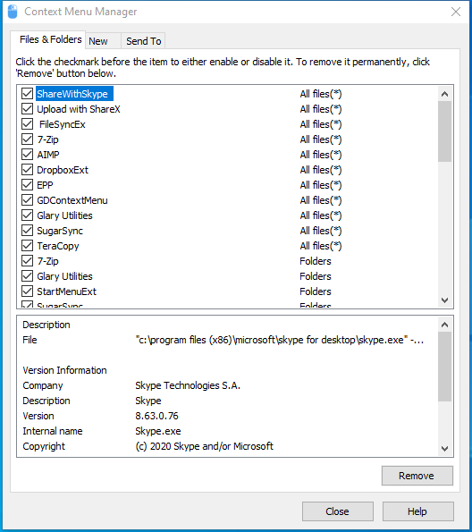

---
title: cmm.exe | Glary Utilities cmm
excerpt: What is cmm.exe?
---

# cmm.exe 

* File Path: `C:\Program Files (x86)\Glary Utilities 5\cmm.exe`
* Description: Glary Utilities cmm

## Screenshot

## Hashes

Type | Hash
-- | --
MD5 | `36B90A261054515B83979DCF55C8577E`
SHA1 | `C53CADFDC4BA9A4D185A2D5BC44E669669390899`
SHA256 | `B790F9CD3B4759068B0A36D5655CC043D633CF43303B5EE9C10E8FFC4AEE0004`
SHA384 | `B242993C637805EE47E900494EC31FC90D80A4483BF74890DCD4F55A0F658B52DA876F6F4BB95C3899922E2B20EAA681`
SHA512 | `2120E567DF941EC7A4C2DB4535460EA0EA042810F6D09F680F67C7D6300D396B6EE2D269DCE75C37EF27E16F5F057353E69306E13085310012A46B2B0115699A`
SSDEEP | `3072:mACh0ZoK3GT5bVLN6PVMOzcai1JZs+oJeVY:hCRK2TBVJ6PVMOzU3ZyJZ`
IMP | `321913A5546B42CE0416F7EFD43E489B`
PESHA1 | `9852E5AA756FCD3326C9E95853F58995FAEEC189`
PE256 | `97D4B106BAF04BBDC1D876E4F2936F65F81CE5051BCCC408A00C5AC269787D99`

## Runtime Data

### Window Title:
Context Menu Manager

### Open Handles:

Path | Type
-- | --
(R-D)   C:\Windows\Fonts\StaticCache.dat | File
(R-D)   C:\Windows\System32\en-US\propsys.dll.mui | File
(R-D)   C:\Windows\System32\en-US\shell32.dll.mui | File
(R-D)   C:\Windows\System32\en-US\windows.storage.dll.mui | File
(RW-)   C:\Program Files (x86)\Glary Utilities 5 | File
(RW-)   C:\Windows | File
(RW-)   C:\Windows\WinSxS\x86_microsoft.vc90.crt_1fc8b3b9a1e18e3b_9.0.30729.9625_none_508ef7e4bcbbe589 | File
(RW-)   C:\Windows\WinSxS\x86_microsoft.windows.common-controls_6595b64144ccf1df_6.0.19041.488_none_11b1e5df2ffd8627 | File
(RW-)   C:\Windows\WinSxS\x86_microsoft.windows.gdiplus_6595b64144ccf1df_1.1.19041.508_none_429cdbca8a8ffa94 | File
(RW-)   C:\xCyclopedia | File
(RWD)   C:\Users\user\AppData\Local\Microsoft\Windows\Explorer\iconcache_16.db | File
(RWD)   C:\Users\user\AppData\Local\Microsoft\Windows\Explorer\iconcache_32.db | File
(RWD)   C:\Users\user\AppData\Local\Microsoft\Windows\Explorer\iconcache_idx.db | File
\BaseNamedObjects\__ComCatalogCache__ | Section
\BaseNamedObjects\C:\*ProgramData\*Microsoft\*Windows\*Caches\*{6AF0698E-D558-4F6E-9B3C-3716689AF493}.2.ver0x0000000000000003.db | Section
\BaseNamedObjects\C:\*ProgramData\*Microsoft\*Windows\*Caches\*{DDF571F2-BE98-426D-8288-1A9A39C3FDA2}.2.ver0x0000000000000002.db | Section
\BaseNamedObjects\C:\*ProgramData\*Microsoft\*Windows\*Caches\*cversions.2 | Section
\BaseNamedObjects\NLS_CodePage_1252_3_2_0_0 | Section
\BaseNamedObjects\NLS_CodePage_437_3_2_0_0 | Section
\BaseNamedObjects\windows_shell_global_counters | Section
\Sessions\1\BaseNamedObjects\UrlZonesSM_user | Section
\Sessions\1\BaseNamedObjects\windows_shell_global_counters | Section
\Sessions\1\Windows\Theme2547664911 | Section
\Windows\Theme3854699184 | Section

### Loaded Modules:

Path |
-- |
C:\Program Files (x86)\Glary Utilities 5\cmm.exe |
C:\Windows\SYSTEM32\ntdll.dll |
C:\Windows\System32\wow64.dll |
C:\Windows\System32\wow64cpu.dll |
C:\Windows\System32\wow64win.dll |

## Signature

* Status: Signature verified.
* Serial: `0F05AE21CDC17B9F3CF09D7BFC659BA3`
* Thumbprint: `362EBB303E088105BDCC07D94E6B7875D30C0D06`
* Issuer: CN=DigiCert Assured ID Code Signing CA-1, OU=www.digicert.com, O=DigiCert Inc, C=US
* Subject: CN=Glarysoft LTD, O=Glarysoft LTD, S=Beijing, C=CN

## File Metadata

* Original Filename: cmm.exe
* Product Name: Glary Utilities
* Company Name: Glarysoft Ltd
* File Version: 5.0.0.11
* Product Version: 5.0.0.1
* Language: Chinese (Simplified, China)
* Legal Copyright: Copyright (c) 2003-2020 Glarysoft Ltd
* Machine Type: 32-bit

## File Scan

* VirusTotal Detections: 1/67
* VirusTotal Link: https://www.virustotal.com/gui/file/b790f9cd3b4759068b0a36d5655cc043d633cf43303b5ee9c10e8ffc4aee0004/detection/

## File Similarity (ssdeep match)

File | Score
-- | --
[C:\program files (x86)\Glary Utilities 5\cmm.exe](cmm.exe-0F4BA0D299A93A0D3A627A1CAC06061D.md) | 90
[C:\Program Files (x86)\Glary Utilities 5\cmm.exe](cmm.exe-265DCAF0EF43B1F657749CC172F6932F.md) | 90

MIT License. Copyright (c) 2020-2021 Strontic.

