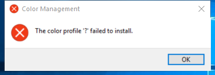

---
title: colorcpl.exe | Microsoft Color Control Panel
---

# colorcpl.exe 

* File Path: `C:\windows\system32\colorcpl.exe`
* Description: Microsoft Color Control Panel

## Screenshot

## Hashes

Type | Hash
-- | --
MD5 | `F24913A27288728064D4B1EE4FBC2354`
SHA1 | `81289E917142E9C188DBEBAEDB280772F7F9AFA0`
SHA256 | `C57CB5E7B90F921FB9C6F4992513D58941397F7ADBB03ACDFAC1E36E7E763A31`
SHA384 | `89E5C19EB933B1425A0259839B1972FFC7F6FB7EFE455A651E748121535BF9D0FF9C6FC65EA1B16F32043CC20CD3E763`
SHA512 | `43C7A0F67697DE959F51D74A3A4D66FCEDF1879A9C6EF0461DD216E0F976C4849860FC314FCD9C0A1B1B7B82ADAFCB2A3678E409D041B5BD89CB91793EF9F0AE`
SSDEEP | `1536:btiIPfSbS9vMBN7rQOJ7CFToTCzhcRguhwxTyPCb3lZpdym4dy7p:x1Xlvq7jSP1cR2prbpdCY9`

## Signature

* Status: Signature verified.
* Serial: `33000001C422B2F79B793DACB20000000001C4`
* Thumbprint: `AE9C1AE54763822EEC42474983D8B635116C8452`
* Issuer: CN=Microsoft Windows Production PCA 2011, O=Microsoft Corporation, L=Redmond, S=Washington, C=US
* Subject: CN=Microsoft Windows, O=Microsoft Corporation, L=Redmond, S=Washington, C=US

## File Metadata

* Original Filename: colorcpl.exe.mui
* Product Name: Microsoft Windows Operating System
* Company Name: Microsoft Corporation
* File Version: 10.0.17763.1 (WinBuild.160101.0800)
* Product Version: 10.0.17763.1
* Language: English (United States)
* Legal Copyright:  Microsoft Corporation. All rights reserved.

## File Similarity (ssdeep match)

File | Score
-- | --
[C:\windows\system32\colorcpl.exe](colorcpl.exe-1FCE45CF94DA9CD4D28B25FFFC1E684F.md) | 96
[C:\WINDOWS\system32\colorcpl.exe](colorcpl.exe-25040F44B9DDAB66CE97AE7EB076C1F4.md) | 96
[C:\Windows\system32\colorcpl.exe](colorcpl.exe-362986B35574BF922A81E7B0BA50C96B.md) | 96
[C:\Windows\system32\colorcpl.exe](colorcpl.exe-7009947CFC65EA513ED9EBD37EC63C62.md) | 96
[C:\windows\SysWOW64\colorcpl.exe](colorcpl.exe-0A606DBA8620A3F24240226798720CDD.md) | 94
[C:\Windows\SysWOW64\colorcpl.exe](colorcpl.exe-38EB45466769CCD7915CA3582FE7D64A.md) | 96
[C:\Windows\SysWOW64\colorcpl.exe](colorcpl.exe-BFCDDC11FE74898B5099303303A24595.md) | 100
[C:\Windows\SysWOW64\colorcpl.exe](colorcpl.exe-DB71E132EBF1FEB6E93E8A2A0F0C903D.md) | 97
[C:\WINDOWS\SysWOW64\colorcpl.exe](colorcpl.exe-F68A384E758C94DA13875354C9CFEB27.md) | 96

MIT License. Copyright (c) 2020 Strontic.

