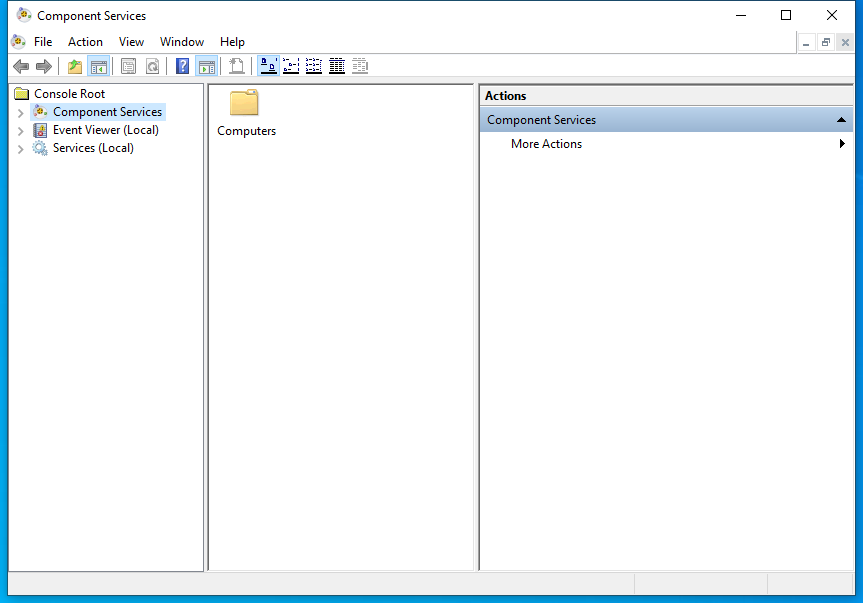

---
title: comexp.msc | 
excerpt: What is comexp.msc?
---

# comexp.msc 

* File Path: `C:\Windows\system32\comexp.msc`
* Description: Component Services (Window Title)

## Screenshot

## Hashes

Type | Hash
-- | --
MD5 | `AC27746CE65F3A7A1329BEBA7A64E08F`
SHA1 | `0730C78E8F241645B21A8BEA93B0EE7398522B61`
SHA256 | `2DF587429BFE2CD5596EFF6E10B3D23BB15A9FD96C7DF96E8D3C767EDA516EC2`
SHA384 | `80282A5C31187729FD77A092E554B5D4AE7EADDF2054E5DE177A816ABDA8D2D4B704BB03A0CDADE44A92A57F76A80748`
SHA512 | `19732A454007BBC7EB3CDCFD774B4A56EC556716E57107A90520FF17DA9B5663314B712CF174DD0ABBD8C5840D90A373913CF8051148659A5930D2BE2ABB8007`
SSDEEP | `384:WBVCm4ETcr1b7bkK4t1/J5Lro7iiI2cwjXsTS7LG4YpbaWv:S94r9C1/J1M7iiI2cwjXsmxQOWv`
PESHA1 | `0730C78E8F241645B21A8BEA93B0EE7398522B61`
PE256 | `2DF587429BFE2CD5596EFF6E10B3D23BB15A9FD96C7DF96E8D3C767EDA516EC2`

## Runtime Data

### Window Title:
Component Services

### Open Handles:

Path | Type
-- | --
(R--)   C:\Windows\Registration\R000000000001.clb | File
(R-D)   C:\Windows\assembly\GAC_MSIL\Microsoft.ManagementConsole\3.0.0.0__31bf3856ad364e35\Microsoft.ManagementConsole.dll | File
(R-D)   C:\Windows\assembly\GAC_MSIL\MMCEx\3.0.0.0__31bf3856ad364e35\MMCEx.dll | File
(R-D)   C:\Windows\assembly\GAC_MSIL\MMCFxCommon\3.0.0.0__31bf3856ad364e35\MMCFxCommon.dll | File
(R-D)   C:\Windows\Fonts\StaticCache.dat | File
(R-D)   C:\Windows\Microsoft.NET\assembly\GAC_64\mscorlib\v4.0_4.0.0.0__b77a5c561934e089\mscorlib.dll | File
(R-D)   C:\Windows\Microsoft.NET\assembly\GAC_MSIL\Accessibility\v4.0_4.0.0.0__b03f5f7f11d50a3a\Accessibility.dll | File
(R-D)   C:\Windows\Microsoft.NET\assembly\GAC_MSIL\EventViewer\v4.0_10.0.0.0__31bf3856ad364e35\EventViewer.dll | File
(R-D)   C:\Windows\Microsoft.NET\assembly\GAC_MSIL\MiguiControls\v4.0_1.0.0.0__31bf3856ad364e35\MIGUIControls.dll | File
(R-D)   C:\Windows\Microsoft.NET\assembly\GAC_MSIL\System.Configuration\v4.0_4.0.0.0__b03f5f7f11d50a3a\System.Configuration.dll | File
(R-D)   C:\Windows\Microsoft.NET\assembly\GAC_MSIL\System.Drawing\v4.0_4.0.0.0__b03f5f7f11d50a3a\System.Drawing.dll | File
(R-D)   C:\Windows\Microsoft.NET\assembly\GAC_MSIL\System.ServiceProcess\v4.0_4.0.0.0__b03f5f7f11d50a3a\System.ServiceProcess.dll | File
(R-D)   C:\Windows\Microsoft.NET\assembly\GAC_MSIL\System.Windows.Forms\v4.0_4.0.0.0__b77a5c561934e089\System.Windows.Forms.dll | File
(R-D)   C:\Windows\Microsoft.NET\assembly\GAC_MSIL\System.Xml\v4.0_4.0.0.0__b77a5c561934e089\System.XML.dll | File
(R-D)   C:\Windows\Microsoft.NET\assembly\GAC_MSIL\System\v4.0_4.0.0.0__b77a5c561934e089\System.dll | File
(R-D)   C:\Windows\System32\en-US\comres.dll.mui | File
(R-D)   C:\Windows\System32\en-US\els.dll.mui | File
(R-D)   C:\Windows\System32\en-US\filemgmt.dll.mui | File
(R-D)   C:\Windows\System32\en-US\KernelBase.dll.mui | File
(R-D)   C:\Windows\System32\en-US\MFC42.dll.mui | File
(R-D)   C:\Windows\System32\en-US\MFC42u.dll.mui | File
(R-D)   C:\Windows\System32\en-US\mmc.exe.mui | File
(R-D)   C:\Windows\System32\en-US\mmcbase.dll.mui | File
(R-D)   C:\Windows\System32\en-US\mmcndmgr.dll.mui | File
(R-D)   C:\Windows\System32\en-US\user32.dll.mui | File
(R-D)   C:\Windows\SystemResources\comres.dll.mun | File
(R-D)   C:\Windows\SystemResources\filemgmt.dll.mun | File
(R-D)   C:\Windows\SystemResources\mmcbase.dll.mun | File
(R-D)   C:\Windows\SystemResources\mmcndmgr.dll.mun | File
(RW-)   C:\Users\user | File
(RW-)   C:\Windows\WinSxS\amd64_microsoft.windows.common-controls_6595b64144ccf1df_5.82.19041.488_none_4238de57f6b64d28 | File
(RW-)   C:\Windows\WinSxS\amd64_microsoft.windows.common-controls_6595b64144ccf1df_6.0.19041.746_none_ca02b4b61b8320a4 | File
(RW-)   C:\Windows\WinSxS\amd64_microsoft.windows.gdiplus_6595b64144ccf1df_1.1.19041.789_none_faf0a7e97612e7bb | File
\...\Cor_SxSPublic_IPCBlock | Section
\BaseNamedObjects\__ComCatalogCache__ | Section
\BaseNamedObjects\C:\*ProgramData\*Microsoft\*Windows\*Caches\*{6AF0698E-D558-4F6E-9B3C-3716689AF493}.2.ver0x0000000000000002.db | Section
\BaseNamedObjects\C:\*ProgramData\*Microsoft\*Windows\*Caches\*{DDF571F2-BE98-426D-8288-1A9A39C3FDA2}.2.ver0x0000000000000002.db | Section
\BaseNamedObjects\C:\*ProgramData\*Microsoft\*Windows\*Caches\*cversions.2 | Section
\BaseNamedObjects\Cor_Private_IPCBlock_v4_6160 | Section
\BaseNamedObjects\NLS_CodePage_1252_3_2_0_0 | Section
\BaseNamedObjects\NLS_CodePage_437_3_2_0_0 | Section
\BaseNamedObjects\windows_shell_global_counters | Section
\Sessions\1\BaseNamedObjects\1810HWNDInterface:2603f4 | Section
\Sessions\1\BaseNamedObjects\1810HWNDInterface:4e05aa | Section
\Sessions\1\BaseNamedObjects\SessionImmersiveColorPreference | Section
\Sessions\1\BaseNamedObjects\windows_shell_global_counters | Section
\Sessions\1\Windows\Theme3205582532 | Section
\Windows\Theme3800351183 | Section

### Loaded Modules:

Path |
-- |
C:\Windows\SYSTEM32\AcGenral.dll |
C:\Windows\SYSTEM32\apphelp.dll |
C:\Windows\System32\KERNEL32.DLL |
C:\Windows\System32\KERNELBASE.dll |
C:\Windows\SYSTEM32\mmc.exe |
C:\Windows\System32\msvcrt.dll |
C:\Windows\SYSTEM32\ntdll.dll |
C:\Windows\System32\sechost.dll |

## Signature

* Status: Signature verified.
* Serial: `3300000266BD1580EFA75CD6D3000000000266`
* Thumbprint: `A4341B9FD50FB9964283220A36A1EF6F6FAA7840`
* Issuer: CN=Microsoft Windows Production PCA 2011, O=Microsoft Corporation, L=Redmond, S=Washington, C=US
* Subject: CN=Microsoft Windows, O=Microsoft Corporation, L=Redmond, S=Washington, C=US

## File Metadata

* Original Filename: 
* Product Name: 
* Company Name: 
* File Version: 
* Product Version: 
* Language: 
* Legal Copyright: 

## File Scan

* VirusTotal Detections: 0/75
* VirusTotal Link: https://www.virustotal.com/gui/file/2df587429bfe2cd5596eff6e10b3d23bb15a9fd96c7df96e8d3c767eda516ec2/detection

## File Similarity (ssdeep match)

File | Score
-- | --
[C:\Windows\system32\en-US\comexp.msc](comexp.msc-AC27746CE65F3A7A1329BEBA7A64E08F.md) | 100
[C:\Windows\SysWOW64\comexp.msc](comexp.msc-AC27746CE65F3A7A1329BEBA7A64E08F.md) | 100
[C:\Windows\SysWOW64\en-US\comexp.msc](comexp.msc-AC27746CE65F3A7A1329BEBA7A64E08F.md) | 100

MIT License. Copyright (c) 2020-2021 Strontic.

