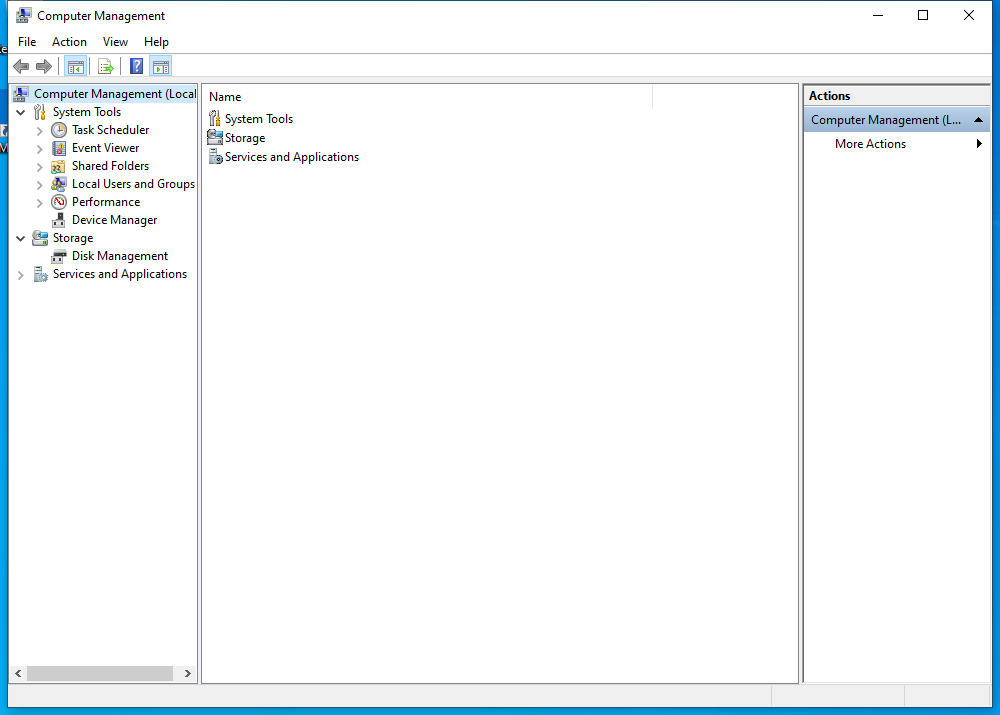

---
title: compmgmt.msc | 
excerpt: What is compmgmt.msc?
---

# compmgmt.msc 

* File Path: `C:\Windows\system32\compmgmt.msc`
* Description: Computer Management (Window Title)

## Screenshot

## Hashes

Type | Hash
-- | --
MD5 | `F04C119C159670C9271623454BEC3254`
SHA1 | `1F42AED72C659B75B9E5A2FF1E284C0649765C3C`
SHA256 | `2456BD374082D03520D844B922AD58FF1E3850C0DC0C3683C9C54D4F538F2C19`
SHA384 | `8E014DFA98358A11462B1974558AA31E85453CEBCA50E0299E19D0EF0E26B49BCD43A852B72B45A2557EACD76E92FCE2`
SHA512 | `9D021717151DA9DDFBE8FAB555334402C5083B6BE678683C180ED726D1DE483390AA197473CEFEF21924CC80DC8FE9D680B1634393F03B72E0C38BBEE45995BB`
SSDEEP | `768:ESITjCqk2doD0w1EG580hUdvKZCXMtmRLB2AvxW/w1S:E1o6oZR80hsEAMQR8A4/w1S`
PESHA1 | `1F42AED72C659B75B9E5A2FF1E284C0649765C3C`
PE256 | `2456BD374082D03520D844B922AD58FF1E3850C0DC0C3683C9C54D4F538F2C19`

## Runtime Data

### Window Title:
Computer Management

### Open Handles:

Path | Type
-- | --
(R-D)   C:\Windows\assembly\GAC_MSIL\Microsoft.ManagementConsole\3.0.0.0__31bf3856ad364e35\Microsoft.ManagementConsole.dll | File
(R-D)   C:\Windows\assembly\GAC_MSIL\MMCEx\3.0.0.0__31bf3856ad364e35\MMCEx.dll | File
(R-D)   C:\Windows\assembly\GAC_MSIL\MMCFxCommon\3.0.0.0__31bf3856ad364e35\MMCFxCommon.dll | File
(R-D)   C:\Windows\Fonts\StaticCache.dat | File
(R-D)   C:\Windows\Microsoft.NET\assembly\GAC_64\mscorlib\v4.0_4.0.0.0__b77a5c561934e089\mscorlib.dll | File
(R-D)   C:\Windows\Microsoft.NET\assembly\GAC_MSIL\Accessibility\v4.0_4.0.0.0__b03f5f7f11d50a3a\Accessibility.dll | File
(R-D)   C:\Windows\Microsoft.NET\assembly\GAC_MSIL\EventViewer\v4.0_10.0.0.0__31bf3856ad364e35\EventViewer.dll | File
(R-D)   C:\Windows\Microsoft.NET\assembly\GAC_MSIL\MiguiControls\v4.0_1.0.0.0__31bf3856ad364e35\MIGUIControls.dll | File
(R-D)   C:\Windows\Microsoft.NET\assembly\GAC_MSIL\System.Configuration\v4.0_4.0.0.0__b03f5f7f11d50a3a\System.Configuration.dll | File
(R-D)   C:\Windows\Microsoft.NET\assembly\GAC_MSIL\System.Drawing\v4.0_4.0.0.0__b03f5f7f11d50a3a\System.Drawing.dll | File
(R-D)   C:\Windows\Microsoft.NET\assembly\GAC_MSIL\System.ServiceProcess\v4.0_4.0.0.0__b03f5f7f11d50a3a\System.ServiceProcess.dll | File
(R-D)   C:\Windows\Microsoft.NET\assembly\GAC_MSIL\System.Windows.Forms\v4.0_4.0.0.0__b77a5c561934e089\System.Windows.Forms.dll | File
(R-D)   C:\Windows\Microsoft.NET\assembly\GAC_MSIL\System.Xml\v4.0_4.0.0.0__b77a5c561934e089\System.XML.dll | File
(R-D)   C:\Windows\Microsoft.NET\assembly\GAC_MSIL\System\v4.0_4.0.0.0__b77a5c561934e089\System.dll | File
(R-D)   C:\Windows\Microsoft.NET\assembly\GAC_MSIL\TaskScheduler\v4.0_10.0.0.0__31bf3856ad364e35\TaskScheduler.dll | File
(R-D)   C:\Windows\System32\en-US\devmgr.dll.mui | File
(R-D)   C:\Windows\System32\en-US\dmdskres.dll.mui | File
(R-D)   C:\Windows\System32\en-US\els.dll.mui | File
(R-D)   C:\Windows\System32\en-US\filemgmt.dll.mui | File
(R-D)   C:\Windows\System32\en-US\KernelBase.dll.mui | File
(R-D)   C:\Windows\System32\en-US\localsec.dll.mui | File
(R-D)   C:\Windows\System32\en-US\MFC42u.dll.mui | File
(R-D)   C:\Windows\System32\en-US\mmc.exe.mui | File
(R-D)   C:\Windows\System32\en-US\mmcbase.dll.mui | File
(R-D)   C:\Windows\System32\en-US\mmcndmgr.dll.mui | File
(R-D)   C:\Windows\System32\en-US\mycomput.dll.mui | File
(R-D)   C:\Windows\System32\en-US\newdev.dll.mui | File
(R-D)   C:\Windows\System32\en-US\user32.dll.mui | File
(R-D)   C:\Windows\System32\en-US\wdc.dll.mui | File
(R-D)   C:\Windows\System32\wbem\en-US\wbemcntl.dll.mui | File
(R-D)   C:\Windows\SystemResources\dmdskres.dll.mun | File
(R-D)   C:\Windows\SystemResources\filemgmt.dll.mun | File
(R-D)   C:\Windows\SystemResources\mmcbase.dll.mun | File
(R-D)   C:\Windows\SystemResources\mmcndmgr.dll.mun | File
(R-D)   C:\Windows\SystemResources\mycomput.dll.mun | File
(R-D)   C:\Windows\SystemResources\wdc.dll.mun | File
(RW-)   C:\Users\user | File
(RW-)   C:\Windows\WinSxS\amd64_microsoft.windows.common-controls_6595b64144ccf1df_5.82.19041.488_none_4238de57f6b64d28 | File
(RW-)   C:\Windows\WinSxS\amd64_microsoft.windows.common-controls_6595b64144ccf1df_6.0.19041.746_none_ca02b4b61b8320a4 | File
(RW-)   C:\Windows\WinSxS\amd64_microsoft.windows.gdiplus_6595b64144ccf1df_1.1.19041.789_none_faf0a7e97612e7bb | File
\...\Cor_SxSPublic_IPCBlock | Section
\BaseNamedObjects\__ComCatalogCache__ | Section
\BaseNamedObjects\C:\*ProgramData\*Microsoft\*Windows\*Caches\*{6AF0698E-D558-4F6E-9B3C-3716689AF493}.2.ver0x0000000000000002.db | Section
\BaseNamedObjects\C:\*ProgramData\*Microsoft\*Windows\*Caches\*{DDF571F2-BE98-426D-8288-1A9A39C3FDA2}.2.ver0x0000000000000002.db | Section
\BaseNamedObjects\C:\*ProgramData\*Microsoft\*Windows\*Caches\*cversions.2 | Section
\BaseNamedObjects\Cor_Private_IPCBlock_v4_1760 | Section
\BaseNamedObjects\NLS_CodePage_1252_3_2_0_0 | Section
\BaseNamedObjects\NLS_CodePage_437_3_2_0_0 | Section
\BaseNamedObjects\windows_shell_global_counters | Section
\Sessions\1\BaseNamedObjects\6e0HWNDInterface:2c03f4 | Section
\Sessions\1\BaseNamedObjects\6e0HWNDInterface:f03fe | Section
\Sessions\1\BaseNamedObjects\SessionImmersiveColorPreference | Section
\Sessions\1\BaseNamedObjects\windows_shell_global_counters | Section
\Sessions\1\Windows\Theme3205582532 | Section
\Windows\Theme3800351183 | Section

### Loaded Modules:

Path |
-- |
C:\Windows\SYSTEM32\apphelp.dll |
C:\Windows\System32\KERNEL32.DLL |
C:\Windows\System32\KERNELBASE.dll |
C:\Windows\SYSTEM32\mmc.exe |
C:\Windows\SYSTEM32\ntdll.dll |

## Signature

* Status: Signature verified.
* Serial: `3300000266BD1580EFA75CD6D3000000000266`
* Thumbprint: `A4341B9FD50FB9964283220A36A1EF6F6FAA7840`
* Issuer: CN=Microsoft Windows Production PCA 2011, O=Microsoft Corporation, L=Redmond, S=Washington, C=US
* Subject: CN=Microsoft Windows, O=Microsoft Corporation, L=Redmond, S=Washington, C=US

## File Metadata

* Original Filename: 
* Product Name: 
* Company Name: 
* File Version: 
* Product Version: 
* Language: 
* Legal Copyright: 

## File Scan

* VirusTotal Detections: 0/74
* VirusTotal Link: https://www.virustotal.com/gui/file/2456bd374082d03520d844b922ad58ff1e3850c0dc0c3683c9c54d4f538f2c19/detection

## File Similarity (ssdeep match)

File | Score
-- | --
[C:\Windows\system32\en-US\compmgmt.msc](compmgmt.msc-F04C119C159670C9271623454BEC3254.md) | 100
[C:\Windows\SysWOW64\compmgmt.msc](compmgmt.msc-F04C119C159670C9271623454BEC3254.md) | 100
[C:\Windows\SysWOW64\en-US\compmgmt.msc](compmgmt.msc-F04C119C159670C9271623454BEC3254.md) | 100

MIT License. Copyright (c) 2020-2021 Strontic.

