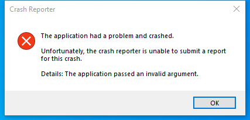

---
title: crashreporter.exe | 
excerpt: What is crashreporter.exe?
---

# crashreporter.exe 

* File Path: `C:\Program Files\Mozilla Thunderbird\crashreporter.exe`
* Description: Crash Reporter (Window Title)

## Screenshot

## Hashes

Type | Hash
-- | --
MD5 | `79E72A69D9DEACB09974E96003A02D12`
SHA1 | `21DFA7595EA757B70DD4F0B86748A6804EE94E11`
SHA256 | `B40F0E7A2B6617F0B4A6E04360BF759BD6B992E34A14249E287C6307A5F5E868`
SHA384 | `93DB25CDD9B8F63713116A3905608B6BC4DFEB963A0FC922494230F18D5E4B498D749F330B9ED16EFEB975BEADE4CC01`
SHA512 | `C9351A6DE0828661B39325052B9CEF8B833120DADF08CB063C0C475187D76FA55EF33EC5C1D32A0194ED4CCD4BD0FC947E2B3E4D5E93637B211029E02BF233CF`
SSDEEP | `6144:33qZHKpj1b4G8OtsGw6gPHQX0OSNN6M/Tu+:qZHcdVskgPwipl`
IMP | `A62DD84F52C9DBCA31671472AA032DCF`
PESHA1 | `A75F6B0BB5391FE0F5895376874CBCEF81024878`
PE256 | `82ADFD8FBEFEA971645322FEF4FB1D2DED0CB7DF760E5B28D29EBCC58868B7A9`

## Runtime Data

### Window Title:
Crash Reporter

### Open Handles:

Path | Type
-- | --
(R-D)   C:\Windows\Fonts\StaticCache.dat | File
(R-D)   C:\Windows\SystemResources\imageres.dll.mun | File
(RW-)   C:\Windows\WinSxS\amd64_microsoft.windows.common-controls_6595b64144ccf1df_6.0.19041.488_none_ca04af081b815d21 | File
(RW-)   C:\xCyclopedia | File
\BaseNamedObjects\NLS_CodePage_1252_3_2_0_0 | Section
\BaseNamedObjects\NLS_CodePage_437_3_2_0_0 | Section
\Sessions\1\Windows\Theme2547664911 | Section
\Windows\Theme3854699184 | Section

### Loaded Modules:

Path |
-- |
C:\Program Files\Mozilla Thunderbird\crashreporter.exe |
C:\Program Files\Mozilla Thunderbird\mozglue.dll |
C:\Program Files\Mozilla Thunderbird\MSVCP140.dll |
C:\Program Files\Mozilla Thunderbird\nss3.dll |
C:\Program Files\Mozilla Thunderbird\VCRUNTIME140.dll |
C:\Windows\System32\ADVAPI32.dll |
C:\Windows\System32\combase.dll |
C:\Windows\System32\CRYPT32.dll |
C:\Windows\SYSTEM32\CRYPTBASE.DLL |
C:\Windows\SYSTEM32\dbghelp.dll |
C:\Windows\System32\GDI32.dll |
C:\Windows\System32\gdi32full.dll |
C:\Windows\System32\IMM32.DLL |
C:\Windows\System32\KERNEL32.DLL |
C:\Windows\System32\KERNELBASE.dll |
C:\Windows\SYSTEM32\MSASN1.dll |
C:\Windows\SYSTEM32\Msftedit.dll |
C:\Windows\System32\msvcp_win.dll |
C:\Windows\System32\msvcrt.dll |
C:\Windows\SYSTEM32\ntdll.dll |
C:\Windows\System32\ole32.dll |
C:\Windows\System32\OLEAUT32.dll |
C:\Windows\System32\RPCRT4.dll |
C:\Windows\System32\sechost.dll |
C:\Windows\System32\SHELL32.dll |
C:\Windows\System32\SHLWAPI.dll |
C:\Windows\System32\ucrtbase.dll |
C:\Windows\System32\USER32.dll |
C:\Windows\SYSTEM32\VERSION.dll |
C:\Windows\System32\win32u.dll |
C:\Windows\SYSTEM32\WININET.dll |
C:\Windows\SYSTEM32\WINMM.dll |
C:\Windows\System32\WINTRUST.dll |
C:\Windows\System32\WS2_32.dll |
C:\Windows\SYSTEM32\WSOCK32.dll |
C:\Windows\WinSxS\amd64_microsoft.windows.common-controls_6595b64144ccf1df_6.0.19041.488_none_ca04af081b815d21\COMCTL32.dll |

## Signature

* Status: Signature verified.
* Serial: `0DDEB53F957337FBEAF98C4A615B149D`
* Thumbprint: `91CABEA509662626E34326687348CAF2DD3B4BBA`
* Issuer: CN=DigiCert SHA2 Assured ID Code Signing CA, OU=www.digicert.com, O=DigiCert Inc, C=US
* Subject: E="release+certificates@mozilla.com", CN=Mozilla Corporation, OU=Firefox Engineering Operations, O=Mozilla Corporation, L=Mountain View, S=California, C=US

## File Metadata

* Original Filename: crashreporter.exe
* Product Name: Thunderbird
* Company Name: Mozilla Foundation
* File Version: 78.2.0
* Product Version: 78.2.0
* Language: Language Neutral
* Legal Copyright: License: MPL 2
* Machine Type: 64-bit

## File Scan

* VirusTotal Detections: 0/69
* VirusTotal Link: https://www.virustotal.com/gui/file/b40f0e7a2b6617f0b4a6e04360bf759bd6b992e34a14249e287c6307a5f5e868/detection/

## File Similarity (ssdeep match)

File | Score
-- | --
[C:\program files\Mozilla Thunderbird\crashreporter.exe](crashreporter.exe-4CFA95487A117B6C1F4BD5F73CCB6055.md) | 91
[C:\Program Files\Mozilla Thunderbird\crashreporter.exe](crashreporter.exe-6DA9600E6D73BB8F66EA47674192D8D9.md) | 93

MIT License. Copyright (c) 2020-2021 Strontic.

