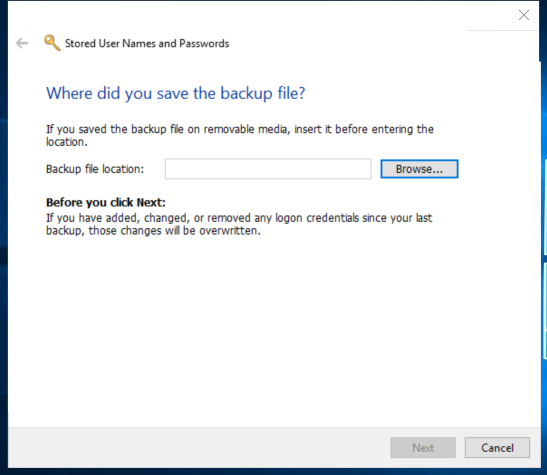

---
title: credwiz.exe | Credential Backup and Restore Wizard
---

# credwiz.exe 

* File Path: `C:\windows\system32\credwiz.exe`
* Description: Credential Backup and Restore Wizard

## Screenshot

## Hashes

Type | Hash
-- | --
MD5 | `2B507018D3511DB1EB9601C5B5D0F2E8`
SHA1 | `D8C992D2518E3999C54E324749F6C1DEA5DF6083`
SHA256 | `C7E7428639C598DD6FE35371CF7C9C11C9E6FC91230B8C615EEC4ED3DFF47EFD`
SHA384 | `823EFA6D0E16B487CD4EAB1BFFBDB29CCEAF592BB88523D435EAD220EBBAA51ECBDDEB5109325D0FC32FE04BF0876FCE`
SHA512 | `C5F0B55F052640DC82028482F393E021BCF5BA868FA80CFF8891515F4A30148364F35C4F44E2C5A6E25E8B077EE08C7DC495603115FBABAD7267D340FF5E96B8`
SSDEEP | `768:YxV0FxNGYOrKge1Gg/46tyLJ5E/fvzNGEuHYTu6AU:YxV8rvRU6SGbAdHY5A`

### Loaded Modules:

Path |
-- |
C:\Windows\System32\ADVAPI32.dll |
C:\Windows\system32\credwiz.exe |
C:\Windows\System32\GDI32.dll |
C:\Windows\System32\gdi32full.dll |
C:\Windows\System32\KERNEL32.DLL |
C:\Windows\System32\KERNELBASE.dll |
C:\Windows\System32\msvcp_win.dll |
C:\Windows\System32\msvcrt.dll |
C:\Windows\SYSTEM32\ntdll.dll |
C:\Windows\System32\RPCRT4.dll |
C:\Windows\System32\sechost.dll |
C:\Windows\System32\ucrtbase.dll |
C:\Windows\System32\win32u.dll |

## Signature

* Status: The file C:\windows\system32\credwiz.exe is not digitally signed. You cannot run this script on the current system. For more information about running scripts and setting execution policy, see about_Execution_Policies at http://go.microsoft.com/fwlink/?LinkID=135170
* Serial: ``
* Thumbprint: ``
* Issuer: 
* Subject: 

## File Metadata

* Original Filename: credwiz.exe.mui
* Product Name: Microsoft Windows Operating System
* Company Name: Microsoft Corporation
* File Version: 6.3.9600.16384 (winblue_rtm.130821-1623)
* Product Version: 6.3.9600.16384
* Language: English (United States)
* Legal Copyright:  Microsoft Corporation. All rights reserved.

MIT License. Copyright (c) 2020 Strontic.

