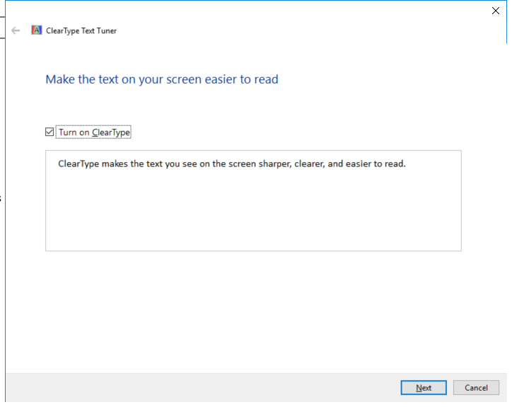
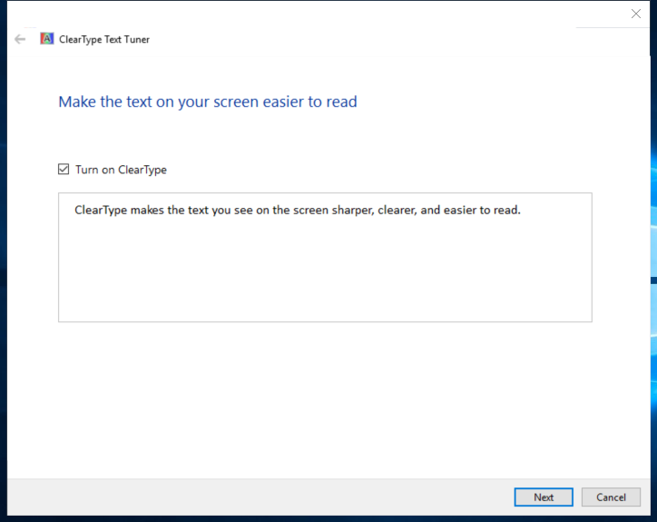

---
title: cttune.exe | ClearType Tuner
---

# cttune.exe 

* File Path: `C:\windows\system32\cttune.exe`
* Description: ClearType Tuner

## Screenshot

## Hashes

Type | Hash
-- | --
MD5 | `CB908509B2FD8557B71F3A16840DF6AA`
SHA1 | `A4CAEB767B5A31B71634E79477FFE08AA9DAABC5`
SHA256 | `E3E64DADD7F56E08452BA6ABE602B28A3494053B1C3BFA9C07E296986AABFB5E`
SHA384 | `88734B2B8D04003A2D04A25B16E6CBE4C6F80A729041503DE12AB9DAC4275B05202B7FF7B0EF265F733A26C5114AAB98`
SHA512 | `12E8ED8650D0C304DE2E120D1111B82B60A109370CFCBB3733E8D9A12A9FDC07EA2D82CDBD9FA66BC798AF155B9BE28B445D6F3F343372E7A958E0F139A94E7F`
SSDEEP | `3072:/I6XZ7mN3HWBZ7s1FJMjf1AWvMjhNfvJqxEm4x1ESuQG+3SeyRS6CSfKVu1xgCA5:bJj7cM7SW01NfvoxEvTEPp/F`

## Signature

* Status: The file C:\windows\system32\cttune.exe is not digitally signed. You cannot run this script on the current system. For more information about running scripts and setting execution policy, see about_Execution_Policies at http://go.microsoft.com/fwlink/?LinkID=135170
* Serial: ``
* Thumbprint: ``
* Issuer: 
* Subject: 

## File Metadata

* Original Filename: CTTUNE.EXE.MUI
* Product Name: Microsoft Windows Operating System
* Company Name: Microsoft Corporation
* File Version: 6.3.9600.16384 (winblue_rtm.130821-1623)
* Product Version: 6.3.9600.16384
* Language: English (United States)
* Legal Copyright:  Microsoft Corporation. All rights reserved.

## File Similarity (ssdeep match)

File | Score
-- | --
[C:\Windows\system32\cttune.exe](cttune.exe-7573E129035AA191B752FAB5BED546AF.md) | 58
[C:\Windows\system32\cttune.exe](cttune.exe-CCD6BF7BE1F0944A59F2BDC788FE24D5.md) | 60
[C:\Windows\SysWOW64\cttune.exe](cttune.exe-45753895AAE368B288C39F8CF8F435E6.md) | 65
[C:\Windows\SysWOW64\cttune.exe](cttune.exe-B3D58D03EF76001519914F49DF180DA5.md) | 65
[C:\windows\SysWOW64\cttune.exe](cttune.exe-C7AC98601D543EFF883E3D3E48797BF2.md) | 63

MIT License. Copyright (c) 2020 Strontic.

