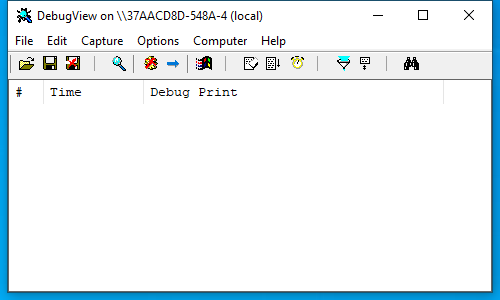

---
title: dbgview64.exe | DebugView
excerpt: What is dbgview64.exe?
---

# dbgview64.exe 

* File Path: `C:\SysinternalsSuite\dbgview64.exe`
* Description: DebugView

## Screenshot

## Hashes

Type | Hash
-- | --
MD5 | `257D864EABFD8ED32DADDF21DE2C2632`
SHA1 | `19A4726C06D89096358CD5BB361370F0F863072C`
SHA256 | `29E9C6CEE0617F4ABEB1E8D886A2DF4BF06244C79F49248D83280D33043C3DD6`
SHA384 | `E609DBDBD02C1E268161E3B0606D3CB4FBBD2CC87D18B2DFB735208F7E46E64217FCAE76011E80DEF2B37151B57BE59D`
SHA512 | `81A00975D5A7719805CC143AAC104D792E3C8EFA7463AA95232E50ED0722F3971E2F035602EC722844C25BC63EA7E281EEE086DF9D983B4F3B73DBE8087A40A8`
SSDEEP | `24576:nlwoldhiHBOPdOpO3ttGzhfAdajYTGq2bqTszxbFgDylSsJspIKJJYsGqelOqn0H:nlwo/EzOIUpommS`
IMP | `0D2CBE6B8A0B15C4E2F5A77D616D765B`
PESHA1 | `572C2AFD655367FF33351796FB8039935443D93D`
PE256 | `5301B868A4D1743E3F4205078B85169A041CB9ABFF82D83372455D756025C748`

## Runtime Data

### Window Title:
Log File Open Error

### Open Handles:

Path | Type
-- | --
(R-D)   C:\Windows\Fonts\StaticCache.dat | File
(R-D)   C:\Windows\SystemResources\imageres.dll.mun | File
(RW-)   C:\Windows\WinSxS\amd64_microsoft.windows.common-controls_6595b64144ccf1df_6.0.19041.488_none_ca04af081b815d21 | File
(RW-)   C:\xCyclopedia | File
\BaseNamedObjects\NLS_CodePage_1252_3_2_0_0 | Section
\BaseNamedObjects\NLS_CodePage_437_3_2_0_0 | Section
\Sessions\1\BaseNamedObjects\DBWIN_BUFFER | Section
\Sessions\1\Windows\Theme2036293991 | Section
\Windows\Theme1324212991 | Section

### Loaded Modules:

Path |
-- |
C:\SysinternalsSuite\dbgview64.exe |
C:\Users\user\AppData\Local\Temp\ADInsightDll64.dll |
C:\Windows\System32\ADVAPI32.dll |
C:\Windows\System32\combase.dll |
C:\Windows\System32\COMDLG32.dll |
C:\Windows\System32\GDI32.dll |
C:\Windows\System32\gdi32full.dll |
C:\Windows\System32\imagehlp.dll |
C:\Windows\System32\IMM32.DLL |
C:\Windows\System32\KERNEL32.DLL |
C:\Windows\System32\KERNELBASE.dll |
C:\Windows\SYSTEM32\MPR.dll |
C:\Windows\System32\msvcp_win.dll |
C:\Windows\System32\msvcrt.dll |
C:\Windows\SYSTEM32\ntdll.dll |
C:\Windows\System32\RPCRT4.dll |
C:\Windows\System32\sechost.dll |
C:\Windows\SYSTEM32\Secur32.dll |
C:\Windows\System32\shcore.dll |
C:\Windows\System32\SHELL32.dll |
C:\Windows\System32\SHLWAPI.dll |
C:\Windows\SYSTEM32\SSPICLI.DLL |
C:\Windows\System32\ucrtbase.dll |
C:\Windows\System32\USER32.dll |
C:\Windows\System32\win32u.dll |
C:\Windows\System32\WS2_32.dll |
C:\Windows\WinSxS\amd64_microsoft.windows.common-controls_6595b64144ccf1df_6.0.19041.488_none_ca04af081b815d21\COMCTL32.dll |

## Signature

* Status: Signature verified.
* Serial: `3300000187721772155940C709000000000187`
* Thumbprint: `2485A7AFA98E178CB8F30C9838346B514AEA4769`
* Issuer: CN=Microsoft Code Signing PCA 2011, O=Microsoft Corporation, L=Redmond, S=Washington, C=US
* Subject: CN=Microsoft Corporation, O=Microsoft Corporation, L=Redmond, S=Washington, C=US

## File Metadata

* Original Filename: Dbgview.exe
* Product Name: Sysinternals Debugview
* Company Name: Sysinternals
* File Version: 4.90
* Product Version: 4.90
* Language: English (United States)
* Legal Copyright: Copyright  1998-2019 Mark Russinovich
* Machine Type: 64-bit

## File Scan

* VirusTotal Detections: 0/68
* VirusTotal Link: https://www.virustotal.com/gui/file/29e9c6cee0617f4abeb1e8d886a2df4bf06244c79f49248d83280d33043c3dd6/detection/

MIT License. Copyright (c) 2020 Strontic.

