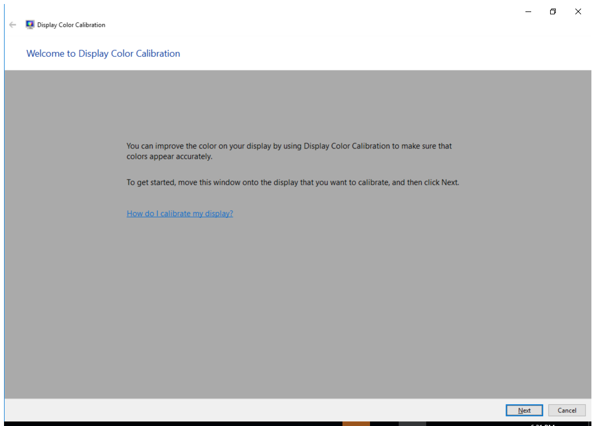

---
title: dccw.exe | Display Color Calibration
excerpt: What is dccw.exe?
---

# dccw.exe 

* File Path: `C:\Windows\SysWOW64\dccw.exe`
* Description: Display Color Calibration

## Screenshot

## Hashes

Type | Hash
-- | --
MD5 | `AA76EB7D3BB05E726748802E555A2173`
SHA1 | `B389EAB83667E32C3DD33B553ABDE3AA0A7FB72B`
SHA256 | `94C5C38AD8252B9481330D500185D57B0A8A40C319A4DF5F35912BBB2B791CDA`
SHA384 | `AFD0FD42E9191C9E7C729ECAE0CECA334188FC7B283467E787B78CD5B0C0C2F7C7BDFB0335D60C9AA3DB95ED74BC6E50`
SHA512 | `86174674A27495B89EE3C68107083A778C321495DE82A18CFEEAE78E30E8254B117DB640EBDAF0C6EDFBC317BA4DDDDF9755384406E58DBBE10BAA0BB4BFA424`
SSDEEP | `12288:iulfTVcBGOhS/IzJqrraq/t2qXy6xdRhMA:iulfZTGS/EEn/tkI`
IMP | `2B7F19B45958484CF7F3CF5ED96C7C95`
PESHA1 | `85DCD283EF912DEC5B381EEBD56F3A44F4985D0A`
PE256 | `D5A411CCB74AC36BF8233262D0373D0BCB0A17C1CB44730768D844F89CD96511`

## Runtime Data

### Window Title:
Display Color Calibration

### Open Handles:

Path | Type
-- | --
(R-D)   C:\Windows\Fonts\StaticCache.dat | File
(R-D)   C:\Windows\System32\en-US\dccw.exe.mui | File
(R-D)   C:\Windows\System32\en-US\imageres.dll.mui | File
(RW-)   C:\Users\user | File
(RW-)   C:\Windows | File
(RW-)   C:\Windows\WinSxS\x86_microsoft.windows.common-controls_6595b64144ccf1df_6.0.17763.1518_none_261b62a767ca4e6d | File
(RW-)   C:\Windows\WinSxS\x86_microsoft.windows.gdiplus_6595b64144ccf1df_1.1.17763.1518_none_5706558cc25cc83b | File
\BaseNamedObjects\C:\*ProgramData\*Microsoft\*Windows\*Caches\*{6AF0698E-D558-4F6E-9B3C-3716689AF493}.2.ver0x0000000000000004.db | Section
\BaseNamedObjects\C:\*ProgramData\*Microsoft\*Windows\*Caches\*{DDF571F2-BE98-426D-8288-1A9A39C3FDA2}.2.ver0x0000000000000004.db | Section
\BaseNamedObjects\C:\*ProgramData\*Microsoft\*Windows\*Caches\*cversions.2.ro | Section
\BaseNamedObjects\NLS_CodePage_1252_3_2_0_0 | Section
\BaseNamedObjects\NLS_CodePage_437_3_2_0_0 | Section
\Sessions\2\Windows\Theme2131664586 | Section
\Windows\Theme966197582 | Section

### Loaded Modules:

Path |
-- |
C:\Windows\SYSTEM32\ntdll.dll |
C:\Windows\System32\wow64.dll |
C:\Windows\System32\wow64cpu.dll |
C:\Windows\System32\wow64win.dll |
C:\Windows\SysWOW64\dccw.exe |

## Signature

* Status: Signature verified.
* Serial: `33000001C422B2F79B793DACB20000000001C4`
* Thumbprint: `AE9C1AE54763822EEC42474983D8B635116C8452`
* Issuer: CN=Microsoft Windows Production PCA 2011, O=Microsoft Corporation, L=Redmond, S=Washington, C=US
* Subject: CN=Microsoft Windows, O=Microsoft Corporation, L=Redmond, S=Washington, C=US

## File Metadata

* Original Filename: dccw.exe
* Product Name: Microsoft Windows Operating System
* Company Name: Microsoft Corporation
* File Version: 10.0.17763.1 (WinBuild.160101.0800)
* Product Version: 10.0.17763.1
* Language: English (United States)
* Legal Copyright:  Microsoft Corporation. All rights reserved.
* Machine Type: 32-bit

## File Scan

* VirusTotal Detections: 0/67
* VirusTotal Link: https://www.virustotal.com/gui/file/94c5c38ad8252b9481330d500185d57b0a8a40c319a4df5f35912bbb2b791cda/detection/

## File Similarity (ssdeep match)

File | Score
-- | --
[C:\Windows\system32\dccw.exe](dccw.exe-2FA157F391C6C8B7A1EC3D5036D78241.md) | 80
[C:\Windows\system32\dccw.exe](dccw.exe-B6532886AB39BD25126033D15C241E45.md) | 80
[C:\Windows\SysWOW64\dccw.exe](dccw.exe-1121CE30CF23B3FD98E79A22D14E95F5.md) | 82

MIT License. Copyright (c) 2020 Strontic.

