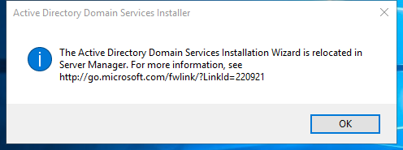

---
title: dcpromo.exe | Active Directory Domain Services Installer
---

# dcpromo.exe 

* File Path: `C:\Windows\system32\dcpromo.exe`
* Description: Active Directory Domain Services Installer

## Screenshot



## Hashes

Type | Hash
-- | --
MD5 | `7CBFAC17F4A4BCA957D351749F0D9803`
SHA1 | `A5748FF4A15F0F947BF3E93F2D06EE37F4573D94`
SHA256 | `673B7844466F95D10780C5ECF267FA938D51C7818BBBAB6C49C989A5B2619084`
SHA384 | `694717AB3F1C7534BBEAB689664154D66AA98880A79B17B737AAEE87236958D64901ED1498C9A66FD75C3D70BD01313F`
SHA512 | `6EAFF562984F47A66C0EF2382CB69BDC8CBE43F2CF5761259393FD9F852E907C56DBAB4240165D3894BDDF3D7B3A6E0B820562BDB1A67B5917395F4D014565C2`
SSDEEP | `6144:CWms72era8bVjnCbn+URLQvG+4ntASgZaghY:GsaUbnCT+URwOtgQg`

## Runtime Data

### Usage (stdout):
```cmhg
The specified argument 'help' should start with '/' or '-'.

```

### Child Processes:
conhost.exe

## Signature

* Status: Signature verified.
* Serial: `33000000BCE120FDD27CC8EE930000000000BC`
* Thumbprint: `E85459B23C232DB3CB94C7A56D47678F58E8E51E`
* Issuer: CN=Microsoft Windows Production PCA 2011, O=Microsoft Corporation, L=Redmond, S=Washington, C=US
* Subject: CN=Microsoft Windows, O=Microsoft Corporation, L=Redmond, S=Washington, C=US

## File Metadata

* Original Filename: dcpromo.exe.mui
* Product Name: Microsoft Windows Operating System
* Company Name: Microsoft Corporation
* File Version: 10.0.14393.0 (rs1_release.160715-1616)
* Product Version: 10.0.14393.0
* Language: English (United States)
* Legal Copyright:  Microsoft Corporation. All rights reserved.


MIT License. Copyright (c) 2020 Strontic.


