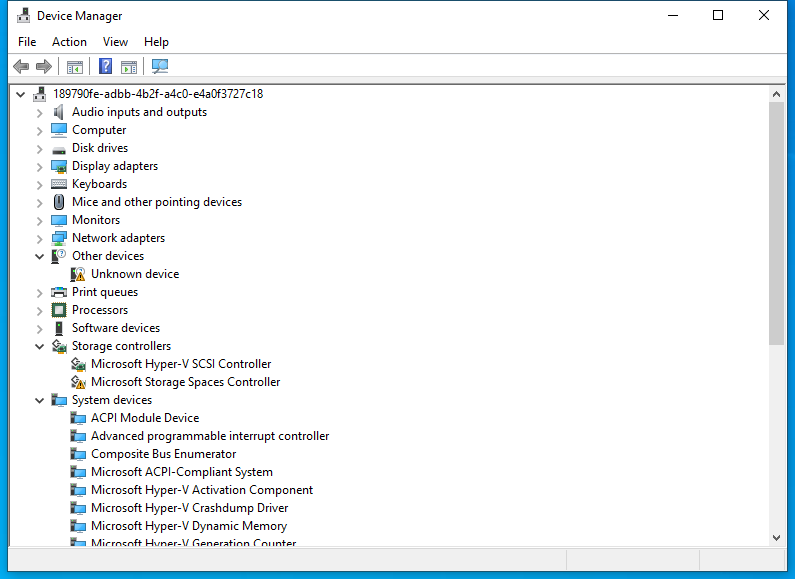

---
title: devmgmt.msc | 
excerpt: What is devmgmt.msc?
---

# devmgmt.msc 

* File Path: `C:\Windows\system32\devmgmt.msc`
* Description: Device Manager (Window Title)

## Screenshot

## Hashes

Type | Hash
-- | --
MD5 | `383A3B36999FABD8DCA7691B38713C40`
SHA1 | `7F1DB4732C2D816BA860442718CA713065B73234`
SHA256 | `81834650BF3682D8C5ED3ED0222EBDE30E8E117CFC8F2B81E8BC2D45B95158D5`
SHA384 | `8ECBE13817E320C41D9708AA7146CDCC8AF40615077BC20553DCA1B30F827BC08569D1B2606F409232DFA259C976A857`
SHA512 | `93FF33A9D08FD396619A23343128F7767FD8C122013EC09F726C1ECCDB277906075D69F241AAD9612676BD335C631EDD1647CA3B10EC6EF7912E511E5594A6A5`
SSDEEP | `384:pAvcrUyv8htcJX6oIlIUIbTR8k9/B3jORUHjrTTQPOkJ/b+9+dsy:wgvY86oNDHZy`
PESHA1 | `7F1DB4732C2D816BA860442718CA713065B73234`
PE256 | `81834650BF3682D8C5ED3ED0222EBDE30E8E117CFC8F2B81E8BC2D45B95158D5`

## Runtime Data

### Window Title:
Device Manager

### Open Handles:

Path | Type
-- | --
(R-D)   C:\Windows\Fonts\StaticCache.dat | File
(R-D)   C:\Windows\System32\atl.dll | File
(R-D)   C:\Windows\System32\en-US\devmgr.dll.mui | File
(R-D)   C:\Windows\System32\en-US\KernelBase.dll.mui | File
(R-D)   C:\Windows\System32\en-US\MFC42u.dll.mui | File
(R-D)   C:\Windows\System32\en-US\mmc.exe.mui | File
(R-D)   C:\Windows\System32\en-US\mmcbase.dll.mui | File
(R-D)   C:\Windows\System32\en-US\newdev.dll.mui | File
(R-D)   C:\Windows\System32\en-US\setupapi.dll.mui | File
(R-D)   C:\Windows\System32\en-US\user32.dll.mui | File
(R-D)   C:\Windows\System32\stdole2.tlb | File
(R-D)   C:\Windows\SystemResources\mmcbase.dll.mun | File
(R-D)   C:\Windows\SystemResources\mmcndmgr.dll.mun | File
(R-D)   C:\Windows\SystemResources\shell32.dll.mun | File
(RW-)   C:\Users\user | File
(RW-)   C:\Windows\WinSxS\amd64_microsoft.windows.common-controls_6595b64144ccf1df_5.82.19041.488_none_4238de57f6b64d28 | File
(RW-)   C:\Windows\WinSxS\amd64_microsoft.windows.common-controls_6595b64144ccf1df_6.0.19041.746_none_ca02b4b61b8320a4 | File
\BaseNamedObjects\__ComCatalogCache__ | Section
\BaseNamedObjects\C:\*ProgramData\*Microsoft\*Windows\*Caches\*{6AF0698E-D558-4F6E-9B3C-3716689AF493}.2.ver0x0000000000000002.db | Section
\BaseNamedObjects\C:\*ProgramData\*Microsoft\*Windows\*Caches\*{DDF571F2-BE98-426D-8288-1A9A39C3FDA2}.2.ver0x0000000000000002.db | Section
\BaseNamedObjects\C:\*ProgramData\*Microsoft\*Windows\*Caches\*cversions.2 | Section
\BaseNamedObjects\NLS_CodePage_1252_3_2_0_0 | Section
\BaseNamedObjects\NLS_CodePage_437_3_2_0_0 | Section
\BaseNamedObjects\windows_shell_global_counters | Section
\Sessions\1\BaseNamedObjects\24bcHWNDInterface:3203f4 | Section
\Sessions\1\BaseNamedObjects\24bcHWNDInterface:6102da | Section
\Sessions\1\BaseNamedObjects\SessionImmersiveColorPreference | Section
\Sessions\1\BaseNamedObjects\windows_shell_global_counters | Section
\Sessions\1\Windows\Theme3205582532 | Section
\Windows\Theme3800351183 | Section

### Loaded Modules:

Path |
-- |
C:\Windows\SYSTEM32\AcGenral.dll |
C:\Windows\SYSTEM32\apphelp.dll |
C:\Windows\System32\KERNEL32.DLL |
C:\Windows\System32\KERNELBASE.dll |
C:\Windows\SYSTEM32\mmc.exe |
C:\Windows\System32\msvcrt.dll |
C:\Windows\SYSTEM32\ntdll.dll |
C:\Windows\System32\RPCRT4.dll |
C:\Windows\System32\sechost.dll |

## Signature

* Status: Signature verified.
* Serial: `3300000266BD1580EFA75CD6D3000000000266`
* Thumbprint: `A4341B9FD50FB9964283220A36A1EF6F6FAA7840`
* Issuer: CN=Microsoft Windows Production PCA 2011, O=Microsoft Corporation, L=Redmond, S=Washington, C=US
* Subject: CN=Microsoft Windows, O=Microsoft Corporation, L=Redmond, S=Washington, C=US

## File Metadata

* Original Filename: 
* Product Name: 
* Company Name: 
* File Version: 
* Product Version: 
* Language: 
* Legal Copyright: 

## File Scan

* VirusTotal Detections: 0/76
* VirusTotal Link: https://www.virustotal.com/gui/file/81834650bf3682d8c5ed3ed0222ebde30e8e117cfc8f2b81e8bc2d45b95158d5/detection

## File Similarity (ssdeep match)

File | Score
-- | --
[C:\Windows\system32\en-US\devmgmt.msc](devmgmt.msc-383A3B36999FABD8DCA7691B38713C40.md) | 100
[C:\Windows\SysWOW64\devmgmt.msc](devmgmt.msc-383A3B36999FABD8DCA7691B38713C40.md) | 100
[C:\Windows\SysWOW64\en-US\devmgmt.msc](devmgmt.msc-383A3B36999FABD8DCA7691B38713C40.md) | 100

MIT License. Copyright (c) 2020-2021 Strontic.

