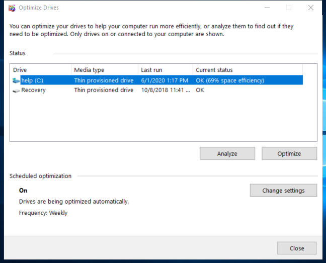

---
title: dfrgui.exe | Microsoft Drive Optimizer
excerpt: What is dfrgui.exe?
---

# dfrgui.exe 

* File Path: `C:\Windows\system32\dfrgui.exe`
* Description: Microsoft Drive Optimizer

## Screenshot

## Hashes

Type | Hash
-- | --
MD5 | `9CAEBEDA61018E86A29C291225F0319F`
SHA1 | `D36E0CF8077D8FCBB4B062D89D1BB655AB00624E`
SHA256 | `348FF9E7A8D17E76AB4E8E3F3F6E3573232B71CD0BB8A94CA78896ADA9211317`
SHA384 | `45E192E73E07F96BFCC99A9843CD9EEB99F9AB7E2EA0F1F1445278D632EDD498DEBA220545CEFFB988AA6F6A2E5DF091`
SHA512 | `2CB0D2A8B43C9EE2D8ECBE1FE5AF57596744DD2A45390098D93A31476738743439E9E77CAD4D831AC347640BFD8A0EA257A952691A170B04C681F82531D854B9`
SSDEEP | `3072:N9vci3mdQFX4kvXhpQsU45kLBOHLZWkJKk/IlUbX+o9:3vh3mdQFo2Xh3Ux6F64`
IMP | `BA22F719CDE8DA4204EB7FFA324CF53D`
PESHA1 | `9E7E9ED0E56FFB5439951909DAF7C1E696824000`
PE256 | `566189381E98F7A290686C7EEB95B74BB6F87C75D29FB3F956F6C557E74D8C55`

## Runtime Data

### Window Title:
Optimize Drives

### Open Handles:

Path | Type
-- | --
(R-D)   C:\Windows\Fonts\StaticCache.dat | File
(R-D)   C:\Windows\System32\en-US\DfrgUI.exe.mui | File
(R-D)   C:\Windows\System32\en-US\user32.dll.mui | File
(R-D)   C:\Windows\SystemResources\dfrgui.exe.mun | File
(RW-)   C:\Users\user | File
(RW-)   C:\Windows\WinSxS\amd64_microsoft.windows.common-controls_6595b64144ccf1df_6.0.19041.1110_none_60b5254171f9507e | File
(RWD)   C:\Users\user\AppData\Local\Microsoft\Windows\Explorer\iconcache_16.db | File
(RWD)   C:\Users\user\AppData\Local\Microsoft\Windows\Explorer\iconcache_idx.db | File
\BaseNamedObjects\__ComCatalogCache__ | Section
\BaseNamedObjects\C:\*ProgramData\*Microsoft\*Windows\*Caches\*{6AF0698E-D558-4F6E-9B3C-3716689AF493}.2.ver0x0000000000000002.db | Section
\BaseNamedObjects\C:\*ProgramData\*Microsoft\*Windows\*Caches\*{DDF571F2-BE98-426D-8288-1A9A39C3FDA2}.2.ver0x0000000000000002.db | Section
\BaseNamedObjects\C:\*ProgramData\*Microsoft\*Windows\*Caches\*cversions.2 | Section
\BaseNamedObjects\NLS_CodePage_1252_3_2_0_0 | Section
\BaseNamedObjects\NLS_CodePage_437_3_2_0_0 | Section
\BaseNamedObjects\windows_shell_global_counters | Section
\Sessions\1\BaseNamedObjects\windows_shell_global_counters | Section
\Sessions\1\Windows\Theme449731986 | Section
\Windows\Theme1396518710 | Section

### Loaded Modules:

Path |
-- |
C:\Windows\System32\ADVAPI32.dll |
C:\Windows\system32\dfrgui.exe |
C:\Windows\System32\GDI32.dll |
C:\Windows\System32\gdi32full.dll |
C:\Windows\System32\KERNEL32.DLL |
C:\Windows\System32\KERNELBASE.dll |
C:\Windows\System32\msvcp_win.dll |
C:\Windows\System32\msvcrt.dll |
C:\Windows\SYSTEM32\ntdll.dll |
C:\Windows\System32\RPCRT4.dll |
C:\Windows\System32\sechost.dll |
C:\Windows\System32\win32u.dll |

## Signature

* Status: Signature verified.
* Serial: `33000002EC6579AD1E670890130000000002EC`
* Thumbprint: `F7C2F2C96A328C13CDA8CDB57B715BDEA2CBD1D9`
* Issuer: CN=Microsoft Windows Production PCA 2011, O=Microsoft Corporation, L=Redmond, S=Washington, C=US
* Subject: CN=Microsoft Windows, O=Microsoft Corporation, L=Redmond, S=Washington, C=US

## File Metadata

* Original Filename: lhdfrgui.exe.mui
* Product Name: Microsoft Windows Operating System
* Company Name: Microsoft Corporation
* File Version: 10.0.19041.1 (WinBuild.160101.0800)
* Product Version: 10.0.19041.1
* Language: English (United States)
* Legal Copyright:  Microsoft Corporation. All rights reserved.
* Machine Type: 64-bit

## File Scan

* VirusTotal Detections: 0/73
* VirusTotal Link: https://www.virustotal.com/gui/file/348ff9e7a8d17e76ab4e8e3f3f6e3573232b71cd0bb8a94ca78896ada9211317/detection

MIT License. Copyright (c) 2020-2021 Strontic.

