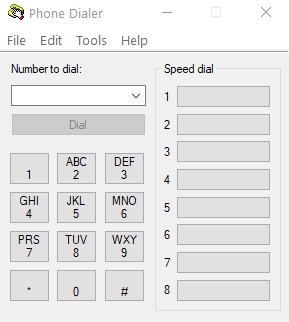

---
title: dialer.exe | Microsoft Windows Phone Dialer
excerpt: What is dialer.exe?
---

# dialer.exe 

* File Path: `C:\Windows\system32\dialer.exe`
* Description: Microsoft Windows Phone Dialer

## Screenshot

## Hashes

Type | Hash
-- | --
MD5 | `52BCE70E1E4701C0113C6A49F6424DEC`
SHA1 | `8C56E4914F7A7AD78582329D98D6B6A78E15565C`
SHA256 | `4F4BF6FC3338E2BB14CC6814DB8CCD9CCEF1F39938EC051A77DD31F69BADC600`
SHA384 | `1A1F8163406590C6299E8C29B160AA279A1153EB0E2A29D0FE193221595452E804C736111B385F088976E7CE0042915C`
SHA512 | `3EF881B5C6F6EF31699CD8248B015FF79FBE1D4A582A34F9186345F98AE8B7FC0877429C3A07BCB25457ACA66505C85E997E058269F8BC6680B9B46E86CB4FDF`
SSDEEP | `768:bft/qZZYgutzQN6TP00/SOZpjfZz52ySWDcI6ICRfrid:Lt+WwY0oPl2ySmcI6IUid`

## Signature

* Status: Signature verified.
* Serial: `33000000BCE120FDD27CC8EE930000000000BC`
* Thumbprint: `E85459B23C232DB3CB94C7A56D47678F58E8E51E`
* Issuer: CN=Microsoft Windows Production PCA 2011, O=Microsoft Corporation, L=Redmond, S=Washington, C=US
* Subject: CN=Microsoft Windows, O=Microsoft Corporation, L=Redmond, S=Washington, C=US

## File Metadata

* Original Filename: DIALER.EXE.MUI
* Product Name: Microsoft Windows Operating System
* Company Name: Microsoft Corporation
* File Version: 10.0.14393.0 (rs1_release.160715-1616)
* Product Version: 10.0.14393.0
* Language: English (United States)
* Legal Copyright:  Microsoft Corporation. All rights reserved.

## Possible Misuse

*The following table contains possible examples of `dialer.exe` being misused. While `dialer.exe` is **not** inherently malicious, its legitimate functionality can by abused for malicious purposes.*

Source | Source File | Example | License
-- | -- | -- | --
[LOLBAS](https://github.com/LOLBAS-Project/LOLBAS) | [Rasautou.yml](https://github.com/LOLBAS-Project/LOLBAS/blob/master/yml/OSBinaries/Rasautou.yml) | `Description: Windows Remote Access Dialer` | 

MIT License. Copyright (c) 2020 Strontic.

