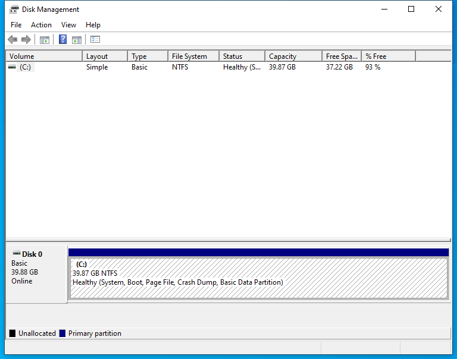

---
title: diskmgmt.msc | 
excerpt: What is diskmgmt.msc?
---

# diskmgmt.msc 

* File Path: `C:\Windows\system32\diskmgmt.msc`
* Description: Disk Management (Window Title)

## Screenshot

## Hashes

Type | Hash
-- | --
MD5 | `E343F7FD42210043208A295CBD6E251C`
SHA1 | `79411BD3F02712F539A9B611490663BF3E3BF908`
SHA256 | `548E1AABFEF8A638D912B6F5D3F4016B0DBDD7121E95E1A362D4AB73F9E4AE64`
SHA384 | `8D36DBC116C1DF58314451993E2CE6E62BFED0B26BEA2F6036D42020487468A9741C3FFA7D4E710062D31A461B926129`
SHA512 | `85348329A96F94624572527665B4CEE35A9173292505655B0057FA713D01E75B6F8574E20510AF4A007DCAD28AB30EDB3EA2E92A718A1804855767434C4C5177`
SSDEEP | `192:6Po/vRW+EL7PNRerNhcQHlONFc4HqWbIUIFQyhjXiocAocxGpLkc2QyhjXiocAoa:hSkNKQHIvc4HqWbIUIZtNp5`
PESHA1 | `79411BD3F02712F539A9B611490663BF3E3BF908`
PE256 | `548E1AABFEF8A638D912B6F5D3F4016B0DBDD7121E95E1A362D4AB73F9E4AE64`

## Runtime Data

### Window Title:
Disk Management

### Open Handles:

Path | Type
-- | --
(R-D)   C:\Windows\Fonts\StaticCache.dat | File
(R-D)   C:\Windows\System32\atl.dll | File
(R-D)   C:\Windows\System32\dmview.ocx | File
(R-D)   C:\Windows\System32\en-US\dmdskres.dll.mui | File
(R-D)   C:\Windows\System32\en-US\dmdskres2.dll.mui | File
(R-D)   C:\Windows\System32\en-US\KernelBase.dll.mui | File
(R-D)   C:\Windows\System32\en-US\MFC42u.dll.mui | File
(R-D)   C:\Windows\System32\en-US\mmc.exe.mui | File
(R-D)   C:\Windows\System32\en-US\mmcbase.dll.mui | File
(R-D)   C:\Windows\System32\en-US\mmcndmgr.dll.mui | File
(R-D)   C:\Windows\System32\en-US\user32.dll.mui | File
(R-D)   C:\Windows\System32\stdole2.tlb | File
(R-D)   C:\Windows\SystemResources\dmdskres.dll.mun | File
(R-D)   C:\Windows\SystemResources\mmcbase.dll.mun | File
(R-D)   C:\Windows\SystemResources\mmcndmgr.dll.mun | File
(RW-)   C:\Users\user | File
(RW-)   C:\Windows\WinSxS\amd64_microsoft.windows.common-controls_6595b64144ccf1df_5.82.19041.488_none_4238de57f6b64d28 | File
(RW-)   C:\Windows\WinSxS\amd64_microsoft.windows.common-controls_6595b64144ccf1df_6.0.19041.746_none_ca02b4b61b8320a4 | File
\BaseNamedObjects\__ComCatalogCache__ | Section
\BaseNamedObjects\C:\*ProgramData\*Microsoft\*Windows\*Caches\*{6AF0698E-D558-4F6E-9B3C-3716689AF493}.2.ver0x0000000000000002.db | Section
\BaseNamedObjects\C:\*ProgramData\*Microsoft\*Windows\*Caches\*{DDF571F2-BE98-426D-8288-1A9A39C3FDA2}.2.ver0x0000000000000002.db | Section
\BaseNamedObjects\C:\*ProgramData\*Microsoft\*Windows\*Caches\*cversions.2 | Section
\BaseNamedObjects\NLS_CodePage_1252_3_2_0_0 | Section
\BaseNamedObjects\NLS_CodePage_437_3_2_0_0 | Section
\BaseNamedObjects\windows_shell_global_counters | Section
\Sessions\1\BaseNamedObjects\1dfcHWNDInterface:1a05d8 | Section
\Sessions\1\BaseNamedObjects\1dfcHWNDInterface:690544 | Section
\Sessions\1\BaseNamedObjects\SessionImmersiveColorPreference | Section
\Sessions\1\BaseNamedObjects\windows_shell_global_counters | Section
\Sessions\1\Windows\Theme3205582532 | Section
\Windows\Theme3800351183 | Section

### Loaded Modules:

Path |
-- |
C:\Windows\SYSTEM32\apphelp.dll |
C:\Windows\System32\KERNEL32.DLL |
C:\Windows\System32\KERNELBASE.dll |
C:\Windows\SYSTEM32\mmc.exe |
C:\Windows\SYSTEM32\ntdll.dll |

## Signature

* Status: Signature verified.
* Serial: `330000023241FB59996DCC4DFF000000000232`
* Thumbprint: `FF82BC38E1DA5E596DF374C53E3617F7EDA36B06`
* Issuer: CN=Microsoft Windows Production PCA 2011, O=Microsoft Corporation, L=Redmond, S=Washington, C=US
* Subject: CN=Microsoft Windows, O=Microsoft Corporation, L=Redmond, S=Washington, C=US

## File Metadata

* Original Filename: 
* Product Name: 
* Company Name: 
* File Version: 
* Product Version: 
* Language: 
* Legal Copyright: 

## File Scan

* VirusTotal Detections: 0/75
* VirusTotal Link: https://www.virustotal.com/gui/file/548e1aabfef8a638d912b6f5d3f4016b0dbdd7121e95e1a362d4ab73f9e4ae64/detection

## File Similarity (ssdeep match)

File | Score
-- | --
[C:\Windows\system32\en-US\diskmgmt.msc](diskmgmt.msc-E343F7FD42210043208A295CBD6E251C.md) | 100
[C:\Windows\SysWOW64\diskmgmt.msc](diskmgmt.msc-E343F7FD42210043208A295CBD6E251C.md) | 100
[C:\Windows\SysWOW64\en-US\diskmgmt.msc](diskmgmt.msc-E343F7FD42210043208A295CBD6E251C.md) | 100

MIT License. Copyright (c) 2020-2021 Strontic.

