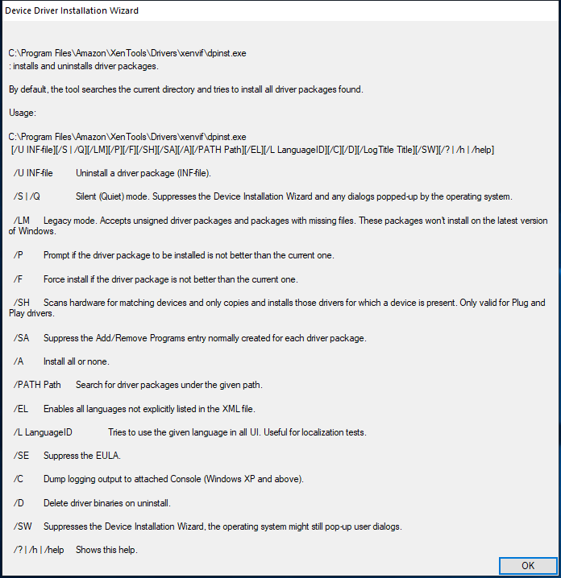

---
title: dpinst.exe | Driver Package Installer
excerpt: What is dpinst.exe?
---

# dpinst.exe 

* File Path: `C:\WINDOWS\system32\DriverStore\FileRepository\synpd.inf_amd64_4e500223b4e4a9e4\dpinst.exe`
* Description: Driver Package Installer

## Screenshot

## Hashes

Type | Hash
-- | --
MD5 | `52A859895F34399FA89DB37D40A20BC0`
SHA1 | `880497C920CD62F7B2076003E2D43822C2C2C53F`
SHA256 | `1165CA1C70618FDBC1E703550413788FFFEDD1A0663E1C7F29A3CFBE1D25906B`
SHA384 | `72D122E08B84CD0F58F1C9873CB3EA6ADF748FF0A56F480BB064BC62D5987594A25C0B527F0B3421EE0062E598365E5B`
SHA512 | `8E08A60B0B016129306C39BE7E4E2B344CB7F2DE61E5E004C0367E2814EE3B2EAEBE7E86E43905EEEA8640BA86FF872432729CDBF03B854F9EBECAADD5EC626E`
SSDEEP | `6144:OsSOzpPId26dQcEaUrPvwgwkRVagRoDHTj8K1sqI6VLp4XOigSbduP/1HHm/hHAl:qIId79EaUTvwieMozMEcOigSpuPMaLio`

## Signature

* Status: Signature verified.
* Serial: `3300000010D1EBBCBE1C4C7C49000100000010`
* Thumbprint: `C802CA01BC3064BFC0510CC762FFAA20BFE8EC61`
* Issuer: CN=Microsoft Windows Hardware Compatibility PCA, O=Microsoft Corporation, L=Redmond, S=Washington, C=US
* Subject: CN=Microsoft Windows Hardware Compatibility Publisher, OU=MOPR, O=Microsoft Corporation, L=Redmond, S=Washington, C=US

## File Metadata

* Original Filename: DPInst.exe
* Product Name: Driver Package Installer (DPInst)
* Company Name: Microsoft Corporation
* File Version: 2.1
* Product Version: 2.1
* Language: English (United States)
* Legal Copyright:  Microsoft Corporation. All rights reserved.

## File Similarity (ssdeep match)

File | Score
-- | --
[C:\Program Files\Amazon\XenTools\dpinst.exe](dpinst.exe-B5F75FCCE7C32239378983A3A3C331D4.md) | 63
[C:\Program Files\Amazon\XenTools\Drivers\xenbus\dpinst.exe](dpinst.exe-B5F75FCCE7C32239378983A3A3C331D4.md) | 63
[C:\Program Files\Amazon\XenTools\Drivers\xeniface\dpinst.exe](dpinst.exe-B5F75FCCE7C32239378983A3A3C331D4.md) | 63
[C:\Program Files\Amazon\XenTools\Drivers\xennet\dpinst.exe](dpinst.exe-B5F75FCCE7C32239378983A3A3C331D4.md) | 63
[C:\Program Files\Amazon\XenTools\Drivers\xenvbd\dpinst.exe](dpinst.exe-B5F75FCCE7C32239378983A3A3C331D4.md) | 63
[C:\Program Files\Amazon\XenTools\Drivers\xenvif\dpinst.exe](dpinst.exe-B5F75FCCE7C32239378983A3A3C331D4.md) | 63
[C:\WINDOWS\system32\DriverStore\FileRepository\synpd.inf_amd64_318aa16b062fddc3\dpinst.exe](dpinst.exe-E7853F12668A54D92899D56791C45BF5.md) | 97

MIT License. Copyright (c) 2020-2021 Strontic.

