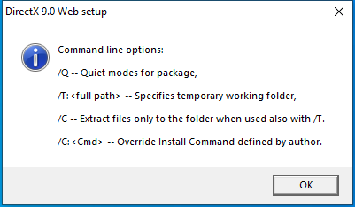

---
title: dxwebsetup.exe | DirectX 9.0 Web setup
excerpt: What is dxwebsetup.exe?
---

# dxwebsetup.exe 

* File Path: `C:\program files (x86)\K-Lite Codec Pack\Tools\dxwebsetup.exe`
* Description: DirectX 9.0 Web setup

## Screenshot

## Hashes

Type | Hash
-- | --
MD5 | `BCBB7C0CD9696068988953990EC5BD11`
SHA1 | `3C8243734CF43DD7BB2332BA05B58CCACFA4377C`
SHA256 | `34F64699D4830145CAE69BD40115B1F326E70FC6A98456CB3DF996D947DDDCA4`
SHA384 | `35ABC56EA5C3C542DD6610BC601B10242F32D2E7B52FE724C2A127E2AA24C6A7AF61D4A04B0B18283CF6B5E067AF6A58`
SHA512 | `551A2E3AA5FC7C0E79C3BD7C5333DF5F1920EA83FE35B99ADBBE865EA926FA772D72709BDE2EA8F2685F4914CD96FF7B5B6F894F9B99F1120C2ABE89C390A786`
SSDEEP | `6144:3WK8fc2liXmrLxcdRDLiH1vVRGVOhMp421/7YQ43:mcvgLARDI1KIOzOR3`

## Runtime Data

### Window Title:
DirectX 9.0 Web setup

### Open Handles:

Path | Type
-- | --
(R-D)   C:\Windows\Fonts\StaticCache.dat | File
(RW-)   C:\Users\user\Documents | File
(RW-)   C:\Windows | File
(RW-)   C:\Windows\WinSxS\x86_microsoft.windows.common-controls_6595b64144ccf1df_5.82.19041.1_none_92e69152510a8cb1 | File
\BaseNamedObjects\NLS_CodePage_1252_3_2_0_0 | Section
\BaseNamedObjects\NLS_CodePage_437_3_2_0_0 | Section
\Sessions\1\Windows\Theme4048709601 | Section
\Windows\Theme603176458 | Section

### Loaded Modules:

Path |
-- |
C:\program files (x86)\K-Lite Codec Pack\Tools\dxwebsetup.exe |
C:\Windows\SYSTEM32\ntdll.dll |
C:\Windows\System32\wow64.dll |
C:\Windows\System32\wow64cpu.dll |
C:\Windows\System32\wow64win.dll |

## Signature

* Status: Signature verified.
* Serial: `6101B29B000000000015`
* Thumbprint: `93859EBF98AFDEB488CCFA263899640E81BC49F1`
* Issuer: CN=Microsoft Code Signing PCA, O=Microsoft Corporation, L=Redmond, S=Washington, C=US
* Subject: CN=Microsoft Corporation, OU=MOPR, O=Microsoft Corporation, L=Redmond, S=Washington, C=US

## File Metadata

* Original Filename: dxwebsetup.exe
* Product Name: Microsoft Windows Operating System
* Company Name: Microsoft Corporation
* File Version: 9.29.1974.0
* Product Version: 9.29.1974.0
* Language: English (United States)
* Legal Copyright: Copyright (c) Microsoft Corporation. All rights reserved.

MIT License. Copyright (c) 2020 Strontic.

