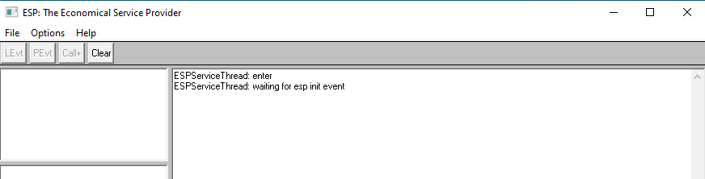

---
title: espexe.exe | Microsoft Windows(TM) Economical Service Provider Application
excerpt: What is espexe.exe?
---

# espexe.exe 

* File Path: `C:\Program Files (x86)\Windows Kits\10\bin\10.0.19041.0\arm64\espexe.exe`
* Description: Microsoft Windows(TM) Economical Service Provider Application

## Screenshot

## Hashes

Type | Hash
-- | --
MD5 | `FEB6F852EC537B25295350B62F7374B1`
SHA1 | `4F3AC4EE1C6AF5CF91A59E2698B76EE0CF3EFE08`
SHA256 | `F33EA8A14CB1A5D44ECE0289CAA291D21AC77BF3342E24594E7E73BA7953987A`
SHA384 | `FA31980A8A1C2FF171B565EA031288408E341172B83DF3800C2EF6D4705CF4DC4C2E6E241C5ABE94CD1553DD544E5530`
SHA512 | `247E0A689C2F10A253C8195FEE62DFA15555CE9C65901E3BF3598B8087418F2B7E1E8614B6C6F6F661D99B1BC402E872F7FCAAB5A2E2868ECCE1D3ED6151F4AF`
SSDEEP | `768:lwyyBB/IVwW9KSFIKwpcLE1PafDUYhzCynXWM5U:FyBB/IVpjE1PaYSzCynGMS`
IMP | `539C5EEA4AB4A28B793575D4BA844523`
PESHA1 | `01F883BF010A7625F8A23A6B43C7822A21CE6E61`
PE256 | `E22726C9BC2A00930529AAA83E3B33A364A2A46DD13B1263F6D36E5A07EF9F3D`

## Signature

* Status: Signature verified.
* Serial: `33000002B7E8E007A82AEF13150000000002B7`
* Thumbprint: `5A68625F1A516670A744F7EF919500A479D32A5B`
* Issuer: CN=Microsoft Code Signing PCA 2010, O=Microsoft Corporation, L=Redmond, S=Washington, C=US
* Subject: CN=Microsoft Windows Kits Publisher, O=Microsoft Corporation, L=Redmond, S=Washington, C=US

## File Metadata

* Original Filename: ESPEXE.EXE
* Product Name: Microsoft Windows Operating System
* Company Name: Microsoft Corporation
* File Version: 10.0.19041.1 (WinBuild.160101.0800)
* Product Version: 10.0.19041.1
* Language: English (United States)
* Legal Copyright: Copyright  Microsoft Corporation 1995.  All Rights Reserved.
* Machine Type: 64-bit ARM

## File Scan

* VirusTotal Detections: 0/73
* VirusTotal Link: https://www.virustotal.com/gui/file/f33ea8a14cb1a5d44ece0289caa291d21ac77bf3342e24594e7e73ba7953987a/detection

MIT License. Copyright (c) 2020-2021 Strontic.

