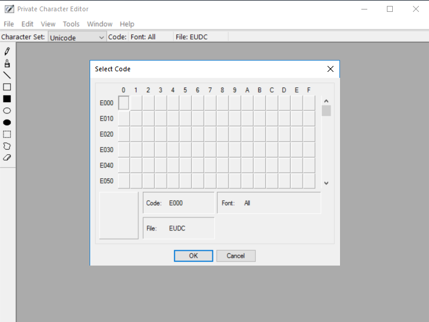

---
title: eudcedit.exe | Private Character Editor
---

# eudcedit.exe 

* File Path: `C:\windows\system32\eudcedit.exe`
* Description: Private Character Editor
* Comments: 

## Screenshot



## Hashes

Type | Hash
-- | --
MD5 | `408DC5DB105FFCE3B70B09AF77E12AEC`
SHA1 | `2250405290FF03EFC545235A438ACDA532E0C843`
SHA256 | `69A75AF2A72D2BB5BDFE7FBED5D155BD0CA0F466C8AFF9F762C3C8CB182CE8ED`
SHA384 | `4274D7F7FA166225260E99FFB79CBF22A2D2B3810A0C5462D8795E6722778287BE92CEAD3809252FF430E540C4582241`
SHA512 | `E5EA5BB824933FA65EED59ED2EA2CD3289211FE5EF8CEC03C891BCAF1914D22641E9501CA7797B61E56767E09FD667E205D935EE7DC4E24249BFA04B7A3B8AA2`
SSDEEP | `6144:CjbJp4VmCeYhDnyyEdRFs4ds4WTRANeEpCem6j4TPhqyF1PZSqtYVY:Cjn4tdERFsxTRnTB13tYC`

## Runtime Data

### Usage (stdout):
```Batchfile

```

### Usage (stderr):
```Batchfile

```

### Child Processes:


## Signature

* Status: Signature verified.
* Serial: `33000001C422B2F79B793DACB20000000001C4`
* Thumbprint: `AE9C1AE54763822EEC42474983D8B635116C8452`
* Issuer: CN=Microsoft Windows Production PCA 2011, O=Microsoft Corporation, L=Redmond, S=Washington, C=US
* Subject: CN=Microsoft Windows, O=Microsoft Corporation, L=Redmond, S=Washington, C=US

## File Metadata

* Original Filename: EUDCEDIT.EXE.MUI
* Product Name: Microsoft Windows Operating System
* Company Name: Microsoft Corporation
* File Version: 10.0.17763.1 (WinBuild.160101.0800)
* Product Version: 10.0.17763.1
* Language: English (United States)
* Legal Copyright:  Microsoft Corporation. All rights reserved.

## File Similarity (ssdeep match)

File | Score
-- | --
[C:\Windows\system32\eudcedit.exe](eudcedit.exe-A9DE6557179D371938FBE52511B551CE.md) | 35
[C:\WINDOWS\system32\eudcedit.exe](eudcedit.exe-AAEC4A29B995CA1079E84C7862C1A239.md) | 33
[C:\Windows\system32\eudcedit.exe](eudcedit.exe-BE25BBC85EB503BF8128ADAD7D971A61.md) | 32
[C:\Windows\SysWOW64\eudcedit.exe](eudcedit.exe-D306B9780453DF3FC0B8FF2538EFC064.md) | 30
[C:\Windows\SysWOW64\eudcedit.exe](eudcedit.exe-D3AEA350CE4203ACC780D2FD85E19CAE.md) | 29
[C:\WINDOWS\SysWOW64\eudcedit.exe](eudcedit.exe-E838E1BBF3FFC2B40CABA383624422E4.md) | 33
[C:\Windows\SysWOW64\eudcedit.exe](eudcedit.exe-EA7665A5FFB3B16DE571F6386BD76851.md) | 35


MIT License. Copyright (c) 2020 Strontic.


