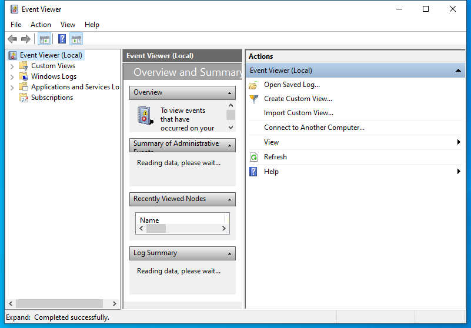

---
title: eventvwr.msc | 
excerpt: What is eventvwr.msc?
---

# eventvwr.msc 

* File Path: `C:\Windows\system32\eventvwr.msc`
* Description: Event Viewer (Window Title)

## Screenshot

## Hashes

Type | Hash
-- | --
MD5 | `9BDCCC1A87CCA27ADEACE8144F385165`
SHA1 | `35D057A2F3752A37A3D96CE1515788A2D1A4C7C8`
SHA256 | `9FD5099BCEF36533E4E5BFA813501854FB3A1C4594195CC3928C262044A90084`
SHA384 | `AD93934196CE19F0572EF2628FCDC71CC8ADDE500B5177C7441DDD3B4C163FC75B3E97F38EFAAC4CFBE1F1D783907B57`
SHA512 | `82C613E017CB80CBB16BD96E4BBD9A36DB58F91E3C607B5F8AB30E78C2842249C7B9E4108BB9FF192F2F5A9AD4F87F1725BAFD2322F292709E2FA7EA953B8DAD`
SSDEEP | `384:mc6644BzUvIi3A6CttsgFCV/Vizvr9gFbY9gvsvLq1gxcDBVlBi:nRrB4vrw6DhevRgFY1vulti`
PESHA1 | `35D057A2F3752A37A3D96CE1515788A2D1A4C7C8`
PE256 | `9FD5099BCEF36533E4E5BFA813501854FB3A1C4594195CC3928C262044A90084`

## Runtime Data

### Window Title:
Event Viewer

### Open Handles:

Path | Type
-- | --
(R-D)   C:\Windows\assembly\GAC_MSIL\Microsoft.ManagementConsole\3.0.0.0__31bf3856ad364e35\Microsoft.ManagementConsole.dll | File
(R-D)   C:\Windows\assembly\GAC_MSIL\MMCEx\3.0.0.0__31bf3856ad364e35\MMCEx.dll | File
(R-D)   C:\Windows\assembly\GAC_MSIL\MMCFxCommon\3.0.0.0__31bf3856ad364e35\MMCFxCommon.dll | File
(R-D)   C:\Windows\Fonts\StaticCache.dat | File
(R-D)   C:\Windows\Microsoft.NET\assembly\GAC_64\mscorlib\v4.0_4.0.0.0__b77a5c561934e089\mscorlib.dll | File
(R-D)   C:\Windows\Microsoft.NET\assembly\GAC_MSIL\Accessibility\v4.0_4.0.0.0__b03f5f7f11d50a3a\Accessibility.dll | File
(R-D)   C:\Windows\Microsoft.NET\assembly\GAC_MSIL\EventViewer\v4.0_10.0.0.0__31bf3856ad364e35\EventViewer.dll | File
(R-D)   C:\Windows\Microsoft.NET\assembly\GAC_MSIL\MiguiControls\v4.0_1.0.0.0__31bf3856ad364e35\MIGUIControls.dll | File
(R-D)   C:\Windows\Microsoft.NET\assembly\GAC_MSIL\System.Configuration\v4.0_4.0.0.0__b03f5f7f11d50a3a\System.Configuration.dll | File
(R-D)   C:\Windows\Microsoft.NET\assembly\GAC_MSIL\System.Drawing\v4.0_4.0.0.0__b03f5f7f11d50a3a\System.Drawing.dll | File
(R-D)   C:\Windows\Microsoft.NET\assembly\GAC_MSIL\System.ServiceProcess\v4.0_4.0.0.0__b03f5f7f11d50a3a\System.ServiceProcess.dll | File
(R-D)   C:\Windows\Microsoft.NET\assembly\GAC_MSIL\System.Windows.Forms\v4.0_4.0.0.0__b77a5c561934e089\System.Windows.Forms.dll | File
(R-D)   C:\Windows\Microsoft.NET\assembly\GAC_MSIL\System.Xml\v4.0_4.0.0.0__b77a5c561934e089\System.XML.dll | File
(R-D)   C:\Windows\Microsoft.NET\assembly\GAC_MSIL\System\v4.0_4.0.0.0__b77a5c561934e089\System.dll | File
(R-D)   C:\Windows\System32\en-US\els.dll.mui | File
(R-D)   C:\Windows\System32\en-US\KernelBase.dll.mui | File
(R-D)   C:\Windows\System32\en-US\MFC42u.dll.mui | File
(R-D)   C:\Windows\System32\en-US\mmc.exe.mui | File
(R-D)   C:\Windows\System32\en-US\mmcbase.dll.mui | File
(R-D)   C:\Windows\System32\en-US\mmcndmgr.dll.mui | File
(R-D)   C:\Windows\System32\en-US\user32.dll.mui | File
(R-D)   C:\Windows\SystemResources\mmcbase.dll.mun | File
(R-D)   C:\Windows\SystemResources\mmcndmgr.dll.mun | File
(RW-)   C:\Users\user | File
(RW-)   C:\Windows\WinSxS\amd64_microsoft.windows.common-controls_6595b64144ccf1df_5.82.19041.488_none_4238de57f6b64d28 | File
(RW-)   C:\Windows\WinSxS\amd64_microsoft.windows.common-controls_6595b64144ccf1df_6.0.19041.746_none_ca02b4b61b8320a4 | File
(RW-)   C:\Windows\WinSxS\amd64_microsoft.windows.gdiplus_6595b64144ccf1df_1.1.19041.789_none_faf0a7e97612e7bb | File
(RWD)   C:\Windows\Fonts\micross.ttf | File
(RWD)   C:\Windows\Fonts\segoeui.ttf | File
(RWD)   C:\Windows\Fonts\segoeuib.ttf | File
(RWD)   C:\Windows\Fonts\segoeuii.ttf | File
(RWD)   C:\Windows\Fonts\segoeuiz.ttf | File
\...\Cor_SxSPublic_IPCBlock | Section
\BaseNamedObjects\__ComCatalogCache__ | Section
\BaseNamedObjects\C:\*ProgramData\*Microsoft\*Windows\*Caches\*{6AF0698E-D558-4F6E-9B3C-3716689AF493}.2.ver0x0000000000000002.db | Section
\BaseNamedObjects\C:\*ProgramData\*Microsoft\*Windows\*Caches\*{DDF571F2-BE98-426D-8288-1A9A39C3FDA2}.2.ver0x0000000000000002.db | Section
\BaseNamedObjects\C:\*ProgramData\*Microsoft\*Windows\*Caches\*cversions.2 | Section
\BaseNamedObjects\Cor_Private_IPCBlock_v4_3284 | Section
\BaseNamedObjects\NLS_CodePage_1252_3_2_0_0 | Section
\BaseNamedObjects\NLS_CodePage_437_3_2_0_0 | Section
\BaseNamedObjects\windows_shell_global_counters | Section
\Sessions\1\BaseNamedObjects\cd4HWNDInterface:2305c4 | Section
\Sessions\1\BaseNamedObjects\cd4HWNDInterface:720998 | Section
\Sessions\1\BaseNamedObjects\SessionImmersiveColorPreference | Section
\Sessions\1\BaseNamedObjects\windows_shell_global_counters | Section
\Sessions\1\Windows\Theme3205582532 | Section
\Windows\Theme3800351183 | Section

### Loaded Modules:

Path |
-- |
C:\Windows\SYSTEM32\AcGenral.dll |
C:\Windows\SYSTEM32\apphelp.dll |
C:\Windows\System32\KERNEL32.DLL |
C:\Windows\System32\KERNELBASE.dll |
C:\Windows\SYSTEM32\mmc.exe |
C:\Windows\System32\msvcrt.dll |
C:\Windows\SYSTEM32\ntdll.dll |
C:\Windows\System32\RPCRT4.dll |
C:\Windows\System32\sechost.dll |
C:\Windows\System32\SHLWAPI.dll |
C:\Windows\System32\USER32.dll |

## Signature

* Status: Signature verified.
* Serial: `3300000266BD1580EFA75CD6D3000000000266`
* Thumbprint: `A4341B9FD50FB9964283220A36A1EF6F6FAA7840`
* Issuer: CN=Microsoft Windows Production PCA 2011, O=Microsoft Corporation, L=Redmond, S=Washington, C=US
* Subject: CN=Microsoft Windows, O=Microsoft Corporation, L=Redmond, S=Washington, C=US

## File Metadata

* Original Filename: 
* Product Name: 
* Company Name: 
* File Version: 
* Product Version: 
* Language: 
* Legal Copyright: 

## File Scan

* VirusTotal Detections: 0/75
* VirusTotal Link: https://www.virustotal.com/gui/file/9fd5099bcef36533e4e5bfa813501854fb3a1c4594195cc3928c262044a90084/detection

## File Similarity (ssdeep match)

File | Score
-- | --
[C:\Windows\system32\en-US\eventvwr.msc](eventvwr.msc-9BDCCC1A87CCA27ADEACE8144F385165.md) | 100
[C:\Windows\SysWOW64\en-US\eventvwr.msc](eventvwr.msc-9BDCCC1A87CCA27ADEACE8144F385165.md) | 100
[C:\Windows\SysWOW64\eventvwr.msc](eventvwr.msc-9BDCCC1A87CCA27ADEACE8144F385165.md) | 100

## Possible Misuse

*The following table contains possible examples of `eventvwr.msc` being misused. While `eventvwr.msc` is **not** inherently malicious, its legitimate functionality can be abused for malicious purposes.*

Source | Source File | Example | License
-- | -- | -- | --
[LOLBAS](https://github.com/LOLBAS-Project/LOLBAS) | [Eventvwr.yml](https://github.com/LOLBAS-Project/LOLBAS/blob/master/yml/OSBinaries/Eventvwr.yml) | `Description: During startup, eventvwr.exe checks the registry value HKCU\Software\Classes\mscfile\shell\open\command for the location of mmc.exe, which is used to open the eventvwr.msc saved console file. If the location of another binary or script is added to this registry value, it will be executed as a high-integrity process without a UAC prompt being displayed to the user.`{:.highlight .language-yaml} | 
[atomic-red-team](https://github.com/redcanaryco/atomic-red-team) | [T1548.002.md](https://github.com/redcanaryco/atomic-red-team/blob/master/atomics/T1548.002/T1548.002.md) | cmd.exe /c eventvwr.msc | [MIT License. © 2018 Red Canary](https://github.com/redcanaryco/atomic-red-team/blob/master/LICENSE.txt)
[atomic-red-team](https://github.com/redcanaryco/atomic-red-team) | [T1548.002.md](https://github.com/redcanaryco/atomic-red-team/blob/master/atomics/T1548.002/T1548.002.md) | Start-Process "C:\Windows\System32\eventvwr.msc" | [MIT License. © 2018 Red Canary](https://github.com/redcanaryco/atomic-red-team/blob/master/LICENSE.txt)
[atomic-red-team](https://github.com/redcanaryco/atomic-red-team) | [T1574.012.md](https://github.com/redcanaryco/atomic-red-team/blob/master/atomics/T1574.012/T1574.012.md) | Write-Host "executing eventvwr.msc" -ForegroundColor Cyan | [MIT License. © 2018 Red Canary](https://github.com/redcanaryco/atomic-red-team/blob/master/LICENSE.txt)
[atomic-red-team](https://github.com/redcanaryco/atomic-red-team) | [T1574.012.md](https://github.com/redcanaryco/atomic-red-team/blob/master/atomics/T1574.012/T1574.012.md) | START MMC.EXE EVENTVWR.MSC | [MIT License. © 2018 Red Canary](https://github.com/redcanaryco/atomic-red-team/blob/master/LICENSE.txt)

MIT License. Copyright (c) 2020-2021 Strontic.

