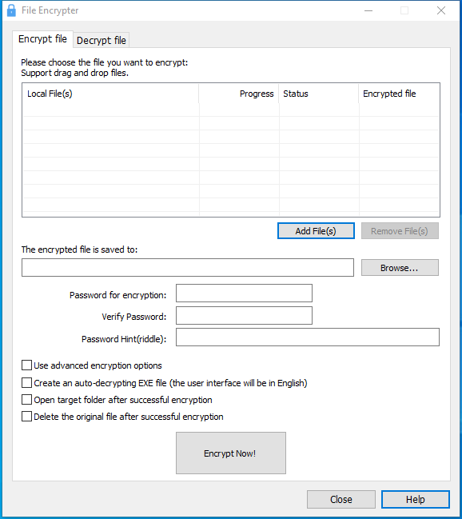

---
title: fileencrypt.exe | File Encrypter and Decrypter
excerpt: What is fileencrypt.exe?
---

# fileencrypt.exe 

* File Path: `C:\program files (x86)\Glary Utilities 5\fileencrypt.exe`
* Description: File Encrypter and Decrypter

## Screenshot

## Hashes

Type | Hash
-- | --
MD5 | `A368AFDE794912E1760345775D723F8F`
SHA1 | `0264B4BE2644232ABB2A83AD7748C556DEDA1FD7`
SHA256 | `ACF2B1A3C17FBF05ED57CFE6D4E0864CB76FA6D1D3D6B4783DC5402CA012026F`
SHA384 | `6F765DC8D153E8399A82E4540DD7DD83C6738D92B1AC81F4E357F16E6A10C0DD0CAE9266471E3D18F616F733A7F8F5B1`
SHA512 | `BD1A7FE88EF0AEBBADA92E8A31721C3E780D782887443516E1F443B6F1455AC0F9DAE462AEA177328BA9E40F5254B4F3F7BC54C8947314DF0212B7205E6EF33E`
SSDEEP | `3072:AX1mKYMmt/7Ehg/uevBT6oUKceVwHgKx/7es9ZOJuamC+N7LPAoGvV/j:YmNNJ4WWe96oUOOgKks9ZOJeWoGl`

## Runtime Data

### Window Title:
File Encrypter

### Open Handles:

Path | Type
-- | --
(R-D)   C:\Windows\Fonts\StaticCache.dat | File
(R-D)   C:\Windows\SysWOW64\en-US\user32.dll.mui | File
(RW-)   C:\Program Files (x86)\Glary Utilities 5 | File
(RW-)   C:\Users\user\Documents | File
(RW-)   C:\Windows | File
(RW-)   C:\Windows\WinSxS\x86_microsoft.vc90.crt_1fc8b3b9a1e18e3b_9.0.30729.9625_none_508ef7e4bcbbe589 | File
(RW-)   C:\Windows\WinSxS\x86_microsoft.windows.common-controls_6595b64144ccf1df_6.0.19041.1_none_fd031af45b0106f2 | File
(RW-)   C:\Windows\WinSxS\x86_microsoft.windows.gdiplus_6595b64144ccf1df_1.1.19041.450_none_4294d6e08a97344a | File
\BaseNamedObjects\__ComCatalogCache__ | Section
\BaseNamedObjects\NLS_CodePage_1252_3_2_0_0 | Section
\BaseNamedObjects\NLS_CodePage_437_3_2_0_0 | Section
\BaseNamedObjects\windows_shell_global_counters | Section
\Sessions\1\BaseNamedObjects\windows_shell_global_counters | Section
\Sessions\1\Windows\Theme4048709601 | Section
\Windows\Theme603176458 | Section

### Loaded Modules:

Path |
-- |
C:\program files (x86)\Glary Utilities 5\fileencrypt.exe |
C:\Windows\SYSTEM32\ntdll.dll |
C:\Windows\System32\wow64.dll |
C:\Windows\System32\wow64cpu.dll |
C:\Windows\System32\wow64win.dll |

## Signature

* Status: Signature verified.
* Serial: `0F05AE21CDC17B9F3CF09D7BFC659BA3`
* Thumbprint: `362EBB303E088105BDCC07D94E6B7875D30C0D06`
* Issuer: CN=DigiCert Assured ID Code Signing CA-1, OU=www.digicert.com, O=DigiCert Inc, C=US
* Subject: CN=Glarysoft LTD, O=Glarysoft LTD, S=Beijing, C=CN

## File Metadata

* Original Filename: FileEncrypt.exe
* Product Name: Glary Utilities
* Company Name: Glarysoft Ltd
* File Version: 5, 0, 0, 38
* Product Version: 5.0.0.1
* Language: Chinese (Simplified, China)
* Legal Copyright: Copyright (c) 2003-2020 Glarysoft Ltd

## File Similarity (ssdeep match)

File | Score
-- | --
[C:\Program Files (x86)\Glary Utilities 5\fileencrypt.exe](fileencrypt.exe-71C92DA6521BC54CCE0640FB2FD0F6DE.md) | 94
[C:\Program Files (x86)\Glary Utilities 5\fileencrypt.exe](fileencrypt.exe-C3C76DD3E1E3D5E36656E8A06ED25E3F.md) | 94

MIT License. Copyright (c) 2020 Strontic.

