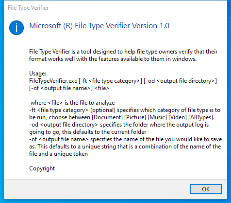

---
title: filetypeverifier.exe | File Type Verifier
excerpt: What is filetypeverifier.exe?
---

# filetypeverifier.exe 

* File Path: `C:\Program Files (x86)\Windows Kits\10\bin\10.0.19041.0\arm\filetypeverifier.exe`
* Description: File Type Verifier

## Screenshot

## Hashes

Type | Hash
-- | --
MD5 | `E9A9F4A70F9AD9DD7E6DD6F133EC8077`
SHA1 | `DC78F25EC9386F585C7FC0EED79F78B80E8D9A1B`
SHA256 | `3BA8818DDE13278F6357F735B0203B27FA465B8562630FEEC3F3A2AC03878284`
SHA384 | `F37FB13160B6FDEA68A32CFAA39976CB829100A90A8038C5F9AA2AD615A10DB4851C6E51433F15CC987C3F7BB0C7B6FC`
SHA512 | `774F4C463FDEAD6BF187AB40F06A6F51C431A6817395CA4ADC5AC30118F30FE3AE9724082FE932D421A18AC12923C6AD7A715A8F629126697EA32A0A70CE2C61`
SSDEEP | `3072:ONAX1JEsjcljw/CiOnLV6LmMcORqSQns4F31GZq+NvXkRHo3T7tQEghBcYr1APKh:kWjp2kq+N8+uhtx0AmcPdYmdpoBIUa`
IMP | `527599EED2AB6CC31C0CA140AD874E37`
PESHA1 | `159FE571E9B1085A04B8AB93D49152E03A04749C`
PE256 | `EFDE62EB378D776B2BEA9EA7311FA12E4BC323951245A072D671352E2C7DD49C`

## Signature

* Status: Signature verified.
* Serial: `33000002B7E8E007A82AEF13150000000002B7`
* Thumbprint: `5A68625F1A516670A744F7EF919500A479D32A5B`
* Issuer: CN=Microsoft Code Signing PCA 2010, O=Microsoft Corporation, L=Redmond, S=Washington, C=US
* Subject: CN=Microsoft Windows Kits Publisher, O=Microsoft Corporation, L=Redmond, S=Washington, C=US

## File Metadata

* Original Filename: FileTypeVerifier.EXE
* Product Name: Microsoft Windows Operating System
* Company Name: Microsoft Corporation
* File Version: 10.0.19041.1 (WinBuild.160101.0800)
* Product Version: 10.0.19041.1
* Language: English (United States)
* Legal Copyright:  Microsoft Corporation. All rights reserved.
* Machine Type: 452

## File Scan

* VirusTotal Detections: Unknown
* VirusTotal Link: n/a

## File Similarity (ssdeep match)

File | Score
-- | --
[C:\Program Files (x86)\Windows Kits\10\bin\10.0.19041.0\arm64\filetypeverifier.exe](filetypeverifier.exe-4C5631352E8E3488D1502C76AE00E806.md) | 57
[C:\Program Files (x86)\Windows Kits\10\bin\10.0.19041.0\x64\filetypeverifier.exe](filetypeverifier.exe-FD12E08F0ADD76B52C3ED4FEAA51619A.md) | 63
[C:\Program Files (x86)\Windows Kits\10\bin\10.0.19041.0\x86\filetypeverifier.exe](filetypeverifier.exe-F440C0F23CF3ED7E047D5A6F6E6F504D.md) | 60

MIT License. Copyright (c) 2020 Strontic.

