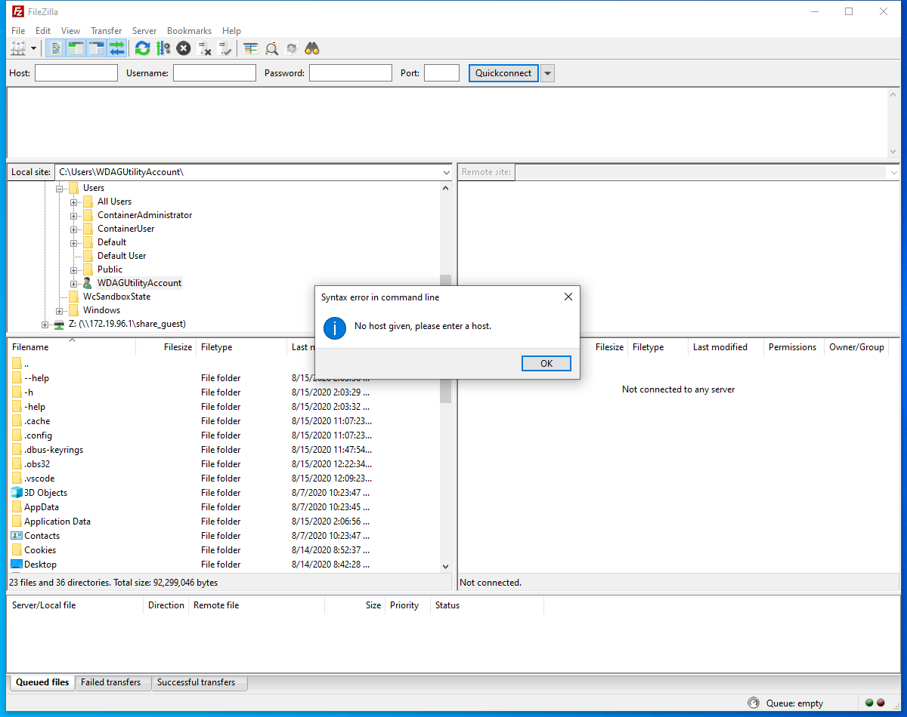
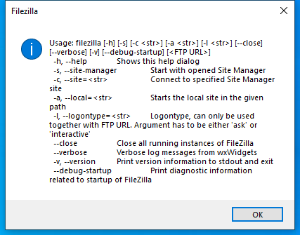

---
title: filezilla.exe | FileZilla FTP Client
excerpt: What is filezilla.exe?
---

# filezilla.exe 

* File Path: `C:\program files\FileZilla FTP Client\filezilla.exe`
* Description: FileZilla FTP Client
* Comments: Version 3.50.0

## Screenshot

## Hashes

Type | Hash
-- | --
MD5 | `313C5BBA40E0A47FB59CE3FBE61061A3`
SHA1 | `4A89C2177F86E3393A676AEE4873673CBDB6F9DD`
SHA256 | `557C627868C7FD1D1B4D570420B9691E68EE6235B1B02361A8FDCAF3B0C0D2E1`
SHA384 | `7312F9429A37AEC37953DB9BEFA401DD7E27B4675C5BB07CBDB7BC93CA8B8D66D0EBDFEB75550B70712F8BC3B648F4FC`
SHA512 | `9B768DBE7B57D26DE3DB4DFF573DB2F4B4B3377518E4FCCEE1ADC375C49E1381537E09DF7DB6A8919274DA6DEF07703EEC02752CC063C7D330DAE6A438E10092`
SSDEEP | `98304:pwODZX45hyOEs8zdO64rjXLD8wVNcM8yMgBp6/gUheg:CODMZSO66LnVJ8deg`

## Runtime Data

### Window Title:
Filezilla

### Open Handles:

Path | Type
-- | --
(R-D)   C:\Windows\Fonts\StaticCache.dat | File
(R-D)   C:\Windows\SystemResources\imageres.dll.mun | File
(RW-)   C:\Users\user\Documents | File
(RW-)   C:\Windows\WinSxS\amd64_microsoft.windows.common-controls_6595b64144ccf1df_6.0.19041.1_none_b555e41d4684ddec | File
\BaseNamedObjects\NLS_CodePage_1252_3_2_0_0 | Section
\BaseNamedObjects\NLS_CodePage_437_3_2_0_0 | Section
\Sessions\1\Windows\Theme4048709601 | Section
\Windows\Theme603176458 | Section

### Loaded Modules:

Path |
-- |
C:\program files\FileZilla FTP Client\filezilla.exe |
C:\program files\FileZilla FTP Client\libfilezilla-9.dll |
C:\program files\FileZilla FTP Client\libgcc_s_seh-1.dll |
C:\program files\FileZilla FTP Client\libgmp-10.dll |
C:\program files\FileZilla FTP Client\libgnutls-30.dll |
C:\program files\FileZilla FTP Client\libhogweed-6.dll |
C:\program files\FileZilla FTP Client\libnettle-8.dll |
C:\program files\FileZilla FTP Client\libpng16-16.dll |
C:\program files\FileZilla FTP Client\libsqlite3-0.dll |
C:\program files\FileZilla FTP Client\libstdc++-6.dll |
C:\program files\FileZilla FTP Client\zlib1.dll |
C:\Windows\System32\ADVAPI32.dll |
C:\Windows\System32\BCRYPT.DLL |
C:\Windows\System32\combase.dll |
C:\Windows\System32\comdlg32.dll |
C:\Windows\System32\CRYPT32.dll |
C:\Windows\System32\GDI32.dll |
C:\Windows\System32\gdi32full.dll |
C:\Windows\System32\KERNEL32.DLL |
C:\Windows\System32\KERNELBASE.dll |
C:\Windows\SYSTEM32\MPR.dll |
C:\Windows\System32\msvcp_win.dll |
C:\Windows\System32\msvcrt.dll |
C:\Windows\SYSTEM32\ncrypt.dll |
C:\Windows\SYSTEM32\NETAPI32.dll |
C:\Windows\SYSTEM32\NETUTILS.DLL |
C:\Windows\System32\Normaliz.dll |
C:\Windows\SYSTEM32\ntdll.dll |
C:\Windows\System32\ole32.dll |
C:\Windows\System32\OLEAUT32.dll |
C:\Windows\SYSTEM32\POWRPROF.dll |
C:\Windows\System32\RPCRT4.dll |
C:\Windows\System32\sechost.dll |
C:\Windows\System32\shcore.dll |
C:\Windows\System32\SHELL32.dll |
C:\Windows\System32\SHLWAPI.dll |
C:\Windows\SYSTEM32\SRVCLI.DLL |
C:\Windows\System32\ucrtbase.dll |
C:\Windows\System32\USER32.dll |
C:\Windows\System32\win32u.dll |
C:\Windows\SYSTEM32\WINMM.dll |
C:\Windows\System32\WS2_32.dll |
C:\Windows\WinSxS\amd64_microsoft.windows.common-controls_6595b64144ccf1df_6.0.19041.1_none_b555e41d4684ddec\COMCTL32.dll |

## Signature

* Status: Signature verified.
* Serial: `5D38D8BD64455068C2D1C74088C5E28A`
* Thumbprint: `3C574B927B475D65E573BFF74CCEFF3454587B07`
* Issuer: CN=Sectigo RSA Code Signing CA, O=Sectigo Limited, L=Salford, S=Greater Manchester, C=GB
* Subject: CN=Tim Kosse, O=Tim Kosse, STREET=Lukasstr. 10, L=Kln, S=NRW, PostalCode=50823, C=DE

## File Metadata

* Original Filename: filezilla.exe
* Product Name: FileZilla
* Company Name: FileZilla Project
* File Version: 3, 50, 0, 0
* Product Version: 3, 50, 0, 0
* Language: Language Neutral
* Legal Copyright: Copyright (C) 2006-2020

MIT License. Copyright (c) 2020 Strontic.

