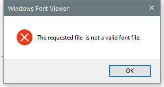

---
title: fontview.exe | Windows Font Viewer
---

# fontview.exe 

* File Path: `C:\windows\system32\fontview.exe`
* Description: Windows Font Viewer

## Screenshot

## Hashes

Type | Hash
-- | --
MD5 | `9B8B5487536052919900017EF778A88B`
SHA1 | `36C68E6E0EDCB86A7773CB232D531A5A8434BE76`
SHA256 | `16DBFC579FB6990745D48969F82927037209C028FD8E9F6B8017B32602209387`
SHA384 | `C7A66782C276D8E8B7E0A7444F344EAA7CBF1937FEE47DCBBA38FB76B4A0D42C98FE327965098410BA2FB9A8ECDEA725`
SHA512 | `8E5A575F95959219CD72512E40C599B0C8CEAFEE672D7B327EB851633E4E7055B95BD03A4E7AE2DAB90B6CB062778D056825FF1903D7D019C72B334F03640A4C`
SSDEEP | `1536:UzybmukAytMZOt3IWjWffRkOMwXFN1HKwtf11lSn42yD/c/znD1gvvUGmGPzOtSL:QiiFNJjWRkOtHxtt3EOL2QvIsitSYVI`

## Signature

* Status: The file C:\windows\system32\fontview.exe is not digitally signed. You cannot run this script on the current system. For more information about running scripts and setting execution policy, see about_Execution_Policies at http://go.microsoft.com/fwlink/?LinkID=135170
* Serial: ``
* Thumbprint: ``
* Issuer: 
* Subject: 

## File Metadata

* Original Filename: FONTVIEW.EXE.MUI
* Product Name: Microsoft Windows Operating System
* Company Name: Microsoft Corporation
* File Version: 6.3.9600.16384 (winblue_rtm.130821-1623)
* Product Version: 6.3.9600.16384
* Language: English (United States)
* Legal Copyright:  Microsoft Corporation. All rights reserved.

## File Similarity (ssdeep match)

File | Score
-- | --
[C:\WINDOWS\system32\fontview.exe](fontview.exe-074E78E53542819A9CB19E0DEDB1E18F.md) | 72
[C:\Windows\system32\fontview.exe](fontview.exe-5C122031AF7A1DB1A7172B83A220B411.md) | 79
[C:\Windows\system32\fontview.exe](fontview.exe-C07C4F59EA1A3795CEC526582A5DD7C2.md) | 74
[C:\Windows\system32\fontview.exe](fontview.exe-EF5974EAF2890C9D9F659C42F356B5D1.md) | 72
[C:\Windows\SysWOW64\fontview.exe](fontview.exe-41F2C4BCF495E8130FA93D7A641476CD.md) | 82
[C:\windows\SysWOW64\fontview.exe](fontview.exe-65AB4D02CC2F8D21B92EFA0F9923EA91.md) | 85
[C:\Windows\SysWOW64\fontview.exe](fontview.exe-8324ECE6961ADBE6120CCE9E0BC05F76.md) | 77
[C:\Windows\SysWOW64\fontview.exe](fontview.exe-A8E73AF0EEBD57BDC848C2A58B8CF8BD.md) | 79
[C:\WINDOWS\SysWOW64\fontview.exe](fontview.exe-B3A764361C0ACDEAD4B17F1D33ADC9A7.md) | 83

MIT License. Copyright (c) 2020 Strontic.

