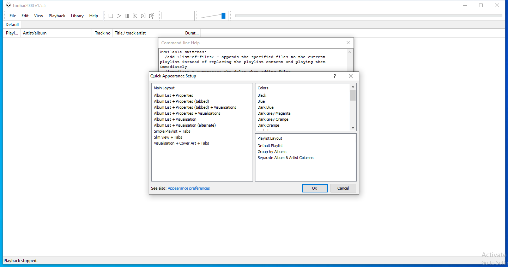

---
title: foobar2000.exe | foobar2000
excerpt: What is foobar2000.exe?
---

# foobar2000.exe 

* File Path: `C:\Program Files (x86)\foobar2000\foobar2000.exe`
* Description: foobar2000

## Screenshot

## Hashes

Type | Hash
-- | --
MD5 | `12CACC464A346F1144E7695141C0A4B7`
SHA1 | `905E5F4489D233A9FF1D5380E7A90D376F5B6391`
SHA256 | `53029880CFD7D10A39C30EC2437A13060F878B00FADBB6801C9A28BC705C866A`
SHA384 | `21AEC2762BD23CD2A1C06A4FDA92EE68D0A0C4D9B88A2E0DCE54DF3C16C41FA7426FA6B75D37540A627D0CE0E36CB0CC`
SHA512 | `E3BD9F597F125F4A58B9657D3368FFBE2C7ACEB5FBB4F33AA23D56C7495E4FB4A552B398BECDAC98D08B7C61DCE7F4AEE14AB287D788B051E546FF8FD98403F6`
SSDEEP | `49152:CLwf+7naLJm9sa3ETE07Wt737BXsW8fEcG1EFtehEkG4Bt9LXX:CLwfQnmsh0z5BG1EFFkj`
IMP | `85080071D7997B6BDC60F82E87CFFAC8`
PESHA1 | `F5B9CCB03ABD1BED84BD4DF36A7FF6F14B45A35C`
PE256 | `1459E6EB1EF22B2AE38B4EE66CC7CE32B468C38B4B9D01901F6118D400F5A1EA`

## Runtime Data

### Window Title:
foobar2000

### Open Handles:

Path | Type
-- | --
(---)   C:\Users\user\AppData\Roaming\foobar2000\running | File
(R-D)   C:\Windows\Fonts\StaticCache.dat | File
(RW-)   C:\Windows | File
(RW-)   C:\Windows\WinSxS\x86_microsoft.windows.common-controls_6595b64144ccf1df_6.0.19041.488_none_11b1e5df2ffd8627 | File
(RW-)   C:\Windows\WinSxS\x86_microsoft.windows.gdiplus_6595b64144ccf1df_1.1.19041.508_none_429cdbca8a8ffa94 | File
(RW-)   C:\xCyclopedia | File
\BaseNamedObjects\NLS_CodePage_1252_3_2_0_0 | Section
\BaseNamedObjects\NLS_CodePage_437_3_2_0_0 | Section
\Sessions\1\BaseNamedObjects\windows_shell_global_counters | Section
\Sessions\1\Windows\Theme2547664911 | Section
\Windows\Theme3854699184 | Section

### Loaded Modules:

Path |
-- |
C:\Program Files (x86)\foobar2000\foobar2000.exe |
C:\Windows\SYSTEM32\ntdll.dll |
C:\Windows\System32\wow64.dll |
C:\Windows\System32\wow64cpu.dll |
C:\Windows\System32\wow64win.dll |

## Signature

* Status: The file C:\Program Files (x86)\foobar2000\foobar2000.exe is not digitally signed. You cannot run this script on the current system. For more information about running scripts and setting execution policy, see about_Execution_Policies at https:/go.microsoft.com/fwlink/?LinkID=135170
* Serial: ``
* Thumbprint: ``
* Issuer: 
* Subject: 

## File Metadata

* Original Filename: foobar2000.exe
* Product Name: foobar2000 Application
* Company Name: Piotr Pawlowski
* File Version: 1.6.0.0
* Product Version: 1.6.0.0
* Language: English (United States)
* Legal Copyright: Copyright (C) 2002-2020 Piotr Pawlowski
* Machine Type: 32-bit

## File Scan

* VirusTotal Detections: 0/70
* VirusTotal Link: https://www.virustotal.com/gui/file/53029880cfd7d10a39c30ec2437a13060f878b00fadbb6801c9a28bc705c866a/detection/

MIT License. Copyright (c) 2020 Strontic.

