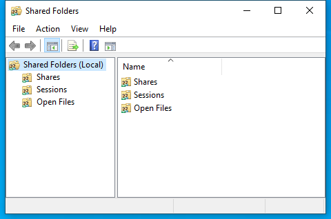

---
title: fsmgmt.msc | 
excerpt: What is fsmgmt.msc?
---

# fsmgmt.msc 

* File Path: `C:\Windows\system32\fsmgmt.msc`
* Description: Shared Folders (Window Title)

## Screenshot

## Hashes

Type | Hash
-- | --
MD5 | `97AED7FC6C2B38F34CA1A3C10D2F5A60`
SHA1 | `4A82D16F8E92D5D89C9D3AA9B5ACFFE0581083D6`
SHA256 | `77BB47313573810FBA4A442602C50868F41F40922AAF16A757D8036D99CB1437`
SHA384 | `1B687F0046C29454996EE050E171A7DB0E28F42B9A392BE6E81588615AC5C958EAC9F71B5DFAC65F705C9D5B6CED2FD6`
SHA512 | `6E8758149C47B2E3A3313F09E6559FF22C1C65C73139B8F57BF6805815A4587427FD024BBA88CAD9411A16105A794D95690D031C566AAF57B32D69CBBBFAC658`
SSDEEP | `384:xE14JG6erP/w63/JeWA+YI5LY8gXhrH6V9fGOK6qdBblI4ZHFTtn:ARrP/3/JW+tLVk0fGNZI6Ttn`
PESHA1 | `4A82D16F8E92D5D89C9D3AA9B5ACFFE0581083D6`
PE256 | `77BB47313573810FBA4A442602C50868F41F40922AAF16A757D8036D99CB1437`

## Runtime Data

### Window Title:
Shared Folders

### Open Handles:

Path | Type
-- | --
(R-D)   C:\Windows\Fonts\StaticCache.dat | File
(R-D)   C:\Windows\System32\en-US\filemgmt.dll.mui | File
(R-D)   C:\Windows\System32\en-US\KernelBase.dll.mui | File
(R-D)   C:\Windows\System32\en-US\MFC42u.dll.mui | File
(R-D)   C:\Windows\System32\en-US\mmc.exe.mui | File
(R-D)   C:\Windows\System32\en-US\mmcbase.dll.mui | File
(R-D)   C:\Windows\System32\en-US\user32.dll.mui | File
(R-D)   C:\Windows\SystemResources\filemgmt.dll.mun | File
(R-D)   C:\Windows\SystemResources\mmcbase.dll.mun | File
(R-D)   C:\Windows\SystemResources\mmcndmgr.dll.mun | File
(RW-)   C:\Users\user | File
(RW-)   C:\Windows\WinSxS\amd64_microsoft.windows.common-controls_6595b64144ccf1df_5.82.19041.488_none_4238de57f6b64d28 | File
(RW-)   C:\Windows\WinSxS\amd64_microsoft.windows.common-controls_6595b64144ccf1df_6.0.19041.746_none_ca02b4b61b8320a4 | File
\BaseNamedObjects\__ComCatalogCache__ | Section
\BaseNamedObjects\C:\*ProgramData\*Microsoft\*Windows\*Caches\*{6AF0698E-D558-4F6E-9B3C-3716689AF493}.2.ver0x0000000000000002.db | Section
\BaseNamedObjects\C:\*ProgramData\*Microsoft\*Windows\*Caches\*{DDF571F2-BE98-426D-8288-1A9A39C3FDA2}.2.ver0x0000000000000002.db | Section
\BaseNamedObjects\C:\*ProgramData\*Microsoft\*Windows\*Caches\*cversions.2 | Section
\BaseNamedObjects\NLS_CodePage_1252_3_2_0_0 | Section
\BaseNamedObjects\NLS_CodePage_437_3_2_0_0 | Section
\BaseNamedObjects\windows_shell_global_counters | Section
\Sessions\1\BaseNamedObjects\18a8HWNDInterface:2905ba | Section
\Sessions\1\BaseNamedObjects\18a8HWNDInterface:43056c | Section
\Sessions\1\BaseNamedObjects\SessionImmersiveColorPreference | Section
\Sessions\1\BaseNamedObjects\windows_shell_global_counters | Section
\Sessions\1\Windows\Theme3205582532 | Section
\Windows\Theme3800351183 | Section

### Loaded Modules:

Path |
-- |
C:\Windows\SYSTEM32\apphelp.dll |
C:\Windows\System32\KERNEL32.DLL |
C:\Windows\System32\KERNELBASE.dll |
C:\Windows\SYSTEM32\mmc.exe |
C:\Windows\SYSTEM32\ntdll.dll |

## Signature

* Status: Signature verified.
* Serial: `3300000266BD1580EFA75CD6D3000000000266`
* Thumbprint: `A4341B9FD50FB9964283220A36A1EF6F6FAA7840`
* Issuer: CN=Microsoft Windows Production PCA 2011, O=Microsoft Corporation, L=Redmond, S=Washington, C=US
* Subject: CN=Microsoft Windows, O=Microsoft Corporation, L=Redmond, S=Washington, C=US

## File Metadata

* Original Filename: 
* Product Name: 
* Company Name: 
* File Version: 
* Product Version: 
* Language: 
* Legal Copyright: 

## File Scan

* VirusTotal Detections: 0/76
* VirusTotal Link: https://www.virustotal.com/gui/file/77bb47313573810fba4a442602c50868f41f40922aaf16a757d8036d99cb1437/detection

## File Similarity (ssdeep match)

File | Score
-- | --
[C:\Windows\system32\en-US\fsmgmt.msc](fsmgmt.msc-97AED7FC6C2B38F34CA1A3C10D2F5A60.md) | 100
[C:\Windows\SysWOW64\fsmgmt.msc](fsmgmt.msc-97AED7FC6C2B38F34CA1A3C10D2F5A60.md) | 100

MIT License. Copyright (c) 2020-2021 Strontic.

