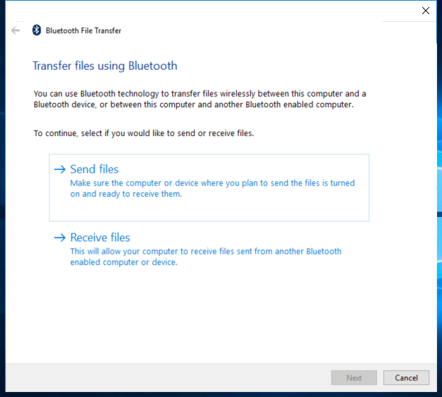

---
title: fsquirt.exe | 
excerpt: What is fsquirt.exe?
---

# fsquirt.exe 

* File Path: `C:\WINDOWS\system32\fsquirt.exe`
* Description: Bluetooth File Transfer (Window Title)

## Screenshot

## Hashes

Type | Hash
-- | --
MD5 | `E31521D909E2BAF6E53F0A2516EE8736`
SHA1 | `AB8B3E77C3196B85141E282CB12E92BDE076A4DE`
SHA256 | `9ED4E18F5114C03229035D6F4D03250425476AA8E7DD2271D689ADD5CD7AF9B9`
SHA384 | `0D78691F754F127B5863B2B58F2694F08173F3073C25328B593151B4B1C8420724A513E9DA7517FAEE83D69259A43872`
SHA512 | `9D899F077A5FC113E222E5BEE25716D7F5D4C7CE4C37FF7B4726E2DF95300EA2E0E1D20CEB29167D9FB330312296714473B6259A44B4E31F0427C369D98E3B19`
SSDEEP | `3072:xsOJ8IpYSXCfjW1BdIFm8sQYQM9FNnCXA1yG4h:us8ISSXCfjW1BdIFm8sN/TIA1`
IMP | `CF9F329811EC0BB29FADA59B7F004646`
PESHA1 | `D1321B1A83DED116A89E2F150F57809007FEFEE2`
PE256 | `B85275757D4935067807F9AC99162D02F20C304B920449BB3473BA3382F14326`

## Runtime Data

### Window Title:
Bluetooth File Transfer

### Open Handles:

Path | Type
-- | --
(R-D)   C:\Windows\Fonts\StaticCache.dat | File
(R-D)   C:\Windows\System32\en-US\fsquirt.exe.mui | File
(R-D)   C:\Windows\System32\en-US\oleaccrc.dll.mui | File
(R-D)   C:\Windows\WinSxS\amd64_microsoft.windows.c..-controls.resources_6595b64144ccf1df_6.0.22000.1_en-us_6b887e04d8b70b4e\comctl32.dll.mui | File
(RW-)   C:\Windows\System32 | File
(RW-)   C:\Windows\WinSxS\amd64_microsoft.windows.c..-controls.resources_6595b64144ccf1df_6.0.22000.1_en-us_6b887e04d8b70b4e | File
(RW-)   C:\Windows\WinSxS\amd64_microsoft.windows.common-controls_6595b64144ccf1df_6.0.22000.120_none_9d947278b86cc467 | File
\BaseNamedObjects\C:\*ProgramData\*Microsoft\*Windows\*Caches\*{6AF0698E-D558-4F6E-9B3C-3716689AF493}.2.ver0x0000000000000001.db | Section
\BaseNamedObjects\C:\*ProgramData\*Microsoft\*Windows\*Caches\*{DDF571F2-BE98-426D-8288-1A9A39C3FDA2}.2.ver0x0000000000000001.db | Section
\BaseNamedObjects\C:\*ProgramData\*Microsoft\*Windows\*Caches\*cversions.2.ro | Section
\Sessions\2\BaseNamedObjects\NLS_CodePage_1252_3_2_0_0 | Section
\Sessions\2\BaseNamedObjects\NLS_CodePage_437_3_2_0_0 | Section
\Sessions\2\Windows\Theme1077709572 | Section
\Windows\Theme3461253685 | Section

### Loaded Modules:

Path |
-- |
C:\WINDOWS\System32\ADVAPI32.dll |
C:\WINDOWS\system32\fsquirt.exe |
C:\WINDOWS\System32\KERNEL32.DLL |
C:\WINDOWS\System32\KERNELBASE.dll |
C:\WINDOWS\SYSTEM32\ntdll.dll |

## Signature

* Status: Signature verified.
* Serial: `33000002ED2C45E4C145CF48440000000002ED`
* Thumbprint: `312860D2047EB81F8F58C29FF19ECDB4C634CF6A`
* Issuer: CN=Microsoft Windows Production PCA 2011, O=Microsoft Corporation, L=Redmond, S=Washington, C=US
* Subject: CN=Microsoft Windows, O=Microsoft Corporation, L=Redmond, S=Washington, C=US

## File Metadata

* Original Filename: fsquirt.exe.mui
* Product Name: Microsoft Windows Operating System
* Company Name: Microsoft Corporation
* File Version: 10.0.22000.1 (WinBuild.160101.0800)
* Product Version: 10.0.22000.1
* Language: English (United States)
* Legal Copyright:  Microsoft Corporation. All rights reserved.
* Machine Type: 64-bit

## File Scan

* VirusTotal Detections: 0/74
* VirusTotal Link: https://www.virustotal.com/gui/file/9ed4e18f5114c03229035d6f4d03250425476aa8e7dd2271d689add5cd7af9b9/detection

MIT License. Copyright (c) 2020-2021 Strontic.

