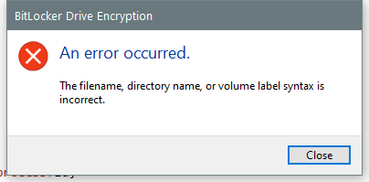

---
title: fvenotify.exe | BitLocker Drive Encryption Notification Utility
---

# fvenotify.exe 

* File Path: `C:\Windows\system32\fvenotify.exe`
* Description: BitLocker Drive Encryption Notification Utility

## Screenshot

## Hashes

Type | Hash
-- | --
MD5 | `1DDE0327CAF5309EC597B21726028153`
SHA1 | `D8325D665F482377A0622B6C70C25911F81E1A95`
SHA256 | `B7FD898228EFFC5C80349B74175337486E43F327782B3CF37CC6C81FF5F934C5`
SHA384 | `EB0305AC930B321B98DB1D8D63D085C6CCF42F740EC81CD8F6D0077A4E5D296FB34F203252927C2B7BE54B7624FEC30E`
SHA512 | `BE51BFB66DFB2CC0FD21BC17DE1A36A59E290E3C249A3D1EFBC11A9F5E436C39A4CEEBC3AE4D510900BE26572E7C27635F57054472C320299FF890A5239F8DFB`
SSDEEP | `3072:8P4awiEsVHmEZj0SkK4avkuIwnVS570M9kdatGCO+xmBc+hMPhPsx:HKqEZ0SkKbDVs7nyatGt+SYF`

## Runtime Data

### Window Title:
BitLocker Drive Encryption

### Open Handles:

Path | Type
-- | --
(R-D)   C:\Windows\Fonts\StaticCache.dat | File
(R-D)   C:\Windows\System32\en-US\duser.dll.mui | File
(R-D)   C:\Windows\System32\en-US\fvenotify.exe.mui | File
(R-D)   C:\Windows\System32\en-US\KernelBase.dll.mui | File
(R-D)   C:\Windows\SystemResources\imageres.dll.mun | File
(R-D)   C:\Windows\WinSxS\amd64_microsoft.windows.c..-controls.resources_6595b64144ccf1df_6.0.19041.1_en-us_cb612d02732b0fd9\comctl32.dll.mui | File
(RW-)   C:\Users\user | File
(RW-)   C:\Windows\WinSxS\amd64_microsoft.windows.c..-controls.resources_6595b64144ccf1df_6.0.19041.1_en-us_cb612d02732b0fd9 | File
(RW-)   C:\Windows\WinSxS\amd64_microsoft.windows.common-controls_6595b64144ccf1df_6.0.19041.1_none_b555e41d4684ddec | File
\BaseNamedObjects\C:\*ProgramData\*Microsoft\*Windows\*Caches\*{6AF0698E-D558-4F6E-9B3C-3716689AF493}.2.ver0x0000000000000002.db | Section
\BaseNamedObjects\C:\*ProgramData\*Microsoft\*Windows\*Caches\*{DDF571F2-BE98-426D-8288-1A9A39C3FDA2}.2.ver0x0000000000000001.db | Section
\BaseNamedObjects\C:\*ProgramData\*Microsoft\*Windows\*Caches\*cversions.2.ro | Section
\BaseNamedObjects\NLS_CodePage_1252_3_2_0_0 | Section
\BaseNamedObjects\NLS_CodePage_437_3_2_0_0 | Section
\Sessions\1\BaseNamedObjects\C:\*ProgramData\*Microsoft\*Windows\*Caches\*{F79646A6-8BE5-443B-A98F-AD03D667F646}.2.ver0x0000000000000001.db | Section
\Sessions\1\BaseNamedObjects\SessionImmersiveColorPreference | Section
\Sessions\1\Windows\Theme1149834063 | Section
\Windows\Theme2597483563 | Section

### Loaded Modules:

Path |
-- |
C:\Windows\System32\ADVAPI32.dll |
C:\Windows\system32\fvenotify.exe |
C:\Windows\System32\KERNEL32.DLL |
C:\Windows\System32\KERNELBASE.dll |
C:\Windows\System32\msvcrt.dll |
C:\Windows\SYSTEM32\ntdll.dll |

## Signature

* Status: Signature verified.
* Serial: `330000026551AE1BBD005CBFBD000000000265`
* Thumbprint: `E168609353F30FF2373157B4EB8CD519D07A2BFF`
* Issuer: CN=Microsoft Windows Production PCA 2011, O=Microsoft Corporation, L=Redmond, S=Washington, C=US
* Subject: CN=Microsoft Windows, O=Microsoft Corporation, L=Redmond, S=Washington, C=US

## File Metadata

* Original Filename: FVENOTIFY.EXE.MUI
* Product Name: Microsoft Windows Operating System
* Company Name: Microsoft Corporation
* File Version: 10.0.19041.1 (WinBuild.160101.0800)
* Product Version: 10.0.19041.1
* Language: English (United States)
* Legal Copyright:  Microsoft Corporation. All rights reserved.

## File Similarity (ssdeep match)

File | Score
-- | --
[C:\Windows\system32\baaupdate.exe](baaupdate.exe-124495DF347DBB3FE50CAF55B211CBD9.md) | 69
[C:\WINDOWS\system32\baaupdate.exe](baaupdate.exe-1DE833E454562483BD0CD60D96B3CA0C.md) | 69
[C:\windows\system32\baaupdate.exe](baaupdate.exe-5B49CC654ADC1CE20F2756FB61C1E3A4.md) | 69
[C:\Windows\system32\baaupdate.exe](baaupdate.exe-A5BCC0E852AC6B17F3D0E6C9F95E95D4.md) | 69
[C:\Windows\system32\BdeHdCfg.exe](BdeHdCfg.exe-29B6905327F9571F99697BA8951F60D5.md) | 66
[C:\WINDOWS\system32\BdeHdCfg.exe](BdeHdCfg.exe-49993078062CFCCFE5EE1ACCF47B1EAF.md) | 66
[C:\Windows\system32\BdeHdCfg.exe](BdeHdCfg.exe-89D0572C9B53F34230C8514F6B11BD56.md) | 66
[C:\windows\system32\BdeHdCfg.exe](BdeHdCfg.exe-A0B0BD83DF86073C86D4111FDF4B82AB.md) | 65
[C:\Windows\system32\bdeunlock.exe](bdeunlock.exe-23C71245731416DD69B78A64BDB8A230.md) | 46
[C:\Windows\system32\bdeunlock.exe](bdeunlock.exe-6DF8548ED3BA2DF3C682A5E342DA7BE4.md) | 44
[C:\WINDOWS\system32\bdeunlock.exe](bdeunlock.exe-7EDA3DEC2AC9206D153AF752F20B4B92.md) | 43
[C:\windows\system32\bdeunlock.exe](bdeunlock.exe-F1422C3B0232F78BFB19B51CBC88BB50.md) | 52
[C:\Windows\system32\BitLockerWizard.exe](BitLockerWizard.exe-1F7EC0D141821C5BB3B51C054E7CA8D4.md) | 72
[C:\windows\system32\BitLockerWizard.exe](BitLockerWizard.exe-3F4811D92D68006E636245486A8D92B9.md) | 74
[C:\WINDOWS\system32\BitLockerWizard.exe](BitLockerWizard.exe-6B919B72E58391B39A09EE388FA89BBB.md) | 69
[C:\Windows\system32\BitLockerWizard.exe](BitLockerWizard.exe-A9C78F189E2111734F7E961EBE38188A.md) | 72
[C:\Windows\system32\BitLockerWizardElev.exe](BitLockerWizardElev.exe-46A96812D5A434C3794F06DB978D0C19.md) | 68
[C:\Windows\system32\BitLockerWizardElev.exe](BitLockerWizardElev.exe-68A4D7474F142060F46C37BCE45FABFE.md) | 74
[C:\WINDOWS\system32\BitLockerWizardElev.exe](BitLockerWizardElev.exe-7B6ADCD4165DE7732C61E2381D69BEA3.md) | 71
[C:\windows\system32\BitLockerWizardElev.exe](BitLockerWizardElev.exe-9F4A6D072BF84183E96E8B4D6D536D73.md) | 69
[C:\windows\system32\fvenotify.exe](fvenotify.exe-6A7644DD7F83120D7230C67D74C180EB.md) | 66
[C:\WINDOWS\system32\fvenotify.exe](fvenotify.exe-D7B50B5843EFD63DBAAE341B8E70856D.md) | 68
[C:\Windows\system32\fvenotify.exe](fvenotify.exe-EE3C814D1035CDCDF48E232742D6FA43.md) | 63
[C:\WINDOWS\system32\fveprompt.exe](fveprompt.exe-1B9EC98C9542EF45D511E3D003E00369.md) | 66
[C:\Windows\system32\fveprompt.exe](fveprompt.exe-1FDC5C40B2DE4167895EFFCAB0854C0C.md) | 63
[C:\Windows\system32\fveprompt.exe](fveprompt.exe-57935115ADFEC73AB98655EEA54DF706.md) | 63
[C:\windows\system32\fveprompt.exe](fveprompt.exe-D1A5A16C5C361DFC062E7ADFD3D0C49F.md) | 66
[C:\WINDOWS\system32\manage-bde.exe](manage-bde.exe-146C56E1598A4F568B6F0342A485DD84.md) | 47
[C:\Windows\system32\manage-bde.exe](manage-bde.exe-84021D418863A3E530D2E3F65F5D154C.md) | 50
[C:\Windows\system32\manage-bde.exe](manage-bde.exe-D44D57F5AAF9D5FD64EFC00C4761C304.md) | 46
[C:\windows\system32\manage-bde.exe](manage-bde.exe-F7E627DDF4C3B09BDB8954E02B4A375C.md) | 54
[C:\Windows\system32\repair-bde.exe](repair-bde.exe-0858920D41400F8C585AFE31B80FF884.md) | 71
[C:\WINDOWS\system32\repair-bde.exe](repair-bde.exe-7DE31602235A9B4A6C1EBCFB6E6E30E2.md) | 65
[C:\windows\system32\repair-bde.exe](repair-bde.exe-8A8A24256B145338E025DCD848CBC1EF.md) | 65
[C:\Windows\system32\repair-bde.exe](repair-bde.exe-9FA5C71841FDE30C7D62CC95E5389E6A.md) | 63

MIT License. Copyright (c) 2020 Strontic.

