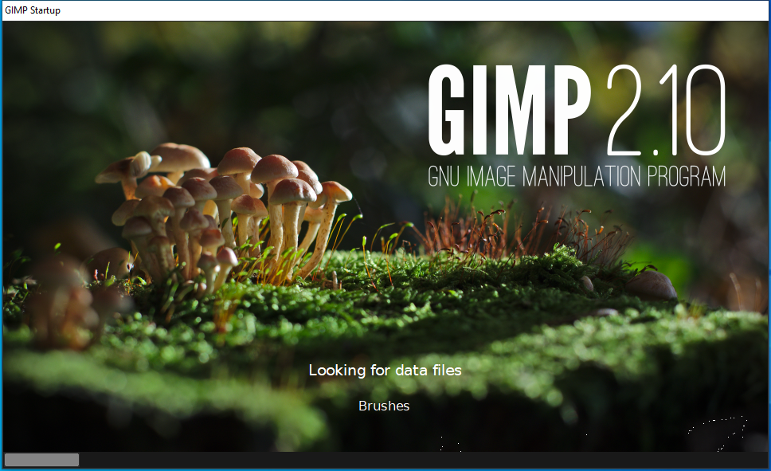

---
title: gimp-2.10.exe | GNU Image Manipulation Program
excerpt: What is gimp-2.10.exe?
---

# gimp-2.10.exe 

* File Path: `C:\program files\GIMP 2\bin\gimp-2.10.exe`
* Description: GNU Image Manipulation Program

## Screenshot



## Hashes

Type | Hash
-- | --
MD5 | `393D3A7D0966381F3AAD77434865999D`
SHA1 | `CDCE31B43781858881A358AC462F33A6BBA65618`
SHA256 | `D5D014A13B535B23FF37758C5A96279866C7D2286D337A810CDB5CDDD4433A01`
SHA384 | `1D826DCE25503D365D4BBEEED6B5B8996088884F8AB126B4A3DEEB5AEC0E98FEEDAFF89242BE2B993B7B9E41C4CB2E80`
SHA512 | `7BD7A9CDDB251FA92C2269A0C31DCF5C8662095CF23DEBC6AEF87A6D15FA4D56A0DCEF9681984AD16DB18EF068091B6913E39F372CB5E00B8BFF63F39E03F4AB`
SSDEEP | `196608:Y4a5vuj5zo56VbLIMYeNnSfUPiPXPBlQxr:Y58omQleNnSfUPiPXPBlQxr`

## Runtime Data

### Usage (stdout):
```cmhg
Usage:
  gimp-2.10.exe [OPTION] [FILE|URI...]

GNU Image Manipulation Program

Help Options:
  -h, --help                              Show help options
  --help-all                              Show all help options
  --help-gegl                             Show GEGL Options
  --help-gtk                              Show GTK+ Options

Application Options:
  -v, --version                           Show version information and exit
  --license                               Show license information and exit
  --verbose                               Be more verbose
  -n, --new-instance                      Start a new GIMP instance
  -a, --as-new                            Open images as new
  -i, --no-interface                      Run without a user interface
  -d, --no-data                           Do not load brushes, gradients, patterns, ...
  -f, --no-fonts                          Do not load any fonts
  -s, --no-splash                         Do not show a splash screen
  --no-shm                                Do not use shared memory between GIMP and plug-ins
  --no-cpu-accel                          Do not use special CPU acceleration functions
  --session=<name>                        Use an alternate sessionrc file
  -g, --gimprc=<filename>                 Use an alternate user gimprc file
  --system-gimprc=<filename>              Use an alternate system gimprc file
  -b, --batch=<command>                   Batch command to run (can be used multiple times)
  --batch-interpreter=<proc>              The procedure to process batch commands with
  -c, --console-messages                  Send messages to console instead of using a dialog
  --pdb-compat-mode=<mode>                PDB compatibility mode (off|on|warn)
  --stack-trace-mode=<mode>               Debug in case of a crash (never|query|always)
  --debug-handlers                        Enable non-fatal debugging signal handlers
  --g-fatal-warnings                      Make all warnings fatal
  --dump-gimprc                           Output a gimprc file with default settings
  --show-playground                       Show a preferences page with experimental features
  --display=DISPLAY                       X display to use


```

### Window Title:
GIMP Startup

### Open Handles:

Path | Type
-- | --
(R-D)   C:\Windows\System32\en-US\KernelBase.dll.mui | File
(RW-)   C:\Users\user\Documents | File
(RW-)   C:\Windows\WinSxS\amd64_microsoft.windows.common-controls_6595b64144ccf1df_5.82.19041.1_none_4b395a7b3c8e63ab | File
(RW-)   C:\Windows\WinSxS\amd64_microsoft.windows.gdiplus_6595b64144ccf1df_1.1.19041.450_none_fae7a009761b0b44 | File
(RWD)   C:\Program Files\GIMP 2\share\mypaint-data\1.0\brushes | File
\BaseNamedObjects\__ComCatalogCache__ | Section
\BaseNamedObjects\NLS_CodePage_1252_3_2_0_0 | Section
\BaseNamedObjects\NLS_CodePage_437_3_2_0_0 | Section
\BaseNamedObjects\windows_shell_global_counters | Section
\Sessions\1\BaseNamedObjects\GIMP7128.SHM | Section
\Sessions\1\BaseNamedObjects\windows_shell_global_counters | Section
\Sessions\1\Windows\Theme4048709601 | Section
\Windows\Theme603176458 | Section


### Loaded Modules:

Path |
-- |
C:\program files\GIMP 2\bin\dbghelp.dll |
C:\program files\GIMP 2\bin\gimp-2.10.exe |
C:\program files\GIMP 2\bin\libbabl-0.1-0.dll |
C:\program files\GIMP 2\bin\libcairo-2.dll |
C:\program files\GIMP 2\bin\libgdk_pixbuf-2.0-0.dll |
C:\program files\GIMP 2\bin\libgimpbase-2.0-0.dll |
C:\program files\GIMP 2\bin\libgimpcolor-2.0-0.dll |
C:\program files\GIMP 2\bin\libgimpconfig-2.0-0.dll |
C:\program files\GIMP 2\bin\libgimpmath-2.0-0.dll |
C:\program files\GIMP 2\bin\libgimpmodule-2.0-0.dll |
C:\program files\GIMP 2\bin\libgimpthumb-2.0-0.dll |
C:\program files\GIMP 2\bin\libgimpwidgets-2.0-0.dll |
C:\Windows\System32\ADVAPI32.dll |
C:\Windows\System32\combase.dll |
C:\Windows\System32\GDI32.dll |
C:\Windows\System32\gdi32full.dll |
C:\Windows\System32\KERNEL32.DLL |
C:\Windows\System32\KERNELBASE.dll |
C:\Windows\System32\msvcp_win.dll |
C:\Windows\System32\msvcrt.dll |
C:\Windows\SYSTEM32\ntdll.dll |
C:\Windows\System32\ole32.dll |
C:\Windows\System32\RPCRT4.dll |
C:\Windows\System32\sechost.dll |
C:\Windows\System32\SHELL32.dll |
C:\Windows\System32\ucrtbase.dll |
C:\Windows\System32\USER32.dll |
C:\Windows\System32\win32u.dll |


## Signature

* Status: Signature verified.
* Serial: `00E7E6FE263192D15EAC485B4198E64488`
* Thumbprint: `3A427356A24983C1C8211C07CF766D4726A33E4F`
* Issuer: CN=COMODO RSA Code Signing CA, O=COMODO CA Limited, L=Salford, S=Greater Manchester, C=GB
* Subject: CN=Jernej Simoni, O=Jernej Simoni, STREET=Herbersteinova 29, L=Ljubljana, S=-, PostalCode=1000, C=SI

## File Metadata

* Original Filename: gimp-2.10.exe
* Product Name: GNU Image Manipulation Program
* Company Name: Spencer Kimball, Peter Mattis and the GIMP Development Team
* File Version: 2.10.20.0
* Product Version: 2.10.20
* Language: English (United States)
* Legal Copyright: Copyright  1995-2020


MIT License. Copyright (c) 2020 Strontic.


